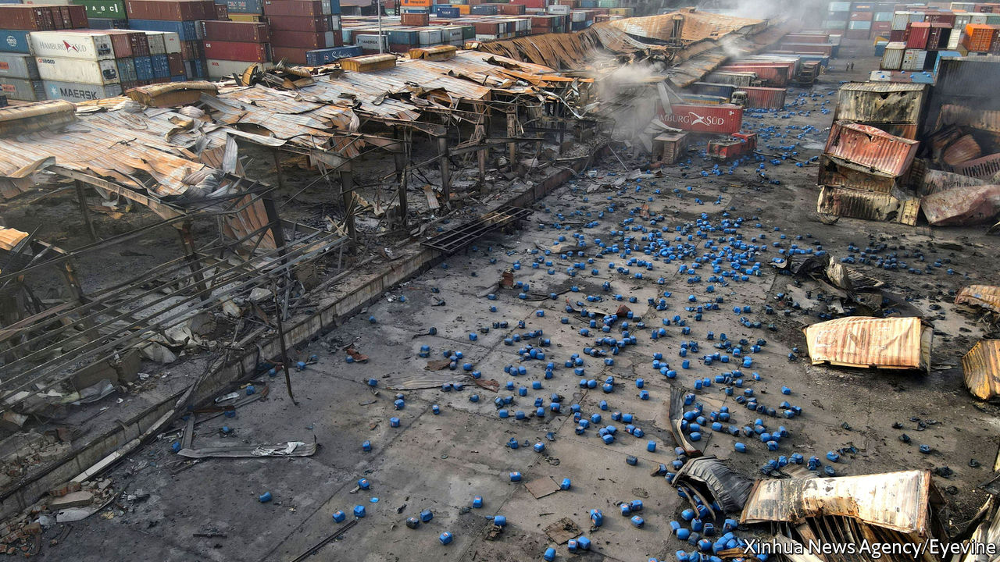

###### Terminal containers

# Bangladesh faces the fallout from another industrial accident 

##### A patchy safety record gets even worse 

 

> Jun 9th 2022 

When a fire broke out at the bm Inland Container Depot in Bangladesh on June 4th Oliur Rahman Nayan, a local worker, did what many young people would do: he took out his phone and started recording. Thousands watched his live-stream as containers full of clothes headed to the nearby port of Chattogram (formerly Chittagong), and then to Western high streets, went up in smoke. They followed along as firefighters tried to douse the flames. Then the screen went black. 

Mr Nayan was dead, engulfed in an explosion that shook buildings miles away. More than 40 others, including nine firefighters, perished. Hundreds more were injured in the blaze. Many details are still unknown, but the picture emerging is painfully familiar in Bangladesh, where rapid industrial growth has been marred by periodic industrial accidents. 

Days before the blast some 850 tonnes of hydrogen peroxide, a volatile chemical, were brought from a nearby plant to the depot, which does not seem to have had any special safety procedures for hazardous materials. Containers full of the stuff were left in the yard alongside other cargo, rather than in a separate shed, as they awaited shipment to Cambodia, according to the , a Bangladeshi newspaper. The explosion occurred when a fire, whose cause is unclear, reached these containers, one of which was leaking. 

The owners of the plant that produced the chemicals are Mostafizur and Mujibur Rahman. They are also majority shareholders of Smart Group, the container depot’s parent company. The fire service has accused them and their business partner of failing to warn it about the stockpile of chemicals. (The Rahman brothers did not respond to requests for comment.) Unaware of the added hazard, the firefighters doused the flames with water—the opposite of what they would have done if they had known about the hydrogen peroxide, says Monir Hossain, the assistant director of the national fire service. The containers, he says, were either unlabelled or mislabelled. On June 7th police charged the depot’s executives with manslaughter and negligence, but not the Rahman brothers.

It took days to put out the blaze. Local volunteers helped until the army stepped in. Anisur Rahman, a worker at the depot, turned up for his shift on Sunday and found himself dragging burnt corpses from the rubble. “I have recovered seven bodies since morning,” he told  that evening.

Authorities say the depot did not have permission to store the chemicals. An official at the bm container depot denies this, saying they did have a storage licence, but admits there was “mismanagement” in the handling of the goods. 

Such accidents are not new in Bangladesh. Last year more than 52 people were killed in a fire at a food-processing factory. The textile industry, which has helped make Bangladesh one of Asia’s fastest-growing economies, has a particularly spotty record. More than 1,100 workers died when Rana Plaza, an eight-storey garment factory on the edge of Dhaka, the capital, . Western retailers whose clothes were being made in the building at the time scrambled to offer compensation to families and introduce new health-and-safety measures.

But improvements have been piecemeal, says Taqbir Huda, a lawyer from Justice for All Now Bangladesh, an advocacy group. The blast in Chattogram is surely tragedy enough to push more sweeping reforms, he says. Not all Bangladeshis share his optimism. Abdu Sattar lives just behind the depot: the air around him is still heavy with the smell of chemicals and the water his family drinks may well be polluted. too. “Everyone knows that chemicals were kept here,” he says. It may be against the rules but in Bangladesh, he says, “money can change everything.” ■

