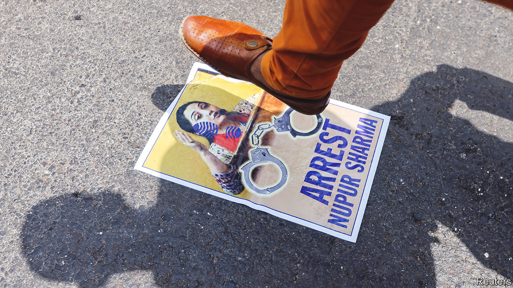

###### Hands off the Prophet

# India’s Islamophobia is affecting its foreign relations 

##### The Bharatiya Janata Party can afford to ignore America, but not the Gulf 

 

> Jun 9th 2022 

When antony blinken, America’s chief diplomat, criticised the decline of religious freedom in India on June 2nd, bemoaning an increase in “attacks on people and places of worship” in the country, the government’s reaction was defiant. It slammed his “ill-informed comments” and suggested that America get its own house in order. 

The reaction was rather different when, a couple of days later, many countries in the Gulf lodged complaints concerning offensive remarks about the Prophet Muhammad by two senior officials in India’s ruling Bharatiya Janata Party (bjp). 

The party quickly declared that the comments of these officials did not represent its official stance. When that failed to calm tempers, the bjp took action against the pair. Nupur Sharma, the party’s national spokeswoman, was suspended. Naveen Jindal, its head of media in Delhi, the country’s capital, was expelled. Indian diplomats in the Gulf sought to play the incident down by describing the two as “fringe elements”, prompting incredulity on Indian social media. The foreign ministry explained that their views did not reflect government policy. Ms Sharma has been summoned by police in Mumbai, the commercial capital, to explain her comments. 

The unusual contrition reflects the material importance of India’s relationships with Muslim-majority countries in the Gulf. America and its allies are easy to ignore because their objections are usually just verbal. India is important as a geopolitical counterweight to China, so no Western country wants to pick a fight with it. But when it comes to the Gulf, “we need them more than they need us,” reckons Happymon Jacob of Jawaharlal Nehru University in Delhi.

Qatar, which was the first to complain, is India’s biggest supplier of lng and an important destination for Indian migrant workers. Gulf countries supply two-thirds of India’s oil and host some 9m Indian workers. They have both the wherewithal and potentially the will to do real damage to India’s interests. 

Muslim countries have for years looked on with concern as the bjp went about its goal of . Yet these were domestic matters, and India’s foreign policy remained a mostly religion-free zone. Narendra Modi, the prime minister, managed to pull off a delicate balancing act between his majoritarian agenda at home and cultivating warm relations with Muslim states (except Pakistan) abroad. 

But as public discourse in India has coarsened—Ms Sharma made her remarks on a widely watched television debate show—and the ruling party’s apparatchiks have become , the balancing act has become harder to sustain. Muslim countries stayed silent about the treatment of minorities within India to avoid being rebuked for meddling in domestic affairs. But “an attack on the very tenets of the faith is a different category of offence”, says Mr Jacob. 

The government is trying to limit the damage without appearing weak. It pushed back against a statement from the Organisation of Islamic Co-operation (oic) that suggested the remarks were representative of systematic discrimination against Muslims in India. Nevertheless, it separately contacted officials from all oic member states to defuse their anger. 

However, instead of dying down, the anger has only grown. Protests have spread from the Gulf to the rest of the Islamic world. More than 20 countries—including Indonesia, Turkey and even the fundamentalist thugs of the Taliban—have registered their displeasure. A statement purportedly released by al-Qaeda called for retaliatory attacks in the states of Gujarat and Uttar Pradesh, both bjp strongholds, and in Delhi and Mumbai. 

India’s 200m-odd Muslims, who hope that the outrage might prompt the government to treat them with more respect, will probably be disappointed. The bjp’s tactical retreat to save face abroad is unlikely to have any bearing on its domestic stance, reckons Harsh Mander, a civil-rights activist. Some of its members  against Muslims. A repeat of the incident seems inevitable. ■

