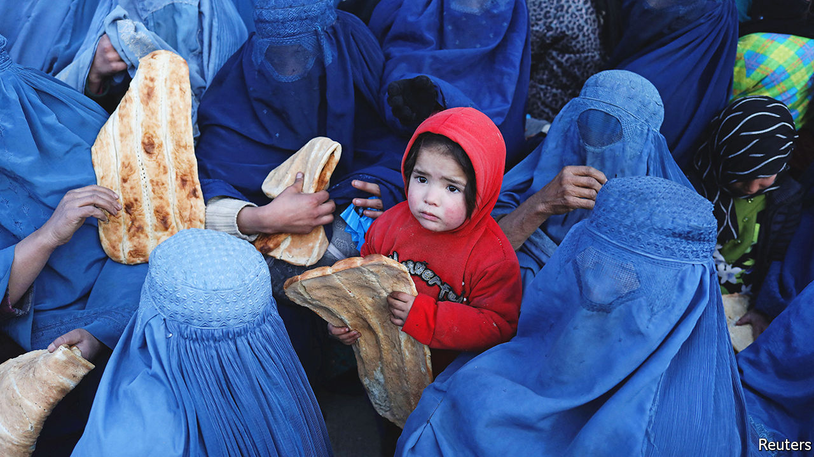
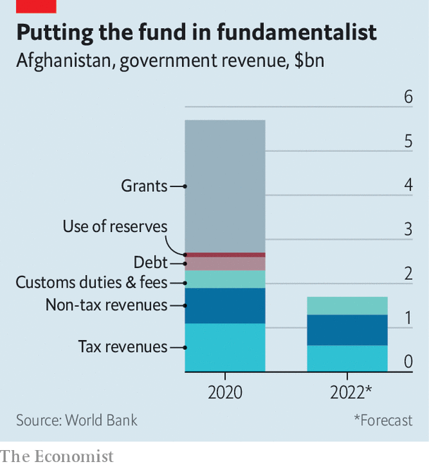

###### Guns over butter

# The Taliban government has proved surprisingly good at raising money 

##### It is letting its people starve anyway 

 

> Jun 8th 2022 

The medina bazaar neighbourhood in Kabul used to be a jolly mess of consumption and construction. As Afghanistan’s economy surged, helped along by billions of dollars in foreign aid, businessmen invested in property. Shopping plazas and wedding halls sprang up. Shops selling everything from women’s fashion to groceries were busy with keen customers. Traders prospered. Today, the area is still packed. But the throngs of people are there for handouts of food from the un. The stores are empty. Mohammad Younis, a local tailor, is struggling to feed his 11 children. “I have a shop, but no one comes in. I just sit there all day,” he says.

It was less than a year ago that  as American troops left, the government collapsed and security forces evaporated. The world watched in horror as crowds gathered at Kabul airport, desperate to flee. Some were killed in bombings. Others clung to departing aircraft and fell from the sky. Many have left the country since.

Most who remain face penury. In the last four months of 2021 the economy contracted by more than a third compared with the same period a year earlier. Private businesses have laid off about three-fifths of employees. Food prices are rising by 18% year on year. Families that were middle-class a year ago are surviving on a single meal a day. More than half the country’s people . Some have taken to selling organs or children. 

Part of the reason for their suffering is that Afghanistan was cut off from the global economy the moment the Taliban took control in August. The foreign funding that had propped up the state was halted. Afghanistan’s central-bank reserves, mostly held in America, were frozen, then seized. Sanctions mean Afghan banks can no longer transact with those abroad. 

When the Taliban seized power, it seemed obvious that they would struggle to switch from running a violent insurgency to administering a country of 40m, especially for lack of money. Yet the new government’s finances appear to be in much better shape than anybody expected. Last month the group announced its first full-year budget, forecasting revenues of $2.1bn. The World Bank’s estimate is more modest but still impressive: it reckons the government will collect about $1.7bn this year (about 12% of gdp) in domestic revenue, from things like taxes, customs and fees for services.

That is nearly three-quarters of the $2.3bn the previous government raised domestically in 2020, before business tanked, trade dried up and many taxpaying Afghans left the country. (Its total funding including foreign finance came to $5.7bn, but the Taliban do not have access to the grants and loans that made up the rest.)

 


That the Taliban have managed to keep revenues flowing despite the obstacles is remarkable. One reason for their success is that they have plenty of experience collecting taxes. During their two decades as a rebel army, they collected traditional tithes, such as , a share of farmers’ harvests, and , religious alms, in areas under their control. David Mansfield, a researcher who has studied Afghanistan’s illicit economy for 25 years, estimates the group made between $27.5m and $35m a year taxing the drug trade and roughly another $245m at checkpoints along main roads, where Taliban fighters extorted fees from truckers moving food and fuel. 

Second, the Taliban have kept official revenues flowing. A handful of holdovers from the former government are maintaining sophisticated financial-management software set up by the American-backed regime to run their revenue-collection systems. The group has also cracked down on graft, a serious problem under the previous government. A recent World Bank survey found that few private-sector businesses have been asked to make unofficial payments when filing taxes or clearing goods through customs since August, whereas such demands used to be common. 

Khalid Payenda, who was the last finance minister under the previous government, recalls staging surprise inspections at customs posts. In Kandahar, his inspectors found officials turning a blind eye as dismantled cars were brought in from abroad and assembled near the customs office, dodging hefty duties on imported vehicles. Mr Payenda, who now lives in Washington, dc, reckons the Taliban could easily double revenues from customs, which came to $400m in 2020, if they eliminate that sort of graft. 

The Taliban plan to spend $2.6bn this year, though they have not published details of where that money will go or how they will make up the $500m shortfall between their outlays and their own projections of revenues. One hint comes from an interim budget covering the three months to March, in which the Taliban said they would devote about 40% of total spending to defence and security. This financial year, that share is expected to rise to 50%, a staggering sum given that the government faces no existential threats and at least half the country’s population is living on less than $1.90 a day.

Analysts are left wondering what the defence budget will be spent on. Will it be used against the local branch of Islamic State, which has staged bloody attacks in the east of the country? Or to take on the anti-Taliban resistance in the north? The most likely answer is that much of it will be used to pay the thousands of fighters who worked for the Taliban before August, mostly young men who might rebel if their income is suddenly cut off.

Whatever the answer, the result will be less money to feed hungry citizens, let alone pay for health care, education or rebuilding the economy. That means that already reluctant foreign donors will be forced to step in to keep Afghans from starving. Earlier this year the un launched its largest-ever appeal for a single country, hoping to raise $4.4bn in emergency aid. But donor fatigue, aversion to the Taliban and the diversion of resources to Ukraine mean that only about a third of that has been raised so far. 

The Taliban are not helping international fundraising efforts. They have broken their promise to let girls back into secondary schools and have shut women out of public life. Even as they announced the budget last month, authorities dissolved the Human Rights Commission. The Taliban have surprised the world by showing they can continue to raise money to run the state. But they have yet to show they can spend it wisely. ■

