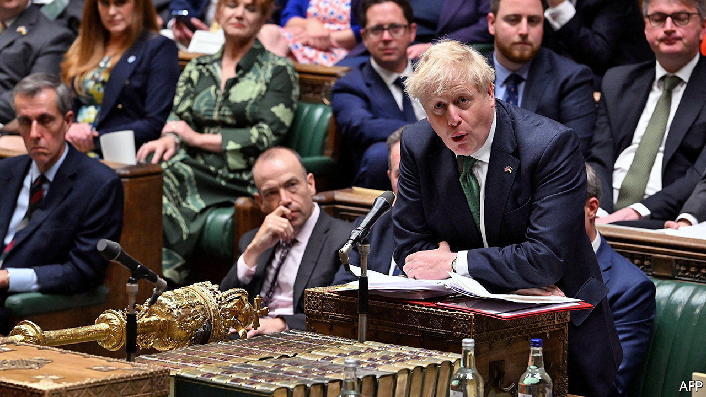
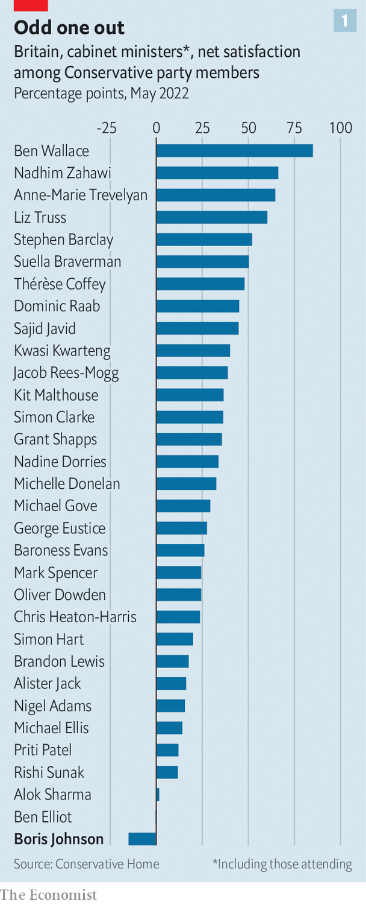
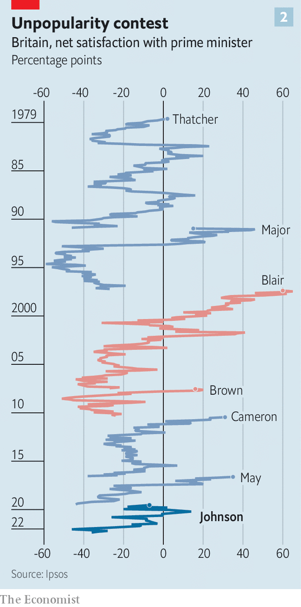

###### The divine right of Boris

# Boris Johnson divides Tories into Roundheads and Cavaliers 

##### A confidence vote reflects a split over the source of the prime minister’s authority 

 

> Jun 9th 2022 

It is hard to escape the English Civil War in the Houses of Parliament. Conservative mps arriving to vote on Boris Johnson’s future on June 6th would have passed a statue of Oliver Cromwell, who led the parliamentarians to victory against Charles I. They may then have walked through Westminster Hall, where the same king, who had insisted upon his divine right to rule, was sentenced to death. Near the chamber they would have passed a mural to Speaker Lenthall, who stood up for the Commons against the crown. Perhaps those things played on their minds; many would later say their party was in a state of civil war.

 


The Tories have been divided on Mr Johnson since he became prime minister in July 2019, but only now is it clear just how deeply. The revolt against Mr Johnson was triggered by illegal parties in Downing Street during the covid-19 lockdowns, which wrecked his standing in the opinion polls and among his party’s activists (see chart 1). In a confidence ballot triggered by his own mps he received 211 votes in his favour; 148 voted against him. His support was shallower than previously supposed, and his opponents, many of whom had been reluctant to choose a side until forced by their colleagues, far more numerous. At 59%, his share of support is lower than that received by Theresa May and Sir John Major, two of his predecessors, in similar ballots. It leaves his authority broken and his rivals wrestling to succeed him. 

The Conservative Party is riven by factions: northern and southern, Remainer and Brexiteer. Yet the split over Mr Johnson has defied easy analysis, running through all its tribes and regions. It separates Steve Baker, a leader of the Brexit right and a Johnson critic, from Jacob Rees-Mogg, a Brexiteer loyalist. New northern mps, such as Dehenna Davison and Peter Gibson, found themselves on opposite sides; so did some southern Remainers. Douglas Ross, who represents the party in Scotland, wanted Mr Johnson gone; Alister Jack, who represents Scotland in the cabinet, backed the prime minister. This split reflects another fault line, a philosophical gulf among Tory mps over the scope of Mr Johnson’s power and the source of its legitimacy. It is a struggle, says one, “between parliamentarians and the populists.” 

Ranged against Mr Johnson are the Roundheads. Theirs is an orthodox understanding of Britain’s constitution—that mps are elected by their constituents; and whoever enjoys the confidence of a majority of them is appointed by the queen as prime minister, who in turn may appoint ministers. If the prime minister loses their confidence, they fall. A prime minister’s authority begins and ends in Parliament. 

Mr Johnson’s noisiest defenders, meanwhile, are Cavaliers. Theirs is a garbled idea of the British constitution, which says Mr Johnson draws his legitimacy directly from the people. Under this reading, he was not elected merely by 25,000 voters in his constituency of Uxbridge and South Ruislip, or by his colleagues on the Tory benches, but by all those who voted Conservative in the general election of 2019. 

 


On this view, withdrawing confidence is not an mp’s right but a usurping of the popular will. “I find it utterly bizarre that a small number of mps think that they can overrule that vote of 14 million people,” seethed Nadine Dorries, the culture secretary and one of Mr Johnson’s closest allies. Some sense a special bond between the prime minister and his people: Danny Kruger, another supporter, declared he “personally represents” a “moral” mission to improve Britain. That Mr Johnson was never that popular (see chart 2), and is booed when he appears in public, is an inconvenient detail; many loyalists insist he still has the magic touch with voters.

There is a touch of Charles I about Mr Johnson. As a boy he declared he wanted to be “world king”; earlier in his career, a colleague remarked that he “thinks he has a divine right to rule the country”. Partygate exposed how he ran his administration like a royal court, with friends and courtiers slipping in and out of offices. It also revealed a Cavalier licentiousness; abstemious puritans did not stick around. 

A trend towards regal prime ministers has been under way since Margaret Thatcher: they consult their cabinet less, and are more prominent in election campaigns, than earlier leaders. But Mr Johnson’s premiership is characterised by a special disdain for Parliament. The Brexit referendum pitted a new form of popular sovereignty, the “will of the people”, against that of mps. In 2019, when Parliament threatened to stymie his Brexit plans, he prorogued it, a move the Supreme Court found unlawful. In office he has asked Parliament to grant ministers extensive powers to rewrite legislation at will. 

All this has fuelled discontent. Jesse Norman, a leading Roundhead, this week accused Mr Johnson of attempting to import a presidential system “that is entirely foreign to our constitution and law. But you are not a president, and you have no mandate other than as an mp, and from the confidence of your colleagues.” 

Mr Johnson’s next battle is an investigation by Parliament’s Privileges Committee into whether he wilfully misled the House of Commons about the parties; if it finds that he did, the Commons will be asked to ratify its findings and can suspend him as punishment. For Cavaliers it would be a slip of the tongue for which the public care little. For Roundheads it would be a crime: if ministers can freely lie to Parliament, the process of scrutiny on which parliamentary government rests would collapse. 

John Baron, among the first to call for Mr Johnson to go, is an unlikely rebel: a hardline Brexiteer representing the blue-collar seat of Basildon and Billericay. But he is a parliamentarian to his bones, who in 2013 led a rebellion to give mps oversight over the prime minister’s war powers. For Mr Baron, the evasions of Mr Johnson have put the credibility of Parliament in jeopardy. It is an mp’s duty “to ensure that the soul of our constitution is treated with reverence”, he remarked.

It is for this reason that the ministerial code, a rulebook for government, makes lying to Parliament a resigning offence. Yet it is Mr Johnson who polices the code, and he has made it clear to whom he answers. Last month he revised the code to state that he is accountable to Parliament but also “via the ballot box, to the British people”. 

One thing the British people cannot do is govern for him. Mr Johnson has lost control of the Parliament he disdains; the insurrection swamps his working majority. He is even more likely to shy away from confrontation as a result. On the day of the confidence vote the government announced it was dropping a chunk of a new high-speed railway network that irritated local mps. Mr Johnson’s ill-conceived plan to rewrite the Brexit deal on Northern Ireland may be stymied, too. (“Economically very damaging, politically foolhardy and almost certainly illegal,” was Mr Norman’s pithy verdict.) Yet since his opponents are so fragmented, appeasing one faction will only aggravate another.

An indiscreet contest to succeed Mr Johnson is under way. The field of candidates will be wide. It will include Ben Wallace, the defence secretary; Liz Truss, the foreign secretary; Jeremy Hunt, a former health secretary; and Nadhim Zahawi, the education secretary. None will find it easy to command the party’s rival factions. All, however, will rally to the Roundhead banner, promising to reassert ministerial standards and restore power to mps. 

The rebels are determined to organise another confidence vote—in theory banned by the rules for another year, yet feasible if these are simply changed by the 1922 Committee of backbench mps. The party’s conference in October will be a moment of danger. But Mr Johnson can also seek to renew his own legitimacy. In March his government repealed the Fixed-term Parliaments Act, restoring the power of the prime minister to call elections before the scheduled end of a term. If Mr Johnson wants to test the popular will in which his supporters place so much faith, he can. ■


