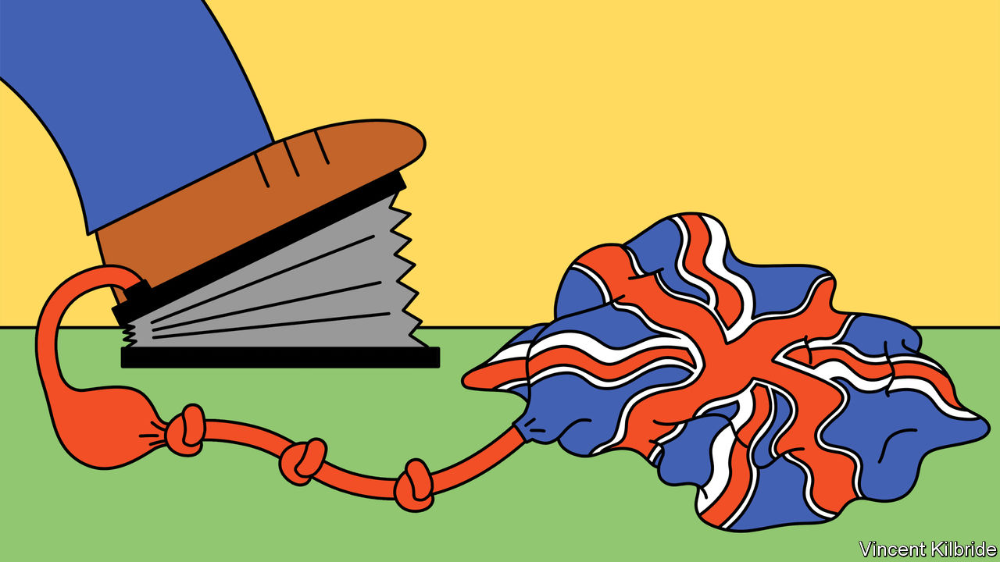
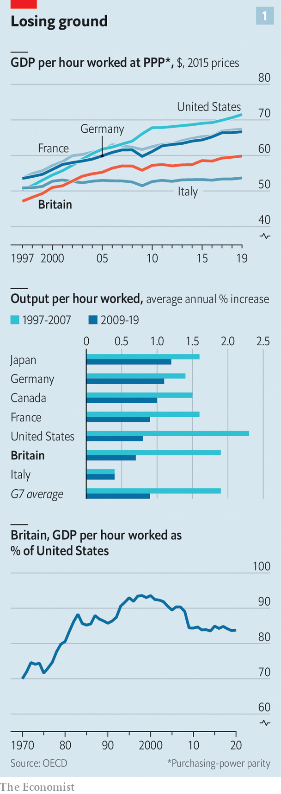
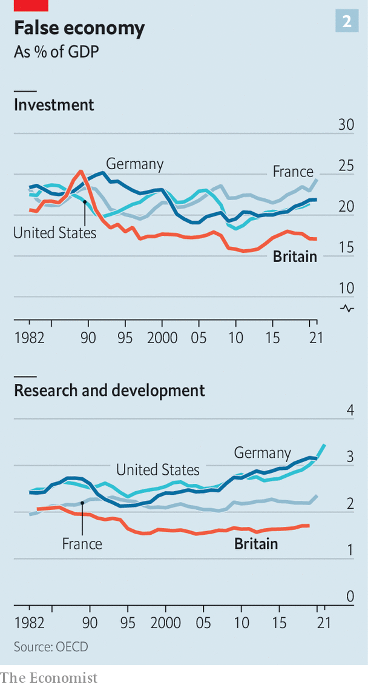

###### Stagnation nation

# Britain’s productivity problem is long-standing and getting worse 

##### Many culprits and few easy answers 

 

> Jun 9th 2022 

In the classic short documentary “Powers of Ten”, made in 1977, the camera steadily pans out from a picnicking couple in a lakeside park to show first the Earth, then the solar system, and eventually the entire universe. An expanding field of view brings home the scale of things. So it is with the challenges facing Britain. 

In the week that Boris Johnson  a vote of confidence in his leadership, the narrowest field of view focuses on the prime minister: how wounded he is, and how long he will survive. Zoom out a bit and you can see the immediate issues facing an enfeebled government, from a creaking health service to the rising cost of living. 

Zoom out farther still, though, and one problem fills the screen: the country’s anaemic growth rate. A healthier economy would raise people’s living standards; faster growth is the way to square the circle between lower taxes and better public services. Yet the oecd, a club of rich countries, reckons that only heavily sanctioned Russia will fare worse in the g20 in 2023. And whereas average annual gdp growth over the decade preceding the 2007-09 financial crisis was 2.7%, the Office for Budget Responsibility (obr), a fiscal watchdog, predicts the new normal is closer to 1.7%. 

The political debate is moving rapidly onto this terrain. Mr Johnson says growth is his top priority. Cabinet ministers are urging tax cuts. The Labour Party is working up a growth strategy. But talking is a lot easier than delivering. Zoom out again, and it is clear that Britain’s growth problem is long-standing and getting worse. 

In the coming months we will publish a series of articles on how to get Britain growing again. But first it is vital to understand how bad things are. That means focusing on one issue—productivity. 

Over the long run productivity growth, or the ability to produce more with less, is all that really matters for rising living standards. Although in theory economies can grow when people work longer hours, at some point that strategy is limited by employees’ health and the number of hours in a day. Raising labour productivity, or the amount workers can produce in an hour, can happen with investment. Or it can happen with greater total factor productivity (tfp), a measure of the overall efficiency with which capital and workers are used. tfp can be traced to factors like better management practices or stiffer competition.

Britain once set the pace in productivity. At the start of the 19th century it overtook the Netherlands as the world’s “productivity frontier”. A century later, America was in the lead. A study by Stephen Broadberry of Oxford University and Doug Irwin of Dartmouth College has documented how in around 1850, American workers produced roughly 10% less than their British peers. By 1910 they produced 25% more.

Britain never regained its lead. Two world wars hit hard; at home, meanwhile, domestic competition waned. European peers industrialised behind protective trade barriers. By the end of the 20th century Britain’s labour productivity was below that of America, France and Germany (see chart 1). Although it matched France’s gdp per hour at the beginning of the 1970s, by 2000 it trailed by over 10%. 

 


This century started promisingly. Between 1997 and 2007 British productivity growth was second only to America’s within the g7 group of countries (see chart 1); output per hour grew at an annual average rate of 1.9%. Over the course of that decade Britain’s gdp per hour grew from 88% of Germany’s to 93%.

But then, disastrously, the global financial crisis struck. The productivity slowdown that followed was global, but Britain’s was particularly dramatic. Between 2009 and 2019 its productivity growth rate was the second slowest in the g7 . A study by Nick Crafts at the University of Warwick and Terence Mills of Loughborough University calculated that Britain’s shortfall during this period, compared with the pre-2008 trend, was the worst in 250 years.

There is no doubt that the cost of this lost decade was huge. Had Britain’s productivity growth rate not fallen after the global financial crisis, gdp per person in 2019 would have been £6,700 ($8,380) higher than it turned out to be. But there is fierce debate over what exactly went wrong. Diane Coyle, a director of the Productivity Institute, a research consortium, likens the search for a source of Britain’s weak productivity growth to the conclusion of an Agatha Christie mystery. “Everybody turns out to have done it.” 

Several enormous shocks hit the British economy over the course of that decade, even before the pandemic delivered another. The financial crisis curbed the flow of credit. One study published in 2020 found that companies with weaker pre-crisis balance-sheets that faced a particularly severe reduction in credit saw sharper reductions in tfp growth, partly because they cut back on innovation. Drooping demand crimped incentives to invest and innovate: around half of European economists surveyed in February 2020 attributed Britain’s slowdown to weak demand associated with the financial crisis or austerity policies. 

And then there was Brexit. On one estimate, uncertainty caused by Britain’s departure from the eu depressed business investment by as much as 11% in 2019, relative to what it would have otherwise been. Erecting trade barriers with Britain’s biggest trading partner has eaten up managers’ time, made supply chains less efficient and added costs. None of that has helped.

Industry-level data yield further clues as to what went wrong. The slowdown in tfp growth within financial services and insurance contributed as much as a third of the economy-wide drop between 2007 and 2019, according to Jonathan Haskel of Imperial College London and Peter Goodridge of Manchester University. Information-technology services, transport-equipment manufacturing and pharmaceuticals also contributed—all industries typically thought to be among Britain’s strengths. Overall, they find that intangibles-heavy and technology-intensive industries were harder hit during the 2010s. 

There are various ways of interpreting these findings. One is that excessive risk-taking in the financial-services industry artificially inflated Britain’s measured productivity in the 2000s. Now that the industry is more heavily regulated, it may not seem as productive as it once did but the risk of a financial crash is lower. Another interpretation is that the benefits of technological change are petering out for everyone. Some, like John Fernald of insead Business School and Robert Inklaar of the University of Groningen, argue that most of Britain’s tfp slowdown in the decade before the pandemic reflected weaker performance in America, which sets the tempo of productivity globally. 

But even if the frontier is slowing, there is no iron law that says Britain cannot move closer to it. Catching up with America’s level of labour productivity would mean that Britain’s gdp per person would be £6,600 higher, for example. And even if it is hard to pin down the exact sources of the productivity slowdown in the 2010s, it is easier to identify areas where Britain has to do better in future. They fall into three big categories: investment, people and the spread of knowledge.

 


The most obvious weakness is investment. Britain consistently invests less than France, Germany and America; it has also long spent less on research and development (see chart 2). Adjustments for the capital available to workers explain almost all the gap between gdp per hour worked in Britain and France, and about a third of the gap between Britain and Germany. Uncertainty about what is around the corner for Britain’s firms is one explanation for this shortfall, but far from the only one. 

Financing is another. Anna Valero of the London School of Economics says that part of the problem relative to America may be that in Britain it is harder to raise the equity capital that supports risk-taking. Compared with Germany, where local banks have long-term relationships with firms, it is harder to find patient finance. 

A related problem is that investment is stymied by the difficulty of getting anything built in Britain. According to a recent oecd index of land-use governance, which measures how fragmented planning decisions are, Britain’s system came second only to Latvia among 18 countries surveyed. In innovation clusters like Oxford and Cambridge, building is constrained by strict rules preserving historic architecture and the surrounding countryside. Housing is eye-wateringly expensive, making it harder to attract newcomers who could productively work there alongside others. 

The next category of improvements involves people. Although it has been successful in encouraging more youngsters to go to university, Britain has struggled for decades to equip people with specific skills, from engineering to welding, that employers demand. The share of the population with higher secondary qualifications—ie, people who do not take a degree but who do stay on in education after the age of 16—is around 32%, well below the oecd average of 42%. The level of collaboration between vocational schools, further-education colleges, businesses and local government is minimal. Plans for lifelong learning are just that—plans.

The quality of people at the top of firms seems to be a problem, too. Compared with Germany and America, Britain’s managers fall short. One study published in 2021 found that only around 11% of firms were as well-managed as the top 25% of American firms. The government is trying to tackle this through its “Help to Grow” programme, which offers subsidised management training to leaders of small businesses. Uptake has reportedly fallen far short of what was expected.

Better training leads naturally on to a third category, the spread of knowledge. Productivity improves when high-skilled people work with other high-skilled people, when transport links are integrated, when ideas diffuse. Geography is one dimension of this problem: regional inequality is very high in Britain. According to an analysis of such internal disparities by Philip McCann of the University of Sheffield, Britain is more unequal than France on 15 out of 21 measures, and more unequal than Germany on 17. Improvements to aggregate productivity rest partly on pushing forward the frontier of innovation and partly on helping less productive firms to catch up with the leaders. That is a lot harder if, as Bart van Ark of the Productivity Institute puts it, many lagging firms are “in regions that are essentially stuck”. 

Britain’s diffusion problem is not just geographical. Although Britain has world-beating research universities, it struggles to spread the knowledge they generate to companies. Compared with America, for example, the country relies relatively heavily on universities and less so on national laboratories, which tend to be more focused on applied research. On average, Britons take out patents at a rate half that of people in America, France and Germany. 

Britain has no shortage of problems to fix, then. If anything, they are mounting. The effects of weaker international competition because of Brexit will sap dynamism. The obr thinks that eventually Britain’s productivity will be 4% lower than if it had stayed in the eu. Britons are ageing, another drag; climate-change commitments imply cost as well as opportunity. 

Some hoped that the pandemic would kick things into a higher gear. Although productivity soared when it first struck, that was because relatively unproductive sectors shut down. The latest data suggest that productivity has settled back to its pre-covid trend. In March the obr said that the pandemic would permanently damage tfp, partly because firms are holding larger inventories in case of future disruptions.

And then there is the question of whether policymakers are capable of making the changes that are required. “Powers of Ten” finishes by steadily zooming back in again, progressively narrowing the field of view until it reaches the sub-atomic level. A narrower view also yields a depressing conclusion. The productivity problem has thwarted far more competent governments than this one. Mr Johnson has made no headway on growth since winning a stonking majority in 2019, and the erosion of his authority after the vote of confidence makes the chances of bold, long-term action even lower. But at least there is no doubt where this government and its successors ought to focus. ■


