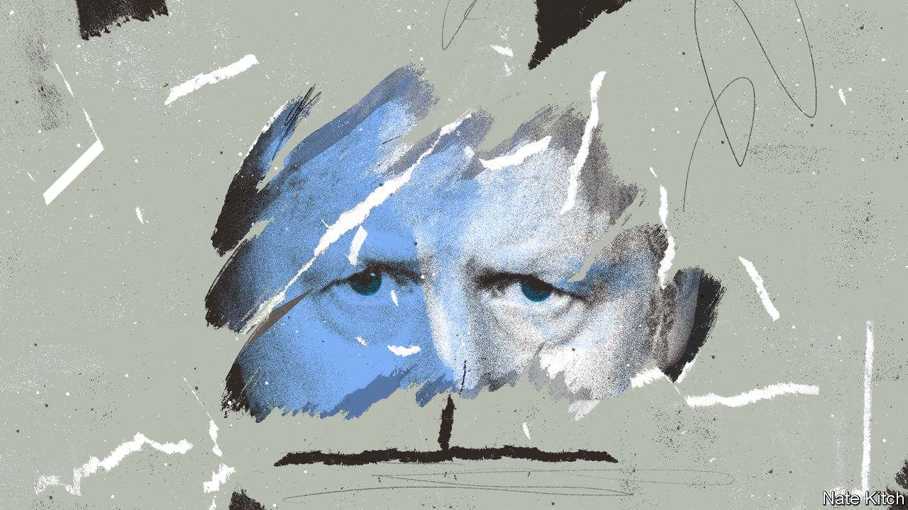

###### Bagehot

# How Boris Johnson undid the Tory Party’s mythology 

##### A party that was ruthless, pragmatic and efficient is now cowardly, incoherent and inept 

 

> Jun 7th 2022 

“Shy tories” are common. Voting for the Conservative Party is never chic, so people often keep quiet about it. In the 1992 and 2015 general elections, voters took pollsters by surprise and handed the Conservative Party unexpected majorities. 

It is voters rather than mps who are supposed to be nervous about this allegiance. But during a vote of no confidence on June 6th in Boris Johnson’s leadership of the Conservative Party, just under 160 mps—a clear minority of the party—pledged their fealty to the prime minister publicly. In the end, 211 mps voted for him. It is this sort of shy Tory mp who quietly keeps Mr Johnson in power. 

They also belie the lore that Conservative mps are cold-hearted killers. The party is often described as an “absolute monarchy tempered by regicide”. The continued failure to remove Mr Johnson, after months of plunging approval ratings, government drift and a steady stream of scandals, reveals it to be anything but. 

That the Conservatives are ruthlessly regicidal is only the latest myth surrounding the Conservatives to be crushed during Mr Johnson’s leadership. This is a party of government that cannot govern. It is the party of business that hates business. It is dedicated to staying in power, yet refuses to take the steps necessary to keep itself there. Even more recent folklore is misleading: this is a populist party with an unpopular agenda.

Take each myth in turn. After a vote in which 41% of Conservative mps revealed they had no confidence in the prime minister, the party is not able to govern. Once an ideological project is ascendant within the party, mps usually fall in behind it. In a radical experiment Margaret Thatcher dismantled the One Nation Conservatism that had dominated in the post-war era and let the free market rip; Conservative mps were willing foot soldiers. David Cameron’s project of fiscal discipline in 2010s was not to everyone’s taste but it prompted little internal protest. 

Mr Johnson offers his followers no such coherence. He cannot decide whether to be a low-tax, supply-side revolutionary à la Thatcher in 1979, or to offer big-state Conservatism in the mould of Harold Macmillan. As a result, the party is riven. Buying off all his opponents is nigh-on impossible. The government’s majority is 78; those who opposed Mr Johnson this week numbered 148. Every policy that placates a wet One Nation critic will annoy a dry Brexiteer who wants precisely the opposite. 

A pervasive lack of seriousness also impedes its ability to govern. Plotters who, remember, are competing to remove the leader of a nuclear power were so disorganised that they could not trigger the vote of confidence at the right moment. The Conservatives are likely to lose two by-elections at the end of this month, denting Mr Johnson’s reputation as an electoral asset and making his position more precarious. Instead, the threshold for holding a confidence vote was reached on a Sunday afternoon while Mr Johnson sat watching a hologram of the queen in a parade at her Platinum Jubilee. In Parliament on Monday evening, plotters giggled alongside loyalists in the queue to vote. The evening felt less like a ballot that could defenestrate a prime minister than an election for the head boy of a public school. 

Traditional policy strengths of the Conservatives have been abandoned. The ever-quotable Mr Johnson once responded “fuck business” when told about corporate grumbles over Brexit. Nothing has been done to allay firms’ grievances. Instead, even the thin deal that was agreed with the eu is threatened by the government’s bellicosity over trade arrangements with Northern Ireland. Likewise, fiscal discipline has been replaced by fiscal incontinence. Rishi Sunak announced £15bn ($18.9bn) in spending at the end of May to alleviate the cost-of-living crisis and to head off political criticism. Now he faces cries for lower taxes. The government can either stick to its spending rules or throw around tax cuts. It cannot do both. To govern is to choose, but the Conservatives refuse. 

Nor does the Conservatives’ new guise as a populist party really fit the facts. Mr Johnson has styled himself as the people’s tribune, in power to do their bidding. Instead, advisers and acolytes project their own views onto an imagined voter who exists only in their heads, charging into a culture war that leaves many real voters nonplussed. And Mr Johnson himself has never been particularly popular; Theresa May enjoyed far higher approval ratings in 2017. Populism without the people is a hollow project. 

Keeping Labour out of office is still an aim. But even this mythological raison d’être seems a bit pointless. In a feat of projection Jonathan Gullis, the mp for Stoke North, said the party had to ensure “we don’t let that shambles Labour get into government”. In fact, Labour has cleaned up its act. When Conservative mps complain about the perils of Corbynism, Sir Keir Starmer can say he wholeheartedly agrees. He has purged the party of lefties, with the brutality one used to associate with the Conservatives. 

What can I do? I’m just a Member of Parliament 

In a Gothic palace by the Thames, Conservative mps despair at their powerlessness. They grumble that the party is sleepwalking towards 1997, when an exhausted, sleaze-ridden Conservative government received a historic battering in that year’s election. mps forget that the prime minister serves at their pleasure, no matter how often Mr Johnson’s supporters reference the prime minister’s popular support.

They also forget their party’s own history. Ruthlessness works. After Thatcher was kicked out, the Conservatives won the next election in 1992 (owing, largely, to shy Tories). Mrs May’s ungainly departure in 2019 preceded the Conservatives’ biggest majority in over 30 years. Even the removal of Iain Duncan Smith, leader of the opposition from 2001-03, was followed by major gains in an election for the first time in decades. Luckily for Mr Johnson, the Conservatives have forgotten this lesson; unluckily for everyone else, they have also trashed the other things they were famous for. ■


