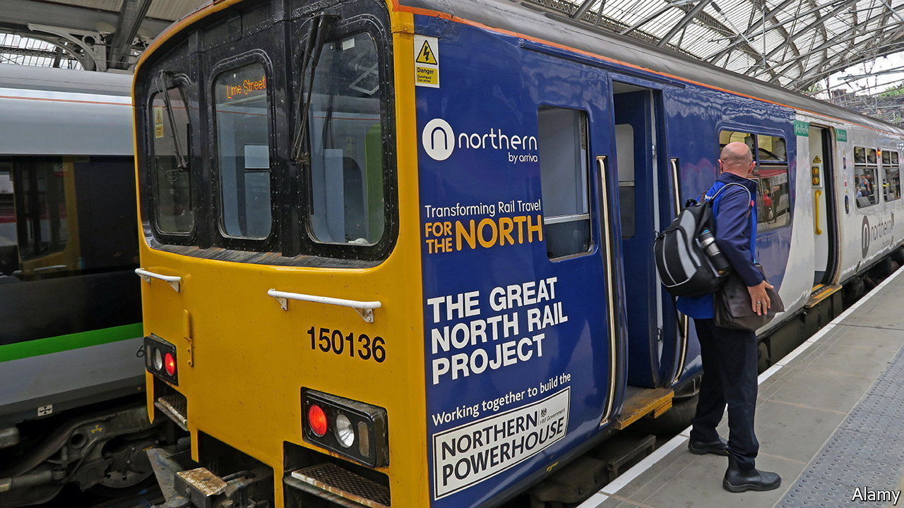

###### Branding Britain

# The many metaphors for Britain’s regional economies 

##### Is this powerhouse a gateway? 

 

> Jun 9th 2022 

How do you level up a country? Skim through the 300-page plan published by the Department for Levelling Up, Housing and Communities earlier this year and you will be bombarded by suggestions: increasing research-and-development spending outside the south-east, investing in regional infrastructure, improving education and devolving political powers. The trouble is that they require lots of time and money. In the meantime a swifter, cheaper solution is at hand: rebranding.

Since 2014 successive chancellors have touted the economic potential of the “Northern Powerhouse”, a constellation of cities including Manchester, Liverpool, Leeds and Hull. To its south lies the “Midlands Engine” which, in a feat of design, is also a “gateway to the global economy”. There is the “Golden Triangle” (whose points lie in Oxford, Cambridge and London) and the “Oxford-Cambridge Arc” (the bits between the two university cities). 

The “Western Gateway” spans south Wales and western England. “Silicon Fen” (Cambridgeshire), “Silicon Glen” (central Scotland) and the “Silicon Corridor” (along the m4 motorway) win no prizes for originality; Great South West wins no prize for effort. 

Nicknames for specific areas are nothing new but they used to be less abstract. For centuries Edinburgh was the “City of Money”, owing to its banks, insurers and fund managers. The Victorians labelled Manchester “Cottonopolis” after its mills and textile factories. The “Black Country” was named for its seam of coal, 30 feet thick, which once conjured up the future; Elihu Burritt, a 19th-century American consul to Birmingham, wrote that it was a “velvet-bound area of fire and smoke” that “cannot be matched for vast and varied production by any other place of equal radius on the surface of the earth”. 

Regional monikers do have their uses. For Bill Lyne of CreativeRace, a consultancy that designed an advertising campaign for the Midlands Engine, one of the area’s biggest challenges was that “international investors simply don’t know where it is”. A distinctive label can help correct that. But if Britain’s geographical inequalities are to be reduced, it will take more than a set of catchy names. 

