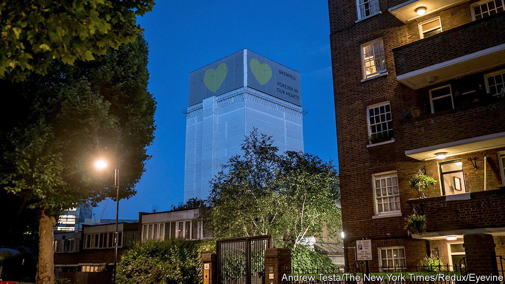

###### Five years after Grenfell

# The repercussions of the Grenfell Tower fire are far from over 

##### Some changes have been made to construction standards. Much else is unresolved 

 

> Jun 9th 2022 

Early on the morning of June 14th 2017, a small fire broke out in the kitchen of a flat on the fourth floor of Grenfell Tower, a residential tower block in west London. By the time firefighters arrived the flames had spread outside the building, licking their way 20 storeys higher along highly combustible weatherproof cladding. Soon, the tower was an inferno. Seventy-two people died and hundreds were made homeless in the deadliest residential fire in Britain since the second world war. 

Five years on, much remains unresolved. Grenfell’s burned-out shell still stands in Kensington, wrapped in protective plastic sheeting. Agreement on how to commemorate the site is elusive. A criminal investigation by London’s Metropolitan Police is still going on, as is an independent public inquiry. 

The most tangible changes to result from the disaster concern the use of the combustible cladding which was, according to the findings of the first phase of the public inquiry, the “primary cause of the rapid spread of fire”. Panels of the sort that encompassed Grenfell are made of aluminium composite materials (acm) with a combustible plastic core. In the immediate aftermath of the blaze the government ruled that such cladding should be stripped from the 486 high-rise buildings in Britain which used it. Only in June did this de facto ban become the law of the land. According to the latest government data, 58 buildings are still clad with acm; 27 of those have begun to remove it. 

It took almost as long to settle whose responsibility it was to get rid of the cladding. Owners of flats in buildings covered with acm found that their properties became unsellable after Grenfell; many began receiving invoices from building-management companies, charging them both for the removal of cladding and for teams of round-the-clock security guards to stand watch in case a fire did break out. In February the government announced that it would force developers which had used the combustible material to bear the cost of its removal, rather than passing the bill on to flat-owners. 

Grenfell has also had an impact on fire-safety procedures and the running of fire-fighting services. The first phase of the public inquiry focused on the course of events on the day of the fire. In May the government said it had implemented 21 of 46 recommendations in the resulting 838-page report. The recommendation that all London Fire Brigade officers above a certain rank receive training in the inspection of high-rise buildings, for instance, is now in place. Another, that fire-brigade technology be upgraded to receive digital plans of buildings, is in progress. 

The inquiry is now in a second phase, to examine the wider causes of the fire. It has already heard that both the local council, the Royal Borough of Kensington and Chelsea, and its contracted landlord for Grenfell, the Kensington and Chelsea tenant management organisation (kctmo), had been warned of risks at the tower block by the fire brigade. The kctmo, which had been the largest body of its kind in England, is a landlord no more and exists solely to take part in the public inquiry. The final report is due to be published next year. 

The inquiry has already been turned into two plays. “Dictating to the Estate” is running at the Maxilla Social Club in Kensington, just a stone’s throw from the tower, every word of dialogue in the script lifted from its proceedings. Another verbatim play, “Grenfell: Value Engineering”, ran in 2021 and will soon air on tv. 

Those who died are remembered on the streets of their old neighbourhood, as well as on the stage. On May 30th, as Britons geared up to celebrate the queen’s 70 years on the throne, a long table was laid out in north Kensington with 72 empty places, one for each victim. ■

