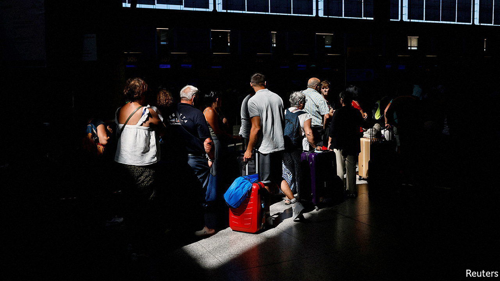
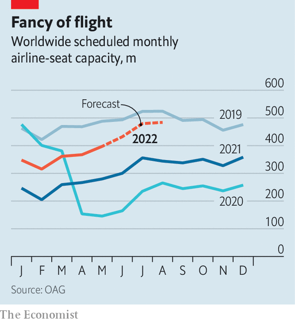

###### Flying start

# Air travel is taking flight again 

##### Headwinds still threaten the recovery 

 

> Jun 9th 2022 

The pandemic denied both the pleasures and tribulations of travel. The urge to make up for lost holidays and reunions with friends and families has brought the sort of airport holiday chaos that travellers avoided while covid-19 scuppered their plans. A rush to take advantage of school breaks caused recent misery in Europe. Passengers queued for hours at airports from Mallorca to Manchester, and flights were delayed or cancelled. Americans were furious after nearly 3,000 flights were scrapped in the four days around the Memorial Day weekend in late May. 

At least the hordes of unsatisfied customers are a sign that air travel is returning to normal. “Pent-up demand for travel is becoming un-pent,” says Andrew Charlton of Aviation Advocacy, a consultancy. The number of seats available on European airlines in the week commencing June 6th was only 9% below the same week in 2019. In North America it was just 5.6% down, according to oag, another consultancy. Japan, which was in effect shut to tourists for two years, said on May 26th that it would start to relax restrictions on visitors. With the exception of China, where severe recent lockdowns set back a strong recovery in domestic flying, the planes are back in the air at close to pre-pandemic levels. 

 


Bookings also look encouraging for the summer. Airlines are having to cope with a new uncertainty—a tendency of travellers to buy tickets later, induced by the riskiness of planning too far ahead during the pandemic. Even so, up to September sales for international routes are at 72% of their level in 2019 and those on domestic ones are at 66%, according to iata, an industry body. Capacity is ascending towards pre-covid levels, according to oag (see chart). Willie Walsh, iata’s boss, said in May that the speed of the rebound meant that passenger numbers worldwide would match figures from 2019 by 2023, a year earlier than previously forecast.

The pace of the recovery has caught out an industry that has been rebuilding at a steady clip. In particular, traffic has become much more concentrated in peak periods, according to aci Europe, a group representing the region’s airports. Passenger numbers are already exceeding pre-pandemic levels in short spells in some places. Airports, in particular, are struggling to cope with these peaks. Replacing workers laid off during the pandemic is tough amid tight labour markets, especially so because of the extra security checks required to hire airport staff. Swissport, the world’s largest airport-service firm, said in May that it needed to take on 30,000 new workers worldwide by the summer on top of the 45,000 it now employs. 

Staff shortages have already prevented some airlines from adding even more capacity to meet the surging demand. Continuing disruptions may deter passengers, especially if the novelty of taking a holiday in a faraway place wears off. Even if airlines and airports are able to recruit staff to make the summer months less painful, other problems remain.

Foremost is a sky-high oil price. Mr Walsh said recently that surging fuel costs had added 10% to fares already. Michael O’Leary, the irrepressibly bouncy boss of Ryanair, Europe’s biggest carrier, admits only to “cautious grounds for optimism”. A white-hot summer could be followed by a difficult winter. ■


