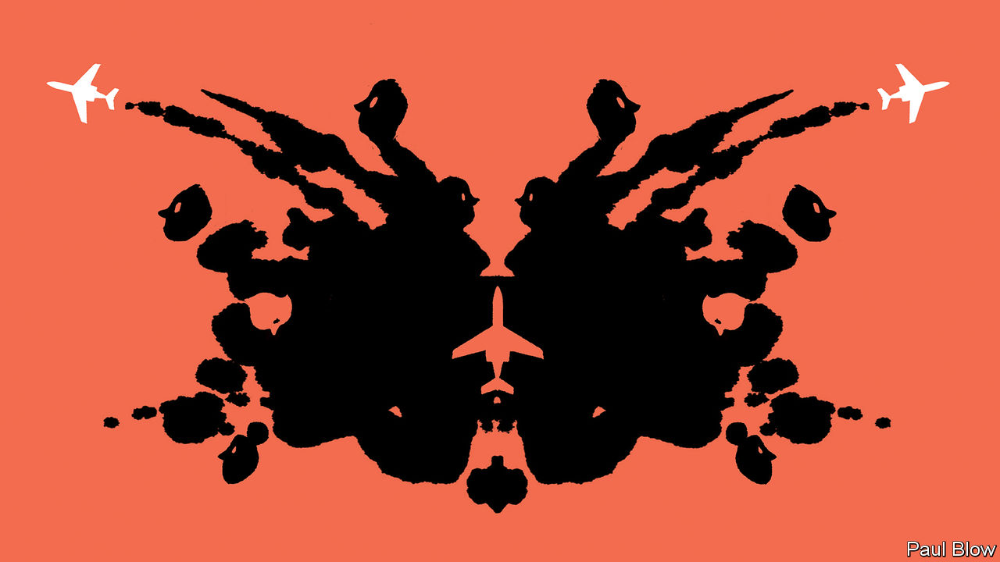

###### Bartleby

# Corporate jets: emblem of greed or a boon to business? 

##### The planes are a shortcut for testing someone’s gut instincts on management 

 

> Jun 9th 2022 

The original Rorschach test involves showing a series of ten inkblots to someone, and asking them what images they see. Although the test’s psychological validity is debatable, no one can dispute its wild success as a metaphor: a single object can mean very different things to different people. In business a prime example of Rorschachiness is the corporate jet. Depending on your perspective, it can signal untrammelled greed, rational decision-making, post-pandemic work habits or the fight against climate change. 

Those who see excess regard the company jet as the worst in a pile of gold-plated perks for overpaid executives. While minions reacquaint themselves with airport queues and the curse of six hours next to the chatty stranger in 24a, bosses skip the lines and travel in luxury. It is difficult to remain grounded in these circumstances. ey, a global accounting firm, reportedly calls its plane “”; on touchdown, auditors doubtless fantasise about radioing that “the eygle has landed”. If jets were used only for work trips, that would be bad enough. But more than half of the ceos of a 500-strong group of companies monitored by Equilar, an analytics outfit, made use of their firm’s jet for personal purposes in 2020. 

This view equates the company plane with entitlement and waste. The bosses of America’s big carmakers were excoriated for using their jets to travel to Washington, dc, to ask for a bail-out during the financial crisis in 2008. Disquiet about his use of Credit Suisse’s private jet was one reason why António Horta-Osório resigned as chairman of the Swiss bank earlier in the year. When Jeff Immelt, a former chief executive of ge, travelled on the firm’s private plane, a second one would sometimes follow him around the world as backup. Mr Immelt’s successor, John Flannery, made a point of putting ge’s jets up for sale when he took over in 2017. A research study from 2012 found that cost-conscious private-equity firms reduced corporate-jet fleets at firms they had acquired. 

If the corporate-jet inkblot spells excess to some, to others it represents hard-headed pragmatism. The personal safety of top executives is one consideration: private aircraft are a big part of Meta’s outsized spending ($27m in 2021) on the security of Mark Zuckerberg, its chief executive. So is privacy: it is really hard to finalise a secret takeover when there is a stranger spilling pretzels on you. (Both of these arguments are slightly weakened by the scraping of air-traffic data that lets people track specific aircraft; a paper published last year described a machine-learning algorithm designed to predict where a corporate jet is going to land while it is still in the air.) 

Above all, chief executives are busy people. If boards would rather they spent more time working and less time watching someone repack their suitcase at the security gates, that’s their call. And because private jets can land on more airfields than commercial airliners can, they are often the only way for executives to travel directly from headquarters to factories and subsidiaries in less accessible locations. A paper published in 2018 by academics at Boston College and Drexel University found that business-related flights of this kind improved firms’ operational performance. 

Some look at corporate jets and primarily see an enemy in the fight against climate change. Because of the small number of passengers on board, private planes emit much more carbon per passenger mile than commercial flights do. Elon Musk, a clean-tech tycoon who is fast becoming a Rorschach test in his own right, was pilloried recently when his jet took a nine-minute flight from San Jose to San Francisco. Mr Musk is also an outspoken critic of remote work, which is another thing that private jets bring to mind. The argument for using them rests heavily on the importance of in-person communication, something that has become a lot more contentious in the post-pandemic workplace. 

The point of the Rorschach test is that it has no single right answer. Corporate jets look unjustifiable to some and sensible to others. They can improve productivity or be a sign of an out-of-control ceo; the paper from 2018 found that planes made more flights to resorts when a firm’s boss had been in place for longer and when it had dual-class shares. They raise questions of fairness among critics and spell efficiency to defenders. They have become a useful shortcut for testing someone’s gut instincts on management, as well as for beating the queues. 


