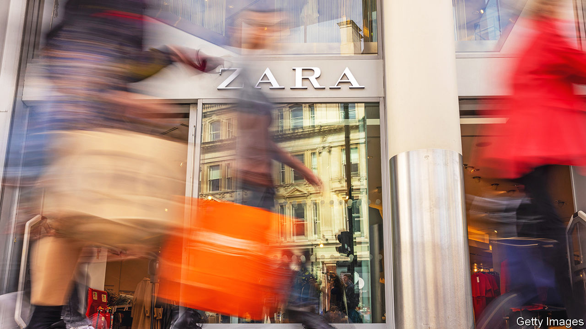

###### A pretty picture

# Fast fashion is in party mode 

##### Next up: the inevitable hangover 

 

> Jun 9th 2022 

“For the last two months it has been busy like the weekend every day,” sighs a sales assistant at a large Zara store on Tauentzienstrasse, a shopping street in the centre of Berlin. On the Tuesday after the long Pentecost weekend about a dozen ladies were queuing for the fitting room, each carrying several items, many of them in hot pink or canary yellow, colours  this season. They don’t seem to be deterred by Zara’s higher garment prices. At least not yet.

Shoppers are still “revenge buying” to make up for all the time when shops were closed and socialising banned amid waves of covid-19. After grafting pajama bottoms onto their legs over the past two years, buyers are snapping up office and party wear. On June 8th Inditex, which own Zara, Bershka and Massimo Dutti, among other brands, reported glittery results for its latest quarter. Revenues rose by 36% year on year, to €6.7bn ($7.2bn), surpassing levels before the pandemic. Net profit jumped by 80% year on year. Online sales dipped compared with the same period in 2021, when the internet was the only place to shop for clothes owing to lockdowns in America and Europe. But the decline of 6% was much slower than expected, which suggests that people have got used to buying garb on the internet. In another boost, China is reopening after the latest bout of lockdowns. Only four of Inditex’s Chinese outlets remain closed, down from 67 in the three months to April. h&amp;m, Inditex’s Swedish fast-fashion rival, is expected to report similarly perky results on June 15th.

The big question for Óscar García Maceiras, who took over as chief executive of Inditex in November, and his opposite numbers at other fast-fashion firms, is whether the party can last. The short answer is that it probably won’t. But if anyone can keep it going for a bit longer, it is Inditex. As Georgina Johanan of JPMorgan Chase, a bank, notes, the Spanish giant looks best-placed to withstand the combined pressures of war, competition, inflation and, possibly, recession. 

Start with the problems. Fast-fashion firms had to put a complete halt to their operations in Russia and Ukraine after Vladimir Putin invaded his southern neighbour in February. Inditex, which has more than 500 shops in Russia, derived 8.5% of its operating profit from the country in 2021. This year it has had to make a €216m provision for the estimated cost of the war to its Ukrainian and Russian businesses. 

Beyond eastern Europe, fashion retailers are being squeezed by competition from Shein, an online-only challenger from China that has sashayed into Western wardrobes in the past few years. And then there is the twin “stagflationary” challenge of higher costs and flagging demand. This is acute for clothes pedlars, since many of their customers have already replenished their closets—and a new pair of trousers is a less urgent need than energy, food and rent, all of which have been getting pricier.

No fast-fashion house is immune to these forces. But with the exception of the Russia-Ukraine war, Inditex does look less vulnerable than the others. Shein, whose items sell for an average of $20 or so, poses less of a direct threat to the Spanish company’s mid-market frocks, which go for just under $40 at Zara, according to estimates by Anne Critchlow of Société Générale, a bank. In recent years Inditex has also done a better job than its rivals of unifying its online operations with its more than 6,000 shops around the world, thanks to clever radio-frequency trackers, an in-house digital platform and a group-wide inventory database. 

Crucially, Inditex enjoys one more advantage over rivals when it comes to inventory, the management of which is particularly important in times of stagflation. The company produces around two-thirds of its items in Europe or in nearby north Africa and Turkey. That allows it to adjust output more quickly in response to demand than firms like h&amp;m, which sources 80% of its clothes from Asia. In a slowdown it pays to be faster in fast fashion. ■


