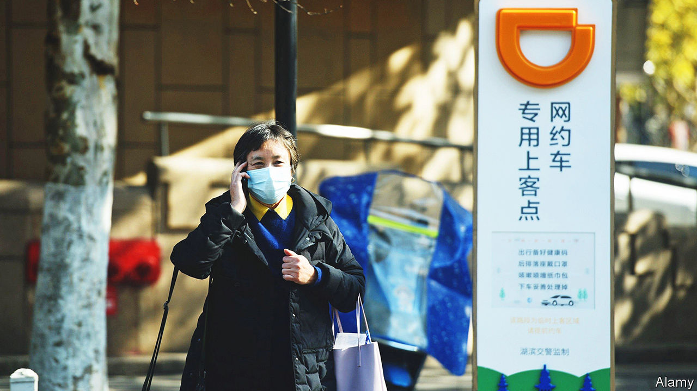

###### Alive. Unwell?

# The Communist Party resuscitates Didi Global 

##### Will investors forget about its near-death experience? 

 

> Jun 9th 2022 

Didi global ought to be dead. Over the past year the Chinese government has stopped the domestic ride-hailing giant from signing up new users and launched a cyber-security investigation into its operations, days after its $4.4bn initial public offering in New York last June. In a seemingly fatal blow, Didi is being forced to delist from America but blocked from relisting in Hong Kong. That the company has not collapsed is a testament to the strength of its business. Its future survival—and that of other Chinese tech darlings—remains in the gift of the Communist Party.

The probe into Didi is expected to wrap up shortly and on June 6th the  reported that the firm will soon be able to take on new customers. The news propelled Didi’s share price up by 60%. It still faces an investigation in America, where it is alleged to have underplayed regulatory risks in its domestic market, and investors are suing it on similar grounds. But these problems seem piffling next to what it has soldiered through at home.

The first sign that the Communist Party’s two-year campaign against big tech would ease came in March from Liu He, a top economics adviser to President Xi Jinping. In May Mr Liu met a handful of tech executives and spoke of supporting the digital economy and balancing the relationship between state and market. The potential resumption of Didi’s business in China is one sign that things are indeed normalising. Some large tech platforms’ first-quarter results were also better than expected. Meituan, a delivery super-app, said on June 6th that revenue grew by 25% year on year in the first three months of 2022. 

Yet China’s tech companies are returning to a very new normal. Its two mightiest tech titans, Alibaba and Tencent, are growing much more slowly than in the past. Room to expand into new areas beyond their core businesses (e-commerce, and social media and video-gaming, respectively) has all but vanished. Outspoken entrepreneurs such as Jack Ma, Alibaba’s co-founder, are a thing of the past. Tech executives instead parrot official lines about ending their industry’s “reckless expansion” (which has also meant laying off tens of thousands of employees). And the state is taking direct stakes in their firms.

Not long ago global investors shuddered at the prospect of state ownership. Now some are coming around to the idea. When Bloomberg reported on May 27th that faw, a state-run carmaker, was planning to buy a large stake in Didi, the ride-hailer’s share price surged by 10%. A big state investor such as faw could help Didi navigate compliance and governance issues, explains Cherry Leung of Bernstein, a broker. State investors have been eyeing the consumer-lending and credit-scoring businesses of Ant Group, Alibaba’s financial affiliate at the heart of the techlash. 

Once viewed as a drag on profitability, backing from a powerful government group is increasingly seen as a precondition for big tech firms to remain going concerns. It may be the only way for companies that have fallen foul of Mr Xi, and his grand plan for achieving “common prosperity” in China, to stay alive. Investors appear happy to forget about Didi’s death throes now that the firm has been resuscitated. They would be wise to remember that China’s leader has changed his mind before—and could do so again. ■


