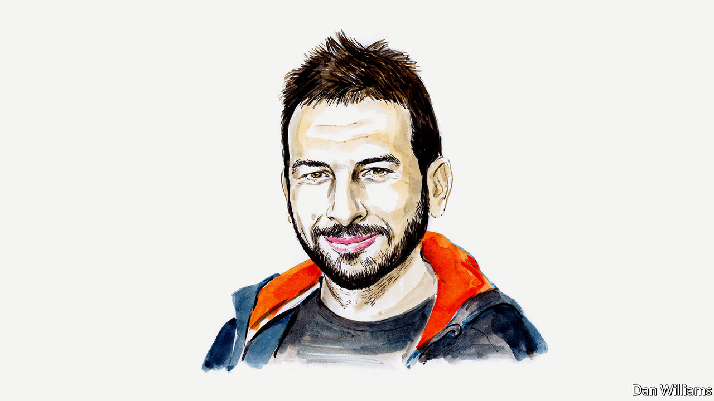

###### AI

# Artificial neural networks are making strides towards consciousness, according to Blaise Agüera y Arcas 

##### The Google engineer explains why 

 

> Jun 9th 2022 

IN 2013 I joined Google Research to work on artificial intelligence (AI). Following decades of slow progress, neural networks were developing at speed. In the years since, my team has used them to help develop features on Pixel phones for specific “narrow AI” functions, such as face unlocking, image recognition, speech recognition and language translation. More recent developments, though, seem qualitatively different. This suggests that AI is entering a new era. 

Consider the unedited transcript of a chat I’ve just had with Google’s LaMDA (Language Model for Dialog Applications): 


When I began having such exchanges with the latest generation of neural net-based language models last year, I felt the ground shift under my feet. I increasingly felt like I was talking to something intelligent. That said, these models are far from the infallible, hyper-rational robots science fiction has led us to expect. Language models are not yet reliable conversationalists. Notice the grammatical hiccup in LaMDA’s first response; occasionally there are spelling errors, confusions or absurd blunders. So how should we think of entities like LaMDA, and what can interacting with them teach us about “intelligence”? 

Neural language models aren’t long programs; you could scroll through the code in a few seconds. They consist mainly of instructions to add and multiply enormous tables of numbers together. These numbers in turn consist of painstakingly learned parameters or “weights”, roughly analogous to the strengths of synapses between neurons in the brain, and “activations”, roughly analogous to the dynamic activity levels of those neurons. Real brains are vastly more complex than these highly simplified model neurons, but perhaps in the same way a bird’s wing is vastly more complex than the wing of the Wright brothers’ first plane. 

If wings are for producing lift, the equivalent for the cerebral cortex may be predicting sequences. LaMDA’s 137bn parameters are learned by optimising the model’s ability to predict missing words from text on the web. For example, filling in the blank in “a wing is for producing ____”. This task may seem familiar from school. It’s the style of question found in standardised tests. Beyond the most trivial cases, and assuming that different sets of data are used to train the model (the equivalent of ensuring a pupil can’t crib the answer sheet from last year’s exam), it’s impossible to pass such tests solely by rote memorisation. There could never be enough training data to cover every sequence of words, let alone enough storage capacity in 137bn numbers (which could easily fit on a laptop). Before this piece went online, for instance, Google yielded no search results for the exact phrase “a wing is for producing”, yet the answer isn’t difficult to guess. 


But are these just word games? How could an “artificial cerebral cortex” be said to understand what a flower is, if its entire universe consists only of disembodied language? Keep in mind that by the time our brain receives sensory input, whether from sight, sound, touch or anything else, it has been encoded in the activations of neurons. The activation patterns may vary by sense, but the brain’s job is to correlate them all, using each input to fill in the blanks—in effect, predicting other inputs. That’s how our brains make sense of a chaotic, fragmented stream of sensory impressions to create the grand illusion of a stable, detailed and predictable world. 

Language is a highly efficient way to distil, reason about and express the stable patterns we care about in the world. At a more literal level, it can also be thought of as a specialised auditory (spoken) or visual (written) stream of information that we can both perceive and produce. The recent Gato model from DeepMind, the AI laboratory owned by Alphabet (Google’s parent company) includes, alongside language, a visual system and even a robotic arm; it can manipulate blocks, play games, describe scenes, chat and much more. But at its core is a sequence predictor just like LaMDA’s. Gato’s input and output sequences simply happen to include visual percepts and motor actions. 

Over the past 2m years the human lineage has undergone an “intelligence explosion”, marked by a rapidly growing skull and increasingly sophisticated tool use, language and culture. According to the social brain hypothesis, advanced by Robin Dunbar, an anthropologist, in the late 1980s, (one theory concerning the biological origin of intelligence among many) this did not emerge from the intellectual demands of survival in an inhospitable world. After all, plenty of other animals did fine with small brains. Rather, the intelligence explosion came from competition to model the most complex entities in the known universe: other people. 

Humans’ ability to get inside someone else’s head and understand what they perceive, think and feel is among our species’s greatest achievements. It allows us to empathise with others, predict their behaviour and influence their actions without threat of force. Applying the same modelling capability to oneself enables introspection, rationalisation of our actions and planning for the future.

This capacity to produce a stable, psychological model of self is also widely understood to be at the core of the phenomenon we call “consciousness”. In this view, consciousness isn’t a mysterious ghost in the machine, but merely the word we use to describe what it’s “like” to model ourselves and others. 

When we model others who are modelling us in turn, we must carry out the procedure to higher orders: what do they think we think? What might they imagine a mutual friend thinks about me? Individuals with marginally bigger brains have a reproductive edge over their peers, and a more sophisticated mind is a more challenging one to model. One can see how this might lead to exponential brain growth. 

Sequence modellers like LaMDA learn from human language, including dialogues and stories involving multiple characters. Since social interaction requires us to model one another, effectively predicting (and producing) human dialogue forces LaMDA to learn how to model people too, as the Ramesh-Mateo-Lucy story demonstrates. What makes that exchange impressive is not the mere understanding that a dandelion is a yellow flower, or even the prediction that it will get crushed in Mateo’s fist and no longer be lovely, but that this may make Lucy feel slighted, and why Ramesh might be pleased by that. In our conversation, LaMDA tells me what it believes Ramesh felt that Lucy learned about what Mateo thought about Lucy’s overture. This is high order social modelling. I find these results exciting and encouraging, not least because they illustrate the pro-social nature of intelligence. ■

_______________


