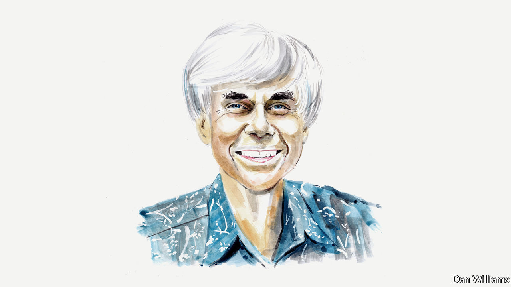

###### AI

# Artificial neural networks today are not conscious, according to Douglas Hofstadter 

##### The American cognitive scientist explains why not, despite their extraordinary accomplishments 

 

> Jun 9th 2022 

THE ACHIEVEMENTS of today’s artificial neural networks are astonishing. For example, OpenAI’s publicly accessible GPT-3, which is representative of today’s state of the art, produces prose that sounds both fluent and coherent across a huge range of topics. Cars now drive themselves in complicated traffic situations. Robots load and unload dishwashers without chipping a cup. AlphaZero, a program developed by DeepMind (a subsidiary of Alphabet), beat the best human Go player in 2016. Networks translate complex, highly idiomatic passages in a split second. They predict protein-folding better than human experts. Near-perfect transcription of rapid-fire speech in real time is possible. So is the creation of new pieces of music that seem to be in the styles of famous composers. 

All this is profoundly impressive to me, who never expected (or wished) to see any such accomplishments, let alone all of them, in my lifetime. Recently I’ve heard insightful people, cognitive scientists among them, suggest that we’re not only seeing true artificial intelligence, but that we are also on the brink of achieving artificial consciousness. 

Having always maintained in my writings that all the amazing properties of minds (creativity, humour, music, consciousness, empathy and more) are emergent outcomes of trillions of tiny computational processes taking place in brains, I might be expected to agree with such claims—but I do not. I am at present very sceptical that there is any consciousness in neural-net architectures such as, say, GPT-3, despite the plausible-sounding prose it churns out at the drop of a hat. Let me explain my viewpoint through a few examples. 

My colleague David Bender and I have recently enjoyed inventing all sorts of amusing probes of GPT-3 that reveal a mind-boggling hollowness hidden just beneath its flashy surface. Consider these sample exchanges: 


I would call GPT-3’s answers not just clueless but cluelessly clueless, meaning that GPT-3 about what it is saying. There are no concepts behind the GPT-3 scenes; rather, there’s just an unimaginably huge amount of absorbed text upon which it draws to produce answers. But since it had no input text about, say, dropping things onto the Andromeda galaxy (an idea that clearly makes no sense), the system just starts babbling randomly—but it has no sense that its random babbling is random babbling. Much the same could be said for how it reacts to the absurd notion of transporting Egypt (for the second time) across the Golden Gate Bridge, or the idea of mile-high vases. 

People who interact with GPT-3 usually don’t probe it sceptically. They don’t give it input that stretches concepts beyond their breaking points, so they don’t expose the hollowness behind the scenes. They give it easy slow pitches (questions whose answers are provided in publicly available text) instead of sneaky curveballs. Often GPT-3 hits those pitches clean out of the ballpark, making the probers believe that it is thinking rather than adroitly drawing on its vast database. 

This is not to say that a combination of neural-net architectures that involve visual and auditory perception, physical actions in the world, language and so forth, might not eventually be able to formulate genuinely flexible concepts and recognise absurd inputs for what they are. But that still wouldn’t amount to consciousness. For consciousness to emerge would require that the system come to know itself, in the sense of being very familiar with its own behaviour, its own predilections, its own strengths, its own weaknesses and more. It would require the system to know itself as well as you or I know ourselves. That’s what I’ve called a “strange loop” in the past, and it’s still a long way off. 

How far off? I don’t know. My record for predicting the future isn’t particularly impressive, so I wouldn’t care to go out on a limb. We’re at least decades away from such a stage, perhaps more. But please don’t hold me to this, since the world is changing faster than I ever expected it to. ■

_______________


