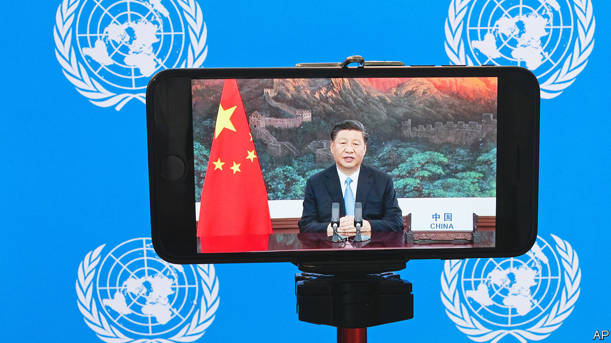

###### A new challenge to the West

# China’s Global Development Initiative is not as innocent as it sounds 

##### Western countries are wary of the plan—and they should be 

 

> Jun 9th 2022 

It is nearly nine years since China’s president, Xi Jinping, began to unveil his first plan for global development. It was revealed in stages, in vague language that conveyed little of what was eventually to become a splurge of infrastructure-building across the world costing hundreds of billions of dollars. Poor countries were delighted; the West grew unnerved. But the Belt and Road Initiative (bri) has hit a few potholes. Covid-19 has taken a toll on debt-laden borrowers. Credit from China has shrunk. So Mr Xi has hatched a new idea. He calls it the Global Development Initiative (gdi), involving less concrete and more greenery. The West will still be wary.

China’s promotion of the gdi suggests how much more confident it has become on the world stage since the bri’s low-key birth, less than a year into Mr Xi’s rule. Unlike the bri, which was pieced together from speeches given by Mr Xi in Asian capitals late in 2013 and took months even to acquire a simple name, the gdi was declared with fanfare—labelled from the start as an initiative with a capital “I”. It was announced by Mr Xi in September in a video address to the un General Assembly. He billed it as a response to the “severe shocks” caused by the pandemic. State media hailed the idea as China’s “golden prescription for global challenges”. 

As the bri was at the beginning, the gdi is, for now, not much more than a broad-brush vision. Officials say it will give new impetus to un members’ uphill struggle to achieve the Sustainable Development Goals for 2030 that they agreed on seven years ago. These cover a wide range of aspirations, including ending poverty and hunger, ensuring everyone has access to affordable clean energy, reducing inequality and cutting pollution. 

Covid has made fulfilling many of these goals even harder. But China has not explained exactly how it will help, nor suggested how much it is willing to spend. It says it is open to others’ ideas for specific projects. Mr Xi made only a couple of commitments in his speech at the un. He promised his country would not build more coal-fired power plants abroad (it had been fond of these) and pledged to give an additional $3bn in aid to poor countries to help them fight covid and recover from the pandemic. 

But Chinese officials clearly regard the gdi as a project of huge importance. State media still gush about the bri, the pursuit of which was written into the Communist Party’s charter in 2017 as one of its pledges. It is not being discarded. The gdi, though, is gaining much attention, too. Official newspapers call it an “expansion” of the bri, and, like the bri, a manifestation of “Chinese wisdom”. 

Mr Xi has been pushing the idea hard. He routinely raises the gdi in conversations with foreign leaders, appealing for their support. Chinese diplomats endlessly tout its virtues. They eagerly proclaim the latest tally of the number of countries that back it: about 100 so far (compared with about 150 that have signed up to the bri). Half of them are members of a group that China launched in January at the un called the Friends of the Global Development Initiative. Last month China’s foreign minister, Wang Yi, told them that his country would soon roll out “a host of practical measures” to enact the scheme. He said China would arrange a “high-level meeting on global development at a proper time”. This implies that China aims to gather world leaders to discuss the gdi. 

Western countries, however, are leery of the scheme. The bri has presented them with enough of a challenge. Its association with debt problems and its obvious political aim of boosting Mr Xi’s prestige and China’s diplomatic clout are among several drawbacks that have deterred most Western governments from signing up. 

The gdi may be less focused than the bri on building costly infrastructure, and more seemingly in tune with the Sustainable Development Goals, which the West has endorsed, too. But it also carries much political baggage. State media describe it in ways that suggest it is part of a struggle: an attempt to push back against Western notions of development, which emphasise enhancing human rights as well as securing economic progress. 

Depends on your meaning

China talks up human rights, too, but its definition of the term is idiosyncratic. It says that economic advancement is itself a human right and that getting richer is a precondition for enjoying other human rights. It calls for “people-centred” development, by which it means a kind that focuses on people’s material needs. When China’s ambassador to the un, Zhang Jun, said in January that the gdi was sure to make an “important contribution to the international human-rights cause”, he did not mean that China would promote free speech or the right to vote. 

In the West, China’s efforts to promote the gdi will not be helped by its link with another project, the Global Security Initiative. Mr Xi presented this in April at the Boao Forum for Asia, a gathering in China of foreign and Chinese businesspeople, academics and officials. Chinese media call the schemes Mr Xi’s “two big initiatives” of recent months. The latest one was clearly a response to the war in Ukraine. Mr Xi told the delegates that security was a “precondition” for development. He said it should involve respecting countries’ sovereignty, but in a dig at nato he also said countries should take others’ “legitimate security concerns” seriously and reject any “cold-war mentality”—a veiled reference to the West’s defence alliances and its pressure on China over human rights. 

China may have hoped that its choice of an anodyne name for the gdi—one sounding like it was thought up by a sleepy un bureaucrat—would help to blunt criticism. With the bri, naming had proved a problem. To Western ears, “One Belt, One Road”, as it was originally called, sounded inflexible: a China-centric view of how the world’s infrastructure should be built. Apparently to help allay such concerns, the English name was changed in 2015. In Chinese, it remained the same.

But Chinese commentators describe the gdi in ways that make it sound as much a demonstration of China’s global stature as an attempt to improve people’s lives. In a party journal, a senior official from the , the party’s main mouthpiece, said the initiative was a “rejection of self-centredness”, but added: “It is China’s choice for improving global governance.” The initiative, the author wrote, was passing on “China’s outstanding traditional culture”. The article also linked the gdi to China’s political ideology, saying it was using “the basic principles of Marxism” to “interpret the times, lead the times, and answer the problems of China and the times”. , another official journal, said the gdi was upholding the party’s “original mission”: a reference to one of Mr Xi’s catchphrases about the party’s role as a leader of economic and social development. 

To many poor countries, desperate for help after being hammered by covid, such ideological tinges may not matter much. Richard Gowan of International Crisis Group, a think-tank, says such countries may regard China as helpfully “filling a space” from which Western donors will retreat as they focus on the crisis in Ukraine. For its part, China may have seen poor countries’ anger over the West’s failure to do more to deliver covid vaccines to them as “an opening” for its gdi push, says Sarah Cliffe of New York University’s Centre on International Co-operation. 

That little is so far known about what China plans to do with its gdi may not matter either. The bri initially caused much puzzlement in the West, before emerging as China’s biggest ever building spree abroad. The gdi is unlikely to involve anything like as much money as the bri—not least given the parlous state of China’s economy as the country struggles to crush covid. But its close link with Mr Xi means that bureaucrats will scrabble in the coming months to flesh out the idea. 

Competition with the West will spur them on. Yu Jie of Chatham House, a think-tank in London, sees the scheme in part as a response to the West’s efforts to challenge the bri with its own infrastructure-building schemes such as the Build Back Better World plan announced by the g7 in June last year. Chinese officials say that by proposing the gdi, Mr Xi is giving developing countries more of a say in their affairs. The battle lines are being drawn. ■

