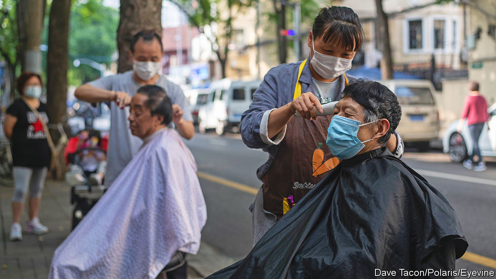
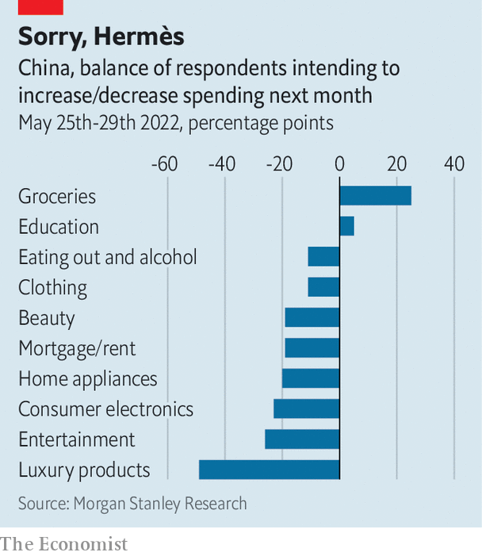

###### Locked down and pent up

# It will take time for China’s consumers to recover from lockdown 

##### Some lost consumption will be lost forever 

 

> Jun 9th 2022 

In april 2020, just after China’s first wave of covid-19 had passed, Hermès opened a new 511-square-metre shop selling luxury bags, scarves and jewellery in Guangzhou, the capital of Guangdong province. The store described itself as “minimalist”. The response to its opening was anything but. Shoppers spent at least 19m yuan ($2.7m) on the first day, according to . One customer (the last to leave) posted online a photo of herself filling the boot of her car with shopping bags. She could not remember if she had spent 930,000 yuan or 960,000. 

The Guangzhou store’s big day is a widely cited example of “revenge spending” in the wake of a lockdown. The term refers to the tendency of consumers to splash out after a period of enforced abstinence—overspending in an attempt to “get even”, hedonically if not financially. As Shanghai emerged from its long lockdown on June 1st, queues formed outside an even bigger Hermès store in China’s financial hub. That raised hopes that shops in the city could benefit from pent-up demand.

There is no universally accepted definition of revenge consumption. It can refer to what people buy (expensive indulgences), why they buy it (to alleviate feelings of boredom, depression or helplessness), or how much of it they buy. In principle, spending must not only get back to normal but exceed it. Indeed, to exact full revenge, the excess spending after lockdown should offset the shortfall during it. 

In Shanghai’s case, that is a tall order. Retail sales fell by almost half in April, compared with a year earlier. From that low point, sales would have to grow by almost 100% merely to get back to normal. For sales to exceed normal by as much as they fell short of it during the lockdown, they would have to grow by roughly 200% from trough to peak.

In some categories of spending, such as cars, refrigerators and other “durable” consumer items, a fairly complete recovery is imaginable. Those who were not able to buy in April or May could make their purchase in the summer instead, provided they kept their jobs. That could leave annual sales close to where they would have been without the lockdown. To encourage this kind of catch-up buying, Shanghai’s government has increased the quota of new car number plates it will allow this year by 40,000. It has also offered subsidies for the purchase of electric vehicles and “smart” appliances.

But in many other categories, including services and perishable goods, consumption has been forgone, not merely postponed. “My hair has not been trimmed for three months,” said Sheng Songcheng of China Europe International Business School at an economic forum last month. “After the lockdown is lifted, it is impossible for me to trim my hair three times a month. This lost consumption will be lost forever.” The same is true of gym trips, restaurant meals and weekend revelries. People cannot have thrice as many workouts, lunches, or weekends to compensate. 

 


Since one person’s spending is another’s income, weak consumption has also hurt jobs and pay. Unemployment in China’s biggest cities now exceeds its rate in early 2020. Morgan Stanley’s survey arm, AlphaWise, asked more than 2,000 urban Chinese about their job situation. Over a quarter said they or a relative had received a pay cut in the past month. 

Moreover, the lifting of lockdown has not entirely lifted people’s fears. The consumer expectation index by the National Bureau of Statistics fell to 87 in April, by far its lowest point since the data began in 1990. (Below 100 denotes pessimism; above, optimism.) The worst reading during the pandemic’s first wave was 115. When asked about their spending plans, more people say they will cut spending than say they will increase it (see chart). The only exceptions are spending on groceries and education, as people stock up their larders and minds. There is “permanent scarring on consumer behaviour”, says Robin Xing of Morgan Stanley.

China’s state-news bulletins still dwell on covid deaths abroad. That helps cast a favourable light on China’s own containment policies, but hardly lifts the mood. Those who are no longer scared of the virus are frightened of the lockdowns that follow in its wake. In the most recent AlphaWise survey, respondents were asked to list their top concerns for the year. Forty-five percent said “a relapse of covid-19 in my community”. China has vanquished a serious Omicron wave. But the virus could still come back with a vengeance. ■


