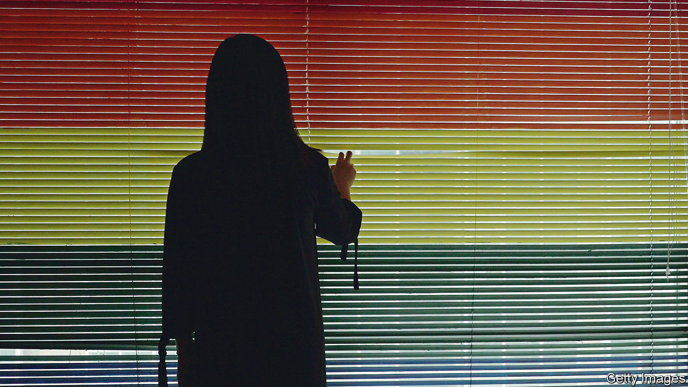

###### Pride and prejudice

# Life is getting harder for gay people in China 

##### While sexual minorities celebrate elsewhere, in China they are hunkering down 

 

> Jun 9th 2022 

“Why did I give birth to a monster?” asks the mother of Huang Shuli in his award-winning documentary short film, “Will You Look at Me”. Mr Huang, who grew up in the coastal city of Wenzhou, has filmed his mum tending her garden, picking flowers and swimming in the wild. There are several dreamy shots of her smiling when she sees him. The audio, though, is from an anguished conversation between the two about his homosexuality.

It was never easy to be gay in China, where the government cares little about the rights of sexual minorities. lgbt activists were allowed some space in the early years of President Xi Jinping’s reign, even as he crushed other parts of civil society. Last year, though, lgbt societies at several universities saw their social-media accounts closed for unspecified violations. Groups pushing for more inclusion have shut down, with members citing an increasingly hostile environment. June is celebrated as “pride month” in parts of the world, but China’s only big lgbt celebration, Shanghai Pride, has not occurred since 2020, when police interrogated several of its organisers.

State media amplify Chinese nationalists who accuse lgbt groups of serving hostile foreign forces and corrupting young people. Last year the top media regulator banned portrayals of “effeminate” and “sissy” men. This year it banned “boys’ love” dramas, a popular genre of shows featuring subtly romantic male friendships. The education ministry has called for strengthening physical education to “cultivate masculinity” and prevent the “feminisation” of boys.

These policies reflect a belief among China’s leaders that sexual orientation can be socially engineered, says Darius Longarino of Yale University. “The party is afraid that forces outside its control had been changing the cultural landscape so much that it was going to change the sexual orientation or gender of China’s youth.” Now it wants to make young people “normal” and “healthy” according to its own vision, says Mr Longarino. 

Another potential avenue is conversion therapy, which is still legal, despite the efforts of Peng Yanzi, an activist. Mr Peng voluntarily underwent hypnotism and electric shocks intended to “cure” his homosexuality. In 2014 he sued the clinic and won, receiving an apology. The ruling, which stated that same-sex attraction is not an illness, received sympathetic media coverage. For a time it seemed as if things might improve for gay people in China.

But the case did not change the law, which discounts the rights of sexual minorities. Mr Peng’s group, lgbt Rights Advocacy China, closed last year amid pressure from the authorities. Today there is much less discussion of lgbt issues. “Everyone is living in a state of silence,” says Mr Huang (who lives in New York).

His voice, though, broke through. “Will You Look at Me” was not released in China, but it has been pirated and shared online. On Douban, a Chinese film site, it has received thousands of positive reviews. ■

