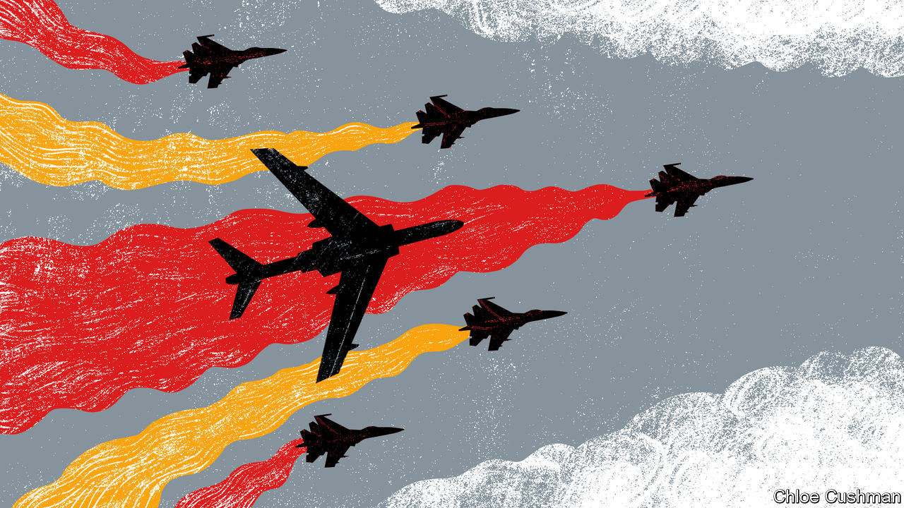

###### Chaguan

# The hotheads who could start a cold war 

##### China’s deep distrust of America and the West is making it reckless 

 

> Jun 9th 2022 

It is almost too polite to call the deepening rivalry between China and the American-led West a new cold war. The original cold war between America and the Soviet Union was grimly rational: a nuclear-armed confrontation between hostile ideological blocs which both longed to see the other fail. For all their differences, China and Western countries profit vastly if unevenly from exchanges of goods, people and services worth billions of dollars a year. Their respective leaders know that global problems from climate change to pandemics or nuclear proliferation can only be solved if they work together. Yet increasingly, interdependency is not enough to stop one side—often China, but not always—from starting reckless disputes rooted in suspicion of the other.

A dismaying case in point involves fighter jets of China’s People’s Liberation Army (pla), which have in recent months staged dangerous, high-speed passes to intimidate Western military aircraft in international airspace near China. Chinese pilots have flown so close that diplomats from America, Australia and Canada have lodged formal complaints with officials in Beijing. Western governments recall the crisis caused by a Chinese pilot who died after colliding with an American spy plane over the South China Sea in 2001. Going public, Australia’s defence minister accused a pla jet of cutting in front of one of its maritime-surveillance aircraft in the same area on May 26th, before releasing “chaff”—tiny metal-coated strips meant to confuse radar—that were sucked into one of the Australian plane’s engines. For its part, Canada accuses Chinese fighter jets of endangering one of its maritime-patrol aircraft flying out of Japan. Canadian officials note that their plane was on a month-long mission to detect North Korean smuggling, including ship-to-ship fuel transfers at sea, in support of United Nations sanctions designed to deter North Korea from developing nuclear missiles. These are sanctions that China approved as a permanent member of the Security Council. China’s actions “are putting people at risk while at the same time not respecting decisions by the un”, said Canada’s prime minister, Justin Trudeau.

These mid-air interceptions are worrying evidence of the pla’s appetite for risk. But defences offered by the Chinese government point to a still larger problem. Chinese distrust of America and its allies is so deep that the two camps do not agree about even basic principles. When America and Western powers try to discuss rules to ensure safe encounters in international waters or skies, China’s response is to growl that foreign warships and planes should stay far from its shores. Its foreign ministry, which has promoted spokespeople who thrill nationalists with shows of contempt for the West, questions the legitimacy of surveillance missions, though these are normal for advanced armed forces, as when a Chinese spy ship loitered 50 nautical miles (93km) from an Australian military communications base last month. Zhao Lijian, a pugnacious foreign-ministry spokesman, said that Australia’s aircraft “seriously threatened China’s sovereignty and security”, and called China’s response “professional, safe, reasonable and legal”. The defence ministry accused Canada of using sanctions as a pretext for “provocations against China” and noted that un resolutions on North Korea offer no mandate for anti-smuggling operations.

Take a step back, and the row reveals how China and the West doubt one another’s sincerity when it comes to ridding the Korean peninsula of nuclear weapons. The un’s nuclear watchdog, the International Atomic Energy Agency, warned on June 6th that the first North Korean nuclear test since 2017 may be imminent, noting activity at a test site. Markus Garlauskas of Georgetown University in Washington was America’s national intelligence officer for North Korea from 2014 to 2020. He calls Chinese “obstructionism” over sanctions enforcement “exactly the wrong message” to send to North Korea at such a moment. Last month China and Russia vetoed an American-drafted un resolution tightening sanctions on North Korea after it tested ballistic missiles. Western diplomats worry that a rare area of agreement with China—a shared concern about a nuclear-armed North Korea— is crumbling.

Such mistrust is mirrored in China, whose diplomats scold America for failing to offer any incentives for North Korea to return to the negotiating table, after failed summit meetings between Kim Jong Un, the North Korean leader, and Donald Trump, the president at the time. Zhao Tong, a Beijing-based disarmament expert with the Carnegie Endowment for International Peace, a research institute, reports that a growing number of Chinese scholars suspect that America “doesn’t want to resolve the North Korean nuclear problem”. Such scholars believe that America is using the threat from North Korea to rally South Korea and Japan behind its true goal, namely containing China, says Mr Zhao.

Close encounters of the reckless kind

China faces unwelcome choices, says Li Nan, an expert on North Korea at the Chinese Academy of Social Sciences. He reports that North Korean officials yearn for a cold war in Asia, believing that Russia and China would take their side, wrecking the long-standing Chinese policy of seeking balanced relations with North and South Korea, which is an important Chinese trading partner. He says that China is anxious to avoid an ideological division of Asia, which would push South Korea and Japan even closer to America. Indeed, China still supports un sanctions on North Korea, insists Mr Li. In his telling, China sees Korean disarmament as an area for co-operation with America, but is losing hope that North Korea is a priority for Joe Biden, America’s president. 

The prospect of North Korea fielding nuclear missiles that can hit far-off continents—a nightmare that brought China and the West together at the un as recently as 2017—is no longer enough to build trust. Meanwhile, the pla tries to use fear to put Western powers in their place and show that China plays by different rules. It is not a cold war yet. But hotheads are courting disaster. ■


