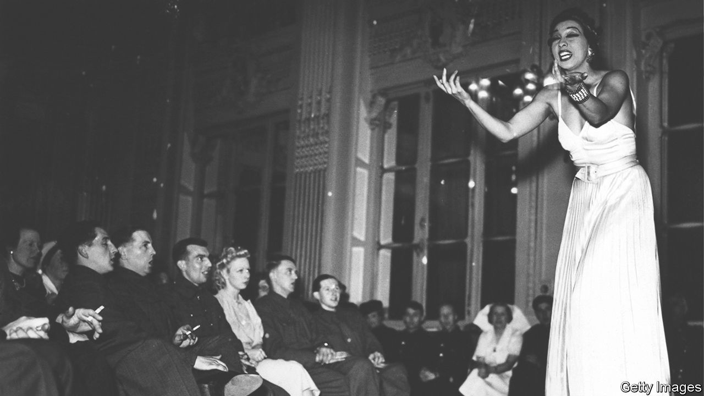

###### Singing her praises

# Josephine Baker was a true hero of the second world war 

##### She smuggled secret documents in her underwear and allowed the French Resistance to use her house 

 

> Jun 9th 2022 

 By Damien Lewis. 

In modern parlance, she was a “triple threat”. Josephine Baker could act, dance and sing—and did all three at Chez Josephine, her nightclub in Paris, and in several films. After escaping the Jim Crow South, she found fame in Europe in the period between the wars and made France her adopted home. Dancing in risqué costumes, she helped Parisians remember how to enjoy themselves. Sidonie-Gabrielle Colette, a French author, likened Baker to a “most beautiful panther”. Ernest Hemingway reckoned the performer was “the most sensational woman anybody ever saw. Or ever will.” 

Perhaps Baker should be considered a quadruple threat, as she also displayed a talent for spying during the second world war. She helped the Allies as an honourable correspondent of the Deuxième Bureau, or French military intelligence, ferrying secret documents across enemy lines. (She often pinned papers to her underclothes.) Whereas the typical agent receded into the shadows, fame was her cover. As she brassily declared: “Who would dare search Josephine Baker to the skin?” 

Her contributions to the war effort are now reasonably well known, described in numerous biographies, television series and films. Baker received the Légion d’Honneur and a symbolic interment in the Panthéon, a monument to French national heroes. But additional files on her intelligence activities were released by the French government in 2020 and are the occasion for a new book by Damien Lewis, a popular historian. “The Flame of Resistance” (to be published as “Agent Josephine” in America) is an entertaining, if occasionally breathless, account of a true hero of the second world war.

Baker’s early missions involved helping the British and French governments divine the intentions of Italy and Japan before they joined the Axis. With her easy glamour and charm, she earned the confidence of an attaché at the Italian embassy and got him talking about Mussolini’s plans to ally with Germany. Next Baker exploited a friendship with the wife of Japan’s ambassador to France to pick up titbits about that country’s intentions. Both efforts were cited in a later war decoration. 

Her most important operation was to carry a priceless cache of intelligence from Paris to Lisbon. The documents included photographs of German military equipment, lists of Abwehr agents, details on Luftwaffe airbases and plans for the German seizure of Gibraltar. Accompanying Baker was her handler—and lover—Jacques Abtey, who posed as her tour manager. Mr Lewis narrates their train rides, airplane connections and border crossings with élan. At Canfranc, where France meets Spain, Baker beguiled the station agents, who were too dazzled to search the mountain of trunks that contained documents covered in invisible ink. 

Baker lent support to the Allies in other ways, too. Her chateau in the Dordogne became an informal headquarters for the Resistance during Germany’s occupation of France. When she fell ill with peritonitis later in the war, she allowed her hospital suite to be used as a dead-drop location. After recovering, she returned to the stage to perform for Allied troops across north Africa and for prisoners at the Buchenwald concentration camp after it was liberated. She often stipulated that the crowds not be segregated by race. At all stops, her signature song was “J’ai Deux Amours”, the two loves being America and Paris. 

Mr Lewis has researched his story thoroughly over the course of a decade, and tells it like a fast-paced spy thriller. This is both praise and critique. Chapters end with cliffhangers, phoenixes rise from the ashes, and purple prose abounds (“She should be safe to weave her vital intrigue, if only she could keep the Grim Reaper at bay”). A figure as bold and underestimated as Josephine Baker needs no such flourishes. She astonishes all on her own. ■

