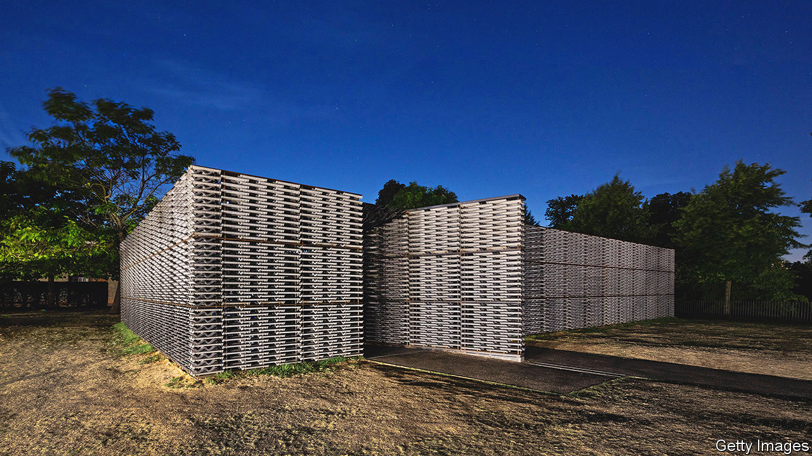

###### Hot property

# Mexico is having a moment in architecture and design 

##### Young stars, promotional initiatives and the pandemic have contributed to an ascendant cultural scene 

 

> Jun 9th 2022 

Frida escobedo’s studio in the hip neighbourhood of Juárez, Mexico City, may be modest, but her ambitions are not. In 2018 she became the youngest architect commissioned to build the Serpentine Pavilion, a temporary structure erected each year in Kensington Gardens in London. In March the Metropolitan Museum of Art in New York announced she would become the first woman to design one of its wings; she will oversee the renovation of the modern and contemporary galleries. Her work, whether at home or abroad, is inspired by her country of origin. Her pavilion (pictured) was made of tiles stacked in an alternating pattern evoking the perforated walls common in Mexico. 

Ms Escobedo is one of several Mexican designers gaining international attention. Many work across disciplines: Ms Escobedo has built furniture as well as shops, hotels and social-housing projects. Architects and artists are certain that “si, se puede hacer”—”yes, we can do it”—she says. “There is an energy, a sense of confidence, a persistence and a sense of solidarity here.” Ana Elena Mallet, a curator and lecturer at Tecnológico de Monterrey, a university, says the Mexican creative industry has been ascendant for some time. “Every X number of years there is excitement about Mexico, but this time there is more content to talk about.” 

The foundations were laid in 2000 when Mexico shrugged off more than seven decades of rule by the Institutional Revolutionary Party (pri). Under it art and culture were all about “titanic, heroic” projects, says Ms Mallet. The atmosphere was stifling. When the pri lost power, it signalled the country’s interest in a greater plurality of opinion, including over what art should be. Over time society has become more liberal, too, and women were recognised for their creative talents. Young or female architects opened their own  (practices) rather than working in the junior ranks of the office of an older, well-established man, as they might have done a generation earlier. 

Efforts to promote Mexican designers increased, led from within the industry rather than by the government. Since 2011 zonamaco design, a showcase of jewellery, textiles and furniture, has been held in Mexico City, drawing attention to the work of artisans. Boutique galleries have proliferated. In recent years new design partnerships have been established, such as the exhibitions jointly hosted by Brian Thoreen, an American artist, and Héctor Esrawe, a Mexican designer. 

The pandemic helped, too, as Mexico was one of the few countries to keep its borders open. Tourists and art lovers, especially from the United States, flocked to the country: it became a permissive, creative hub while other places were stymied by coronavirus restrictions.

Mexican universities are paying more attention to the country’s own styles. Ms Mallet says that five years ago she would not have been hired to teach the history of design in Mexico. Earlier courses covered Bauhaus and other international movements, but “now it is about recuperating the link people had lost to our history and territory,” she says. Likewise, rather than “taking objects from elsewhere, copying them, adapting them to Mexico and selling them, there is a local design culture.”

Ariel Rojo, an established industrial designer, has watched this progress unfold. Echoing Ms Mallet, he attributes the buzz to Mexican artists finding their own identity rather than replicating things done elsewhere. “What can I be as a Mexican designer in a globalised world?” he wondered. “What would have happened if the Aztecs had continued to design?” 

In his formative years Mr Rojo spent hours in the National Museum of Anthropology in Mexico City, taking inspiration from its artefacts (“but not just doing clichés like replicating skulls”). For example, a bottle he designed for Tequila Decáda, a drinks company, draws on Mexico’s history. The bottom part is a pyramid, nodding to pre-Hispanic cultures, while the top features an “X” that refers to the “x” in Mexico as well as the country’s Christian heritage. 

Architects and artists have a rich history to draw on, from ancient indigenous cultures and the colonial period, through the revolution to the present day. Modern Mexico itself is many discrete countries in one, with vast differences between northern industrial states and poorer ones in the south. Mexico’s social exigencies have helped shape the design scene, where there is a keen focus on buildings and objects being functional and cost-effective as well as aesthetically pleasing. 

Ways, shapes and forms

These factors inform Ms Escobedo’s choice of materials. “This is a country with limited resources, both for the government and among people. We have to design things that are affordable, work and will last for years,” she says. Mezcal cups made of jicama, a root vegetable native to Mexico, are dotted around her studio as small, simple reminders of this philosophy. 

Much of Mexican architecture employs concrete or (mud bricks). Many designers are using , or clay, for their items. Traditional crafts persist, from basket-weaving to , brightly coloured folk-art sculptures of fantastical beasts. Mexico boasts world-class artisans and so finding a metalworker or weaver is straightforward and often affordable. That lowers the bar to entry for newcomers.

“There is a fluidity here,” says Su Wu, an American curator and advocate of Mexico’s artists who lives in Mexico City. “You don’t have to be an architect or a designer, you can be both. There is a sense of disregard for the rules.” She reckons that what is happening shares traits with similar moments in other cities such as Berlin. But in its quality and its sense of history and tradition, Mexican craftsmanship has its own unique signature. ■

