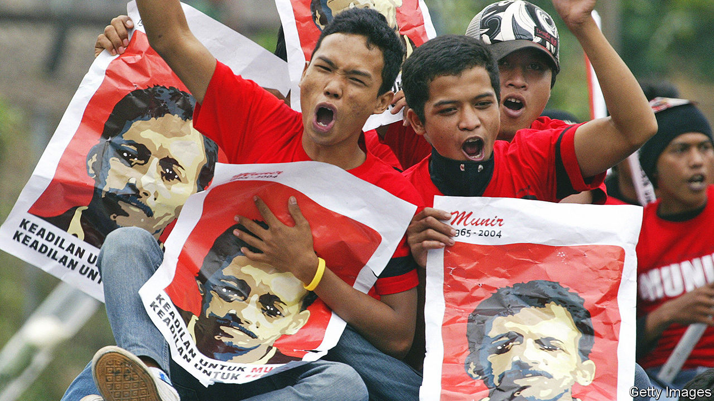

###### In the shadows

# The uphill struggle for justice and human rights in Indonesia 

##### Matt Easton’s book documents the murder of an activist in 2004 and the disputed legal process that followed 

 

> Jun 9th 2022 

By Matt Easton. 

Writers about Indonesian politics find themselves drawn irresistibly to comparisons to Javanese shadow-puppetry, and the notion of the , the all-powerful puppet-master, manipulating everything from behind the screen. The habit became ingrained during the 32-year dictatorship of Suharto, for whose ruling methods it was an excellent metaphor. He tolerated the appearance of political competition, but only so long as he could control the outcome. Nearly a quarter of a century after his downfall in 1998, the Indonesian deep state he created endures. The imagery has not grown stale.

The metaphor recurs throughout Matt Easton’s account of the efforts to bring to justice the killers of Munir, a prominent human-rights activist murdered by arsenic poisoning in 2004 while flying to the Netherlands for a course of study. The likely poisoner was identified fairly quickly, and eventually convicted. He was freed from prison in 2014, after serving eight years of a 14-year sentence, and died of covid-19 in 2020. But despite years of police investigations and special commissions of inquiry, and intensive efforts by Munir’s supporters—notably his heroic widow, Suciwati—and notwithstanding persuasive evidence that the killing was at the behest of Indonesia’s security services, nobody has been brought to justice for having planned or ordered the murder.

The book reads like a gripping legal-procedural whodunnit, as evidence is slowly unearthed from telephone records, lost documents are retrieved from deleted computer files and intriguing new witnesses emerge. As fiction the story would be profoundly unsatisfying, because it has no ending. As recent history, it is meticulous and moving.

The legal process, for all the vigour with which Munir’s supporters pursue justice, ends in near-farce. Even the prosecutors find it expedient to present the murder as an apparently motiveless personal vendetta, undermining the subsequent prosecution of an alleged instigator. In that trial, a number of witnesses withdraw their earlier evidence; the courtroom is packed with thuggish supporters of the accused senior intelligence officer, their cheers and jeers going mostly unrebuked by the judges. After the acquittal, many of those who had worked hard on the case find their careers blighted. At least five people connected to it die in mysterious circumstances.

Munir made his name as a campaigner and investigator during the unrest at the tail-end of the Suharto era, when a number of activists were abducted, some never to be seen again. His efforts to bring those responsible to account were as fruitless as those to apportion blame for the cataclysmic bloodletting across Indonesia that accompanied Suharto’s rise to power in 1965-66. Never having faced up to this mass slaughter, Indonesia still suffers its consequences. The thugs who commandeered the courtroom were from a group that emerged in 1965.

Munir was killed in the dying days of the presidency of Megawati Sukarnoputri, a former leader of the lacklustre opposition to Suharto. Two supposedly reformist successors—Susilo Bambang Yudhoyono, a former general, and Joko Widodo, a businessman and city mayor—have failed to provide the political leadership that might have emboldened the judiciary to bring the case to a conclusion. Instead they have promoted and relied on those implicated in Suharto-era atrocities.

Reflecting on this, Mr Easton aptly refers to “The Leopard”, Giuseppe Tomasi di Lampedusa’s novel of political ferment in 19th-century Sicily, and its nobleman’s lament: “If we want things to stay as they are, things will have to change.” The Indonesian elite, he notes, had made the same calculation. What seemed like a revolution in 1998 did not transform power structures; it preserved them, and the culture of impunity that protects the puppeteers. ■

