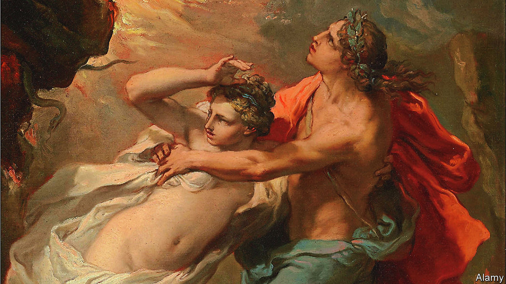

###### Back Story

# Visiting the scenes of stories is an act of imagination 

##### The true destination lies in the pilgrims’ mind 

 

> Jun 9th 2022 

As you approach the gateway to the underworld, the driving gets hairy. The clifftop road skirts ruined towers and terraces carved by desperate farmers into the barren mountains, before dead-ending at the southern tip of the Mani, the wildest part of the Peloponnese. The roar of the cicadas dies away and, on the finger of land dividing the Aegean and Ionian seas, only thorns seem to grow. Known as Cape Matapan or Cape Tenaro, this beautiful, desolate headland hosts the entrance to the kingdom of Hades. 

Or so classical authors such as Euripides implied; others put the gateway farther north in Greece, or near Naples, or on the Turkish coast. But for visitors who suspend disbelief on the path that winds from a derelict chapel to a quiet cove, this is it: the place where Heracles dragged Cerberus, the three-headed guard-dog, snarling into the light, and where Orpheus turned and lost Eurydice to the darkness for ever. 

Classical landmarks drew sightseers even before Byron set off a craze for them 200 years ago. Boosted by screen adaptations, literary tourism has since become a mass pursuit, as the post-covid holiday rush attests. Harry Potter fans are again queuing to pose beneath the sign for Platform 9¾ at King’s Cross station, whence trains to Hogwarts depart in J.K. Rowling’s books. From the mortal platforms nearby, devotees can again unravel “The Da Vinci Code” on London-to-Paris tours. On June 16th, when the action of “Ulysses” is set, Dubliners will celebrate Bloomsday—named for James Joyce’s protagonist, Leopold Bloom—in the novel’s costumes and pubs. 

A quarter of British travellers stop at bookish attractions on domestic trips, says a survey. On the face of it, the urge to follow in imaginary footsteps is odd, even irrational. Look more closely, and as well as private enthusiasms, these journeys trace the alchemical links between stories and their readers.

It is one thing to visit the spots where authors wrote and died, trekking to the Brontë parsonage at Haworth or down the causeways to Hemingway’s bolthole in Key West. Seeking out the sites of fictional marriage proposals—or ancient myths—is weirder. After all, the characters, being made up, never went there; nor, sometimes, did the authors. More eccentric still are quests to find non-existent places like Tolkien’s Middle-earth. In “Confederates in the Attic”, Tony Horwitz described tourists in Georgia searching for Tara, home of Scarlett O’Hara, though the film of “Gone with the Wind” was mostly shot in California, and Margaret Mitchell, the book’s author, made sure her plantation resembled no real ones. 

Plainly, it is easy to be snooty about literary tourism. The yen to see and touch the scenery of books can seem ploddingly literal. In their heads, it is said, everyone is the hero of their own story, but lots of people seem content to be an extra in someone else’s. Missions to track down invented figures or settings seem bound to end in disappointment—except for the entrepreneurs and marketeers who peddle Sherlock Holmes deerstalkers or guides to Jane Austen’s Bath.

The elusiveness, however, may be the point: the true destination lies in the pilgrims’ imagination. Influenced by post-structuralism, a school of criticism has from the 1960s analysed fiction in a related way, as a collaboration not a sermon. Authors, in this view, do not have godlike power to fix a work’s meaning; readers are not passive recipients but partners in creation. Barbara Schaff, an expert on literary tourists at the University of Göttingen, sees them as collaborators in “The Death of the Author” (the title of a famous essay of 1967 by Roland Barthes). The Harry Potter luggage trolley embedded in the wall at King’s Cross is, she says, “material testimony” to “the reader’s power to create the text”.

Perhaps. Another way to put it is that, for many, fiction can seem more vivid than life. Visiting the scene of a story is a means to revive its drama and resurrect its characters, freeing them from the dead, finite bounds of a book. It is a bid to expand the borders of the actual world to take in another one. It is a magic trick against reality. 

In his travelogue of the Mani, Sir Patrick Leigh Fermor placed the portal to the underworld in a phosphorescent cavern along the coast from the headland. No matter. In the cove at Cape Tenaro, hidden by an eerie burst of foliage, is a cave with an overhanging lip that suggests a giant maw. Inside is a stagnant pool and, at the back, an icky-looking recess. In the murk it is hard to see how deep it goes. Maybe all the way.


