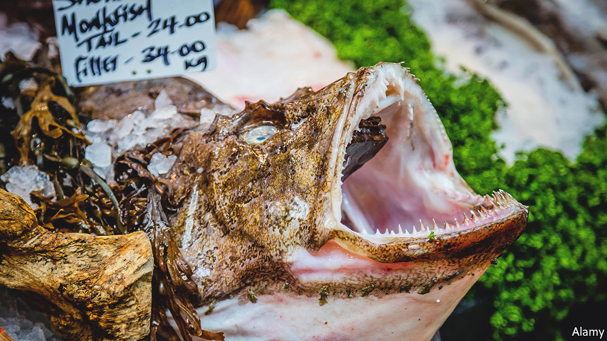

###### World in a dish

# Why everyone should eat more ugly seafood 

##### In praise of the monstrous, abundant and delicious monkfish 

 

> Jun 9th 2022 

Monkfish are low in calories and fat, packed with vitamins and have dense, firm flesh, which makes them relatively easy to cook. They can be cut into chunks, marinated with egg whites, cornflour and seasonings, then briefly blanched in boiling water. Monkfish tail can even be stir-fried without breaking apart, as more delicate fish tend to do. In fact, there is only one problem with monkfish: they are hideous. 

With their bulging eyes and wide mouths lined with rows of sharp teeth, they are nightmarish. In Dutch monkfish are called (“sea-devil”); fishermen who caught them used to throw them back. They are still usually sold without their heads, but the days of chucking them overboard are long gone. Japanese diners love the fatty liver; while Italians may still derisively call them “toad tails”, that does not stop them from eating the fish. Fishermen’s associations have been encouraging others to overcome their aversion and eat more monkfish, as well as other unsightly creatures—the better to ensure more diverse, sustainable fisheries.

There is precedent for species going from shunned to consumed. In America, lobster used to be fed to prisoners and slaves—a result of their abundance but also, no doubt, because they are difficult to eat and look rather like an inflamed cockroach. Not until the late 19th century did they become haute cuisine. Today they are so desirable that Maine, where most American lobsters are caught, puts them on its licence plates (and monkfish are known as “poor man’s lobster”).

Sometimes fashion goes the other way. Turtles were plentiful in early America, but in the 19th century they became chic: few foods were more esteemed than terrapin turtle soup. Americans ate some species of turtle—fiendishly difficult to prepare, as just looking at them might suggest—nearly to extinction. Yet today turtle-eating is more closely associated with backwoods, eat-what-you-can-catch diets than with liveried waiters.

While abundance and tricky preparation may put some diners off, easily found species that take some work to cook can be delicious. Along America’s north-west coast, advocates tout the versatility of geoduck, a species of burrowing clam with sweet, slightly chewy flesh beneath a thick skin that must be peeled, and an off-putting appearance. Catfish would probably be more popular were it not a bottom-feeder that often resembles a deranged Hercule Poirot. Its clean, neutral flavour makes it suitable for a wide range of cuisines and techniques.

Prizing the rare and beautiful over the unattractive and commonplace is hardly unique to culinary preferences. Engagement rings, after all, usually feature diamonds rather than concrete. But such narrow-minded food choices can have irrevocable consequences: the bluefin tuna and Chinook salmon may not survive human fondness for them. Better to stare into a sea-devil’s beady eyes, or get to grips with a geoduck, than to contribute to the permanent loss of a species. ■

