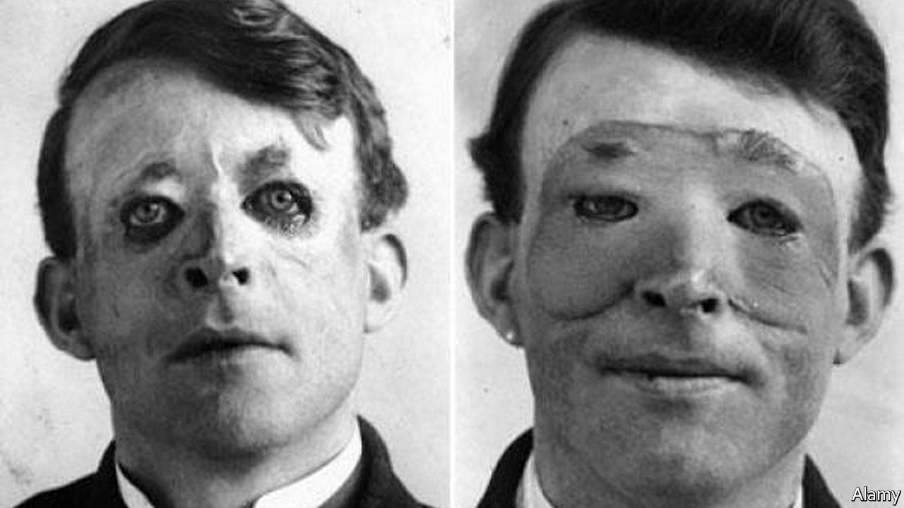

###### The history of medicine

# “The Facemaker” explores the work of a pioneering plastic surgeon 

##### During the first world war, British soldiers with facial injuries were sent to Harold Gillies 

 

> Jun 8th 2022 

By Lindsey Fitzharris. 

When you think of plastic surgery, you probably imagine the cosmetic kind. According to the American Society of Plastic Surgeons, Americans went under the knife 2.3m times in 2020 for aesthetic reasons: the most common procedures included rhinoplasties (ie, nose jobs), blepharoplasties (eyelid surgery), facelifts, liposuction and breast augmentations. Non-surgical interventions, particularly injectable dermal fillers, have also proliferated in recent years. Such beautifying efforts have a long history. Texts from ancient Egypt and India describe some early attempts at reshaping noses.

“The Facemaker”, a new book, looks at the other aspect of plastic surgery—that which focuses on reconstruction, in many cases after trauma. Lindsey Fitzharris, a medical historian, describes the pioneering work done by Harold Gillies in the early 20th century. The powerful weaponry used in the first world war, including shells, grenades, mortar bombs and automatic guns, killed millions of men. It maimed many others: as Ms Fitzharris notes, “before the war was over, 280,000 men from France, Germany and Britain alone would suffer some form of facial trauma.” Such injuries had rarely been seen before, and there was no established method for treating them. As one nurse at the time put it: the “science of healing stood baffled before the science of destroying”.

Gillies, who was born in New Zealand, studied at Cambridge University and St Bartholomew’s Hospital in London. He was particularly interested in otorhinolaryngology—today simplified as ent, or ears, nose and throat—and enjoyed a comfortable life at a practice in Marylebone before war broke out. Once hostilities began, however, he recognised the need for medical volunteers. He signed up with the Red Cross and, leaving his pregnant wife and small child behind, set off for France. 

At the front he met Auguste Charles Valadier, a Franco-American dentist who had converted his Rolls-Royce into a mobile clinic. Valadier helped rebuild soldiers’ jaws by performing bone grafts and “distraction osteogenesis”, a method still used today which involves separating bone to promote new growth. Valadier’s work demonstrated to Gillies the importance of getting the “architecture” of the face right before addressing tissue damage. Gillies also visited Hippolyte Morestin, a French surgeon skilled at both removing facial tumours and repairing the resulting disfigurement using flaps of skin.

Gillies soon became convinced of the need for a specialist maxillofacial unit in Britain, and established one first in Aldershot, then in Sidcup. Thousands of soldiers came to him with an array of ghastly injuries. (Ms Fitzharris does not flinch when describing crushed jaws, sliced noses and cheeks perforated by bullets.) Many afflictions had been made worse by hasty attempts to stitch the wound. Gillies worked carefully and was attentive to both form and function. 

He was also unfailingly kind to his patients, cognisant of the importance of an individual’s features to their sense of identity. “Don’t worry, sonny,” he would say, “you’ll be all right and have as good a face as most of us before we’re finished with you.” In the persona of “Dr Scroggie”, he encouraged his patients to break hospital rules around drinking and gambling, thereby introducing fun into the long, tedious and painful rehabilitation period.

As photographs attest, Gillies often made good on his promise. But it involved a lot of trial and error. Penicillin had not yet been discovered, and infection was a risk. Grafts sometimes did not take. Anaesthetic proved difficult to administer to those with facial injuries. Patients required multiple surgeries in order that the work could be done incrementally; Gillies removed the mirrors from his wards so that patients would not be disheartened by their appearance during the process. 

Inevitably, “The Facemaker” sometimes makes for sad reading. One young man, “Corporal X”, made an astounding recovery after shrapnel destroyed his face. But he caught a glimpse of his reflection and, appalled by what he saw, wrote a letter to his fiancée and childhood sweetheart claiming that he had fallen in love with another woman. “It wouldn’t be fair to let a girl like Molly be tied to a miserable wreck like me,” he said. “I’m not going to let her sacrifice herself out of pity.” After he was discharged, Corporal X became a recluse.

“All the time, we were fumbling towards new methods and new results,” Gillies wrote. Among his inventive techniques were “tubed pedicles”, a way of transplanting skin and soft tissues, and the “epithelial outlay”, a skin-grafting technique which allowed him to reconstruct eyelids. After the war he outlined these methods in two influential books. In 1944 he proposed a professional body for British plastic surgeons, one that would “uphold the standards” of the specialty. In 1946 he became its first president.

Ms Fitzharris might have spent more time on Gillies’s legacy and post-war career. She notes that his cousin, Archibald McIndoe, would follow him into plastic surgery and build on his maxillofacial work when treating pilots during the second world war, but does not say how. (She does acknowledge that Gillies was the first surgeon to complete a successful phalloplasty; his work formed the basis of modern gender-reassignment surgery.) But these are minor faults in an accessible book. “The Facemaker” is an engaging biography of a masterful surgeon as well as a heartening account of medical progress. ■

