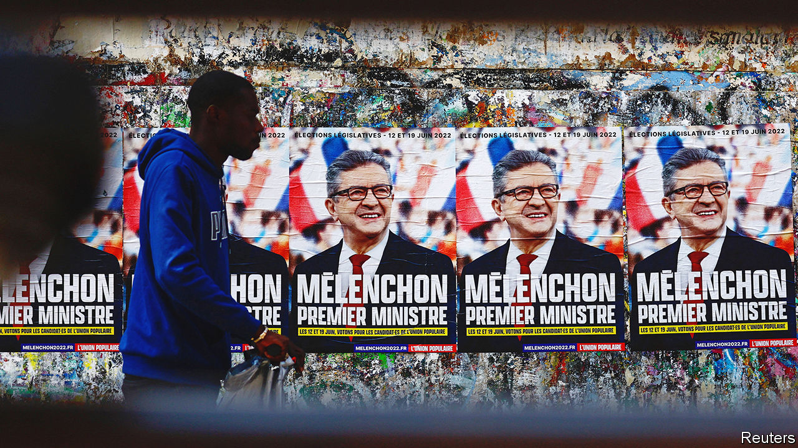
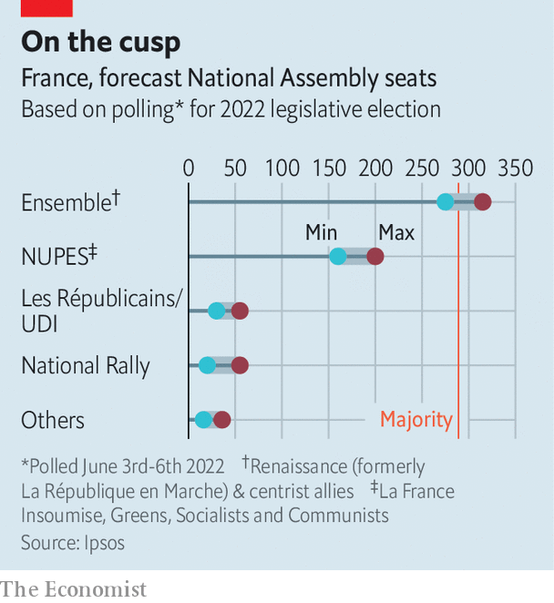

###### Damage control

# At French elections, Macron’s majority is on the line 

##### If he loses, the president will struggle to keep reforming France 

 

> Jun 9th 2022 

Five years ago, a wave of political debutants surged into the French National Assembly. A teacher from Strasbourg, an entrepreneur from Lyon, a farmer from Brittany, a fireman from western France: all these, and many more, won seats for Emmanuel Macron’s centrist party, then called La République en Marche. With allies it bagged 60% of the lower house of parliament, marking a wholesale clear-out that lowered the average age of deputies and filled the assembly with women.

Today, however, it is Mr Macron’s party that faces an insurgency at the ballot box, which could deprive the re-elected president of his majority and put a stop to any further plans for reforms. On June 12th and 19th voters will elect a new parliament. Nationally, the polls put Ensemble, Mr Macron’s centrist alliance, neck-and-neck with Jean-Luc Mélenchon’s new radical-left grouping nupes, which includes the Socialists, Communists and Greens. Under the two-round first-past-the-post system, Mr Macron’s alliance is likely to remain the biggest. nupes looks set to replace the centre-right Republicans as the main opposition, grabbing at least three times as many seats as both that party and Marine Le Pen’s National Rally. Mr Mélenchon is unlikely to win a majority. But polls suggest that the president could lose his, with a shortfall of anything from 14 to 39 seats.

By swallowing the moderate left, the 70-year-old wisecracking Mr Mélenchon, who admires Venezuela’s Hugo Chávez and wants France out of nato, has forged a potent left-wing movement that has achieved uncommon unity. It appeals in particular to the green-minded, the city-dwelling and the young: 44% of 18- to 24-year-olds back him. This time it is Mr Mélenchon who is fielding the boldest novices, including a baker in eastern France and a chambermaid near Paris. Although he is not even running for re-election, he has also deftly framed the debate around the role he fancies for himself: as Mr Macron’s prime minister. “What will you say to him when you turn up at the Elysée on day one?” asked a radio host. 

 


Sensing this threat, Mr Macron last month named as his new prime minister Elisabeth Borne, an engineer and civil servant who has built her career working for Socialist politicians. Her nomination itself will win few votes on the left, but it marks a shift after Mr Macron’s two previous prime ministers, each of whom hailed from the centre-right. Ms Borne has promised a “food cheque” for the low-paid and other measures to shield the French from inflation. The president has borrowed Mr Mélenchon’s core idea of “green planning” to underpin policymaking. Mr Macron has also named as his new education minister Pap Ndiaye, a historian who has written a lot about race and discrimination. 

Much done, much still to do

Mr Macron enjoys sweeping powers under the French constitution, including the right to pass laws with minimal parliamentary oversight and to appoint the prime minister. But, politically, he still needs a working majority to finish what he started in his first term. This includes a reform of the pension system, which would increase the retirement age from 62 years to 64 or 65. At stake in the parliamentary vote, in other words, is whether Mr Macron can continue as an economic reformer and moderniser of the French welfare state. 

The answer will be a firm no if Mr Mélenchon pulls off a surprise and secures a majority. Mr Macron has hinted that he would refuse to name him prime minister. But he would find it extremely hard not to—just as Jacques Chirac, a Gaullist, appointed Lionel Jospin, a Socialist, after losing his majority in 1997. In the job Mr Mélenchon would seek to reverse most of Mr Macron’s reforms, which have encouraged private investment and job creation. He promises, among other things, to reduce the pension age to 60 years, undo liberalising labour-market reforms, restore the wealth tax, and increase the net minimum wage by 15% to €1,500 ($1,600) a month. Two of his candidates in Paris invited Jeremy Corbyn, Britain’s radical former Labour leader, to campaign with them.

Still, the chances are that Mr Macron either holds on to a shrunken majority, which would enable him to press on, or loses it, which would spell trouble. The president would then need either to stitch together a voting majority with unallied deputies, or seek a formal coalition. Yet, having crushed the mainstream parties with his centrist bloc, Mr Macron finds himself alone against the extremes, with few options; the centre-right Republicans show little interest in helping him. 

The campaign has failed to stir enthusiasm. “People think that the legislatives are just a vote of confirmation, to give the president a majority, which isn’t very motivating,” says Mathieu Gallard, of Ipsos, a pollster. Indeed, by keeping the campaign low-key Mr Macron may have hoped to set up the vote as the natural sequel to the presidential result. Yet the upshot so far has been more of a sense of drift. This has allowed Mr Mélenchon to set the agenda, and damaging events, such as the policing fiasco at a recent European football final, to dominate. “Every seat will be a fight,” says one of Mr Macron’s deputies. The government is on the line. Ministers who fail to get elected, including Ms Borne, who is standing in Normandy, would have to go.

Mr Macron has form defeating the extremes. There is plenty to deplore in Mr Mélenchon’s manifesto, not least its pledge to breach parts of European Union law or to phase out French nuclear energy. During the presidential campaign Mr Macron clinically exposed the contradictions of Ms Le Pen’s promises. Now he needs to do the same to Mr Mélenchon’s. ■

