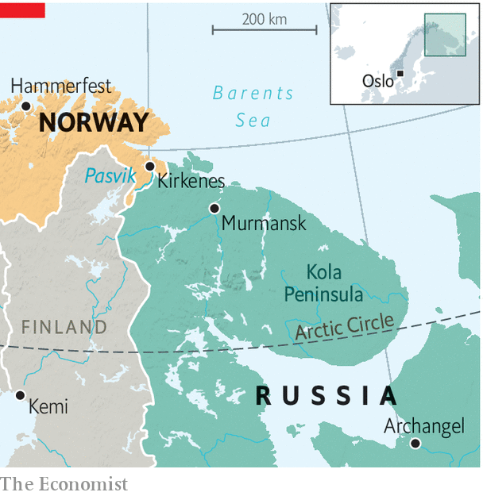

###### High noon in the High North

# The war in Ukraine is reverberating in the Arctic 

##### Russia and Western countries have stopped co-operating on scientific research 

 

> Jun 9th 2022 

“We are back to a cold-war mode,” says Jens-Arne Hoilund, Norway’s Border Commissioner. Mr Hoilund’s job is to resolve any problems that arise along his country’s short but remote border with Russia. That used to mean such things as retrieving errant reindeer that ambled into Russian territory on the far side of the icy Pasvik River in search of fresher lichen. Since March, however, contact with the other side has been minimal. “Getting back to the relationship that we had will take years,” he says. “If it is even possible.” 

The Arctic had been a rare area of successful co-operation between Russia and the West, but now the fragile system that has made it stable and predictable is under threat. “The cold winds in the north did not originate there,” quips Norway’s prime minister, Jonas Gahr Store, speaking to  from his office almost 2,000km to the south in Oslo. “No issue, no region, no matter of co-operation is unaffected by Ukraine,” he adds, “and what the full implications will be for the Arctic, we are yet to know the full extent.” 

Virtually all contact with Russia in the Arctic has now stopped. Of the eight Arctic states, five are members of nato, and two, Finland and Sweden, have now applied to join. Russia is the eighth. The Arctic Council, the main forum for dialogue among the eight, has been paused since March. The Euro-Arctic Barents Council and the Arctic Coast Guard Forum, two smaller groupings, have followed suit. Bilateral ties have not been spared, and only border crossings, search-and-rescue and fisheries are working as usual between Norway and Russia. “Invasions have ramifications far beyond the battlefield,” says Mr Store. 

In Kirkenes, the last fishing town before Russia, nerves are twitchy. Under a bright Arctic sun, a mother complains about the government in Oslo as she watches her son’s football team get battered. “They never think about us up here,” she fumes. The local economy is heavily dependent on Russia; indeed many of its street signs are bilingual. Everything from the shipyard to a cross-border ice-hockey league has been hit by the fallout from the war. “If we are not careful, we will ruin things for generations to come,” she says. “They do not have this closeness down there.” 

 


For the moment, the other Arctic states are focusing on finding a way to resume co-operation among themselves, without Russia. The Arctic is warming twice as fast as the global average and the Nordic countries, at least, consider collaboration on scientific research urgent. 

The war in Ukraine and the breakdown in Arctic dialogue could also exacerbate tensions caused by Russia’s growing military presence in the region. It has reactivated some 50 Soviet outposts in recent years, and invested in its Northern Fleet and in missiles, both nuclear and conventional, based on the Kola Peninsula, a stone’s throw from the Norwegian border. The mauling suffered by Russia’s conventional forces in Ukraine may increase the importance to Russia’s high command of its missiles in the Arctic. What this means for Russian defence planning is preoccupying Scandinavian military strategists.

Norway is also pouring money into the High North. It is building new boats and barracks and has dispatched f-35 jets into Arctic skies and Fridtjof Nansen-class frigates into the Arctic Ocean. Kirkenes is likely to see more bored conscripts wondering why everything closes at 3pm, even under the midnight sun. “We follow what happens in the air, on the surface, on the ground and even under the surface,” warns Mr Store. Norway will be “flying more and observing more”. ■


