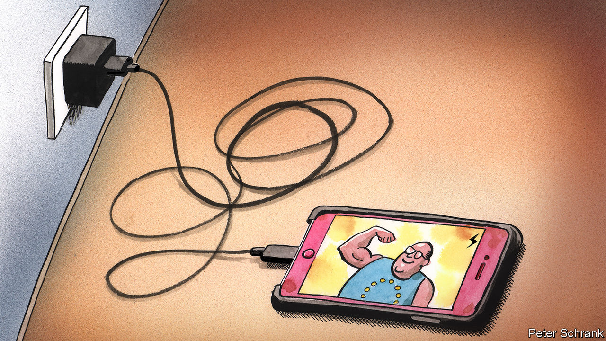

###### Charlemagne

# Tough luck for iPhone users as Europe imposes a standard phone charger 

##### Love it or loathe it, the measure will bring attention to the EU 

 

> Jun 9th 2022 

What has the European Union ever done for us? Well, the single market is jolly useful, as anyone running a business can attest. Structural funds have financed roads, electricity grids and whatnot in poorer bits of the continent. Rather urgent plans to achieve net zero carbon emissions within a generation have been hashed out at eu level, lest anyone forget. You can cross most of its borders without a passport, too, though people take them on holiday anyway. Not to mention antitrust rules devised then enforced in Brussels to prevent big firms from bilking consumers. Oh and there is peace, at least within the bloc. 

Charlemagne could go on. The problem is, few Europeans know about much of this, or give the eu credit for it. Most of what affects their daily lives—education, tax rates, housing benefits, fixing potholes—is decided by national governments or local ones. Beyond the odd summit of leaders discussing the fate of the world (or at least the euro) much of what happens in Brussels is noted primarily by policy wonks. Only occasionally does the great hulking regulatory machine there, including a 32,000-strong European Commission and 705 meps, find a way of doing something that will be both noticed by citizens and for which the eu can claim credit. One such example was agreed on June 7th: by 2024 makers of devices including smartphones and cameras will have to switch to a single type of charger mandated by Brussels. 

European plans for a common plug for electronics are nearly as old as the gizmos themselves. The idea was already floating around in 2006, before the iPhone came to market. Since then every nerd from Lisbon to Helsinki has squirreled away a box full of tangled wire, kept just in case a 12-year-old Nokia brick might need to be revived. The avoidance of such electronic waste is one putative motive for imposing a common charger. The model selected is known as usb-c, an industry standard which most manufacturers already use. The big exception is Apple, which has stuck to its own system. It will either have to make Europe-only gadgets with a usb slot (which many Apple tablets and laptops already feature) or switch over all its iPhones globally to suit the edict.

This electronic-waste line of reasoning is itself as antiquated as a flip-phone. Handset chargers used to be fist-sized bundles of metal; now they are mere cables that connect to interchangeable plug slots. Most people already have plenty of them. A mooted cut of 1,000 tonnes of binned electronics avoided per year sounds impressive, but represents about 0.002% of the global figure. Another justification put forward is the carbon footprint of chargers. Taken together, all those produced for Europeans every year will generate life-cycle emissions of around 900,000 tonnes of CO equivalent. Yet that is less than is spewed by a single Boeing jet. Expected consumer savings of €250m ($267m) a year mean each eu citizen can look forward to a bonanza of roughly €1 every two years, not much of a dent in the cost-of-living squeeze. 

The final argument is one of convenience, for firms and consumers alike. Politicians used to hesitate before telling companies and people what was good for them, even in Europe. But the eu is in a  mood these days (the official leading the charge on chargers, Thierry Breton, is the French internal-market commissioner). Companies stand accused of having failed to gauge the impact of their actions: all that outsourcing to China, say, might prove one day to be as harmful as dependence on Russian gas is today. Public money is pouring into investments, from microchips to semiconductors, which the private sector is apparently too short-sighted to back without subsidy. Spelling out to companies that designed the phones (and chargers that keep them lit) how best to do that fits that politicians-know-best mould. Needling American tech behemoths is an added bonus.

The downside of regulation seems to have been ignored. Standardising chargers might make sense if they have reached the end-state of their development, like electric plugs. But have they? Phone cables have evolved markedly within recent memory, for example when it comes to downloading data as well as juice. Now what innovation might come will have to be agreed by a technical committee that signs off on the usb standard. Apple has taken out patents on a plug-in charger that would improve the water-resistance of its devices: it may as well bin them now, at least in Europe. A similar one-size-fits-all approach will in time be applied to wireless charging, the next big thing in keeping your smartphone alive beyond 3pm. Whoever invents the best system will have to convince officialdom, not consumers, that it is indeed better. 

Battery low: connect your device

The balance between innovation and purported convenience is incidental here. What matters is that however people feel about the move, they are at least bound to notice it. In so far as Europeans hear about what Brussels has done for them, it is mostly when they cross borders. The capping of mobile-phone roaming charges agreed over a decade ago is still brought up as one of the bloc’s signature achievements (and a painful drawback for Brits as they get clobbered with enormous bills for streaming Netflix to while away the hours spent in non-eu queues at Tenerife airport). Like passport-free travel or Erasmus university exchanges, this only affects people who travel. But an eu survey commissioned to justify the end of roaming charges found that most Europeans seldom did, and over a third had never left their own country. In contrast just about everyone has an electronic device these days. 

Can Eurocrats be blamed for craving a bit of the spotlight their national counterparts enjoy? The phone-charger rule provoked more headlines than decades of sensible proposals on regulating chemicals or life insurance ever have, and for which Brussels deserves more credit than it gets. Mandating how phones are juiced is a case of the eu getting closer to the daily concerns of citizens—but also further from where it can be most useful. ■


