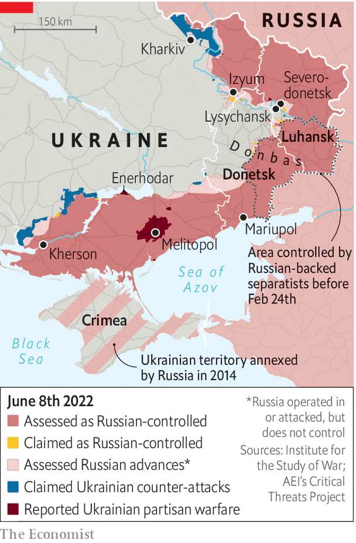

###### Hide and seek

# Ukraine’s partisans are hitting Russian soldiers behind their own lines 

##### In Russian-occupied cities like Melitopol, covert resistance continues 

 

> Jun 5th 2022 

The russians took the strategic rail-hub city of Melitopol on the third day of the war, their route apparently greased by Ukrainian turncoats. Controlling the city, a crucial segment of Vladimir Putin’s land bridge to Crimea, has proven somewhat trickier. Every few days brings a surprising report: an armoured train destroyed and a grenade attack on a command post (May 18th); railway tracks and a radar station blown up (May 22nd); a pro-Ukrainian rally (May 29th); and a collaborator’s house hit by an explosion (May 30th). Ukraine claims its partisans have killed more than 100 Russian soldiers behind enemy lines in Melitopol. “Our people are doing everything to make sure the land burns under the feet of the occupiers,” says , Ivan Fedorov, now safe in Ukrainian-controlled territory. 

Melitopol is the unofficial capital of Ukraine’s resistance. Since mid-March the war maps produced by the American-based Institute for the Study of War show it covered in stripes, meaning it is territory where partisans are active. But it is far from the only place that has seen such operations. In neighbouring , a Russian-controlled airbase has been blown up nearly two dozen times. In Enerhodar, Andrii Shevchyk, the collaborationist mayor, was the target of an unsuccessful assassination attempt. In Izyum, hungry Russian soldiers were purportedly given spiked pies by a seemingly friendly old lady, according to a telephone conversation between a Russian soldier and his girlfriend that was intercepted by Ukrainian intelligence; eight of them reportedly ended up dead. When Russians abandon tanks or petrol trucks, Ukrainian farmers tow them away. Reports of explosions at arms dumps trickle in from the occupied regions of Donetsk and Luhansk. 

 


Fires and explosions at military facilities inside Russia itself are, apparently, becoming more common. In many cases, the evidence points to poor fire safety. But Ukrainian special forces do appear to be targeting supply chains in Russia’s border provinces. On at least one occasion a helicopter struck an oil-storage facility in the Russian city of Bryansk. Officials in Kyiv refuse to comment on the operations. Speaking off the record, a tight-lipped senior intelligence officer says it would be better to speak to a priest: “This is God’s work. God is punishing the Russian Federation. Maybe not directly. Maybe not with his own hands. Maybe he has to use helicopters.”

Ukraine’s underground resistance in occupied territories is co-ordinated by a unit of its armed forces called the Special Operations Forces (sso). The division was formed in 2015 after attempts at partisan activity failed disastrously in the early stages of the war in the Donbas. A former operative in the unit, who asked to remain anonymous, says the work is split into three parts: military action, support operations and psychological warfare. “Say the task is to stop the enemy from moving more reserves to Melitopol,” he explains. “The sso assigns special forces the task of blowing up a bridge, it asks partisans to damage the railway, and it gets psy-ops [psychological operations] to print leaflets to say we’re on the watch. So in the end, only half the troops dare to come.” 

The source says his colleagues spent considerable time preparing potential partisans—“simple local people, but with a secret”—in the years leading up to the war. He refuses to go into detail about the training, but says the basics could be found in “Total Resistance”, a classic guerrilla instruction manual written in 1957 to prepare the Swiss for potential occupation by Warsaw Pact countries. A website published by the sso offers life hacks for Ukraine’s underground warriors. This includes advice about how to organise clandestine resistance (stick to a need-to-know basis), prepare an ambush (ensure clear escape routes), and cope with being arrested (keep calm and hope for the best). 

Vladimir Zhemchugov ran dozens of partisan operations for Ukraine in his native Luhansk in 2014-15, before he was maimed by a mine and captured. He says the current resistance mixes professional soldiers and volunteers “60-40, in that order”. Mr Zhemchugov, who now helps train volunteers, says Ukrainian authorities had laid down the basic structure for an insurgency in a few rushed months before the war. A network of secret arms dumps, safe houses and potential sympathisers now exists across the country; in some cases, criminal networks were co-opted. But the preparation was less thorough than it could have been. It was apparently undermined by officials who later switched to support Russia. “The security services and police proved to be our weakest link.”

As in 2014, when war erupted in eastern Ukraine, Russia’s security services appear to have got their hands on secret military databases. In Kherson, Russian officers are visiting the homes of Ukrainians who served in the army. Those who haven’t managed to switch addresses are detained, beaten, tortured or worse. “This work isn’t always good for one’s health,” says the sso source. “The risks are real and it isn’t a walk in the park.” Russia also appears to be stepping up efforts to stamp out Ukrainian resistance, increasing arrests and demonstrative punishments. But intercepts released by Ukrainian security services suggest some Russian soldiers are fearful. “Every fucking night we’re fighting with diversionary groups who come into the village,” one soldier tells his friend in a call. “Some of us have had enough. We’re getting the fuck out of here.” 

Mr Fedorov, Melitopol’s mayor, was abducted by occupying forces before being released on March 16th in a prisoner exchange. He said Ukraine’s resistance would continue to attract new recruits despite the risks. Only one in ten of Melitopol’s residents had switched to the other side, and that wasn’t a critical mass, he suggested. But the true strength of Ukraine’s resistance will be tested only in a new phase of the war: provided , Kyiv hopes to launch a counter-attack to retake the south. The tight-lipped intelligence officer predicts Ukraine’s underground army will prove to be a big asset. He suggests Vladimir Putin’s troops will be forced to beat an ugly retreat. “The Russians will be able to write another ‘War and Peace’. I’ve always been very fond of Tolstoy.” ■


