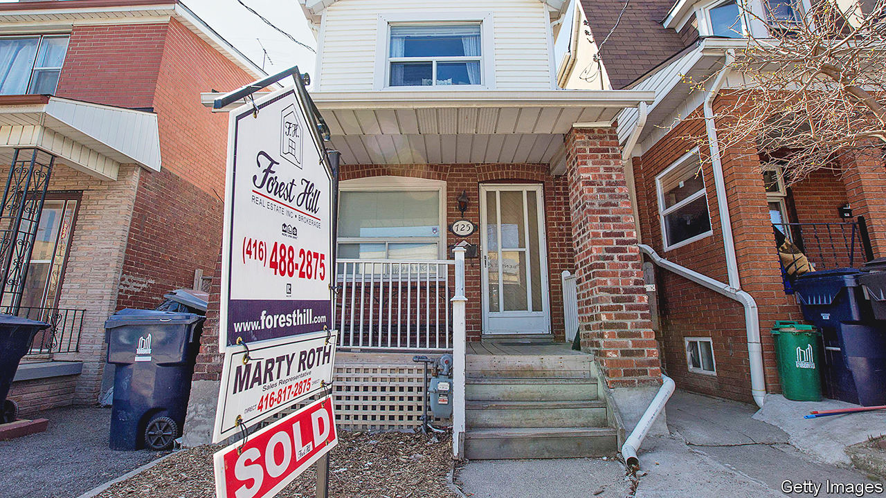
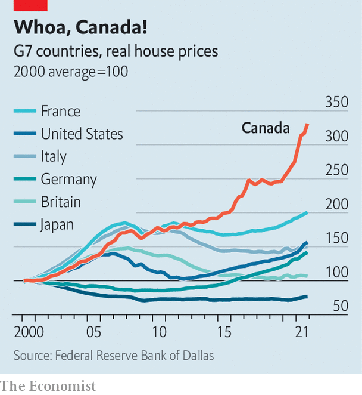

###### Whoa, Canada!

# Air starts to seep out of the bubbly Canadian property market 

##### Two decades of nearly uninterrupted price gains collide with rising mortgage costs 

 

> Jun 9th 2022 

Tired, old stereotypes portray Canada as the frigid north, awash in maple syrup, hockey and politeness. In the financial world it has earned a more novel, racier reputation: as home to a giant housing bubble. Canada’s property market has soared for the past two decades, shrugging off the global financial crisis of 2007-09 and outperforming most other countries throughout the covid-19 pandemic. Lately, though, cracks have started to appear. In Toronto prices have fallen for three consecutive months. Throughout the country, home sales have plunged. Many economists warn that worse lies ahead.

 


Canadians may scoff at such doomsayers. After all, bubble talk is nothing new, with economists blaring warnings since at least 2010. Nevertheless, a comparison between Canada and other rich countries should give rise to some concern. Since 2000 the average house price has more than tripled in Canada; in America, by contrast, it is up by just about 60% (see chart). The median home in Canada costs ten times the median household income, the highest multiple since at least 1980. Within the oecd, a club of mainly rich countries, only New Zealand has seen house prices increase at a faster rate relative to incomes over the past two decades.

The trigger for the recent fall in sales is the same thing hitting markets from America to Australia: inflation. The Bank of Canada, like its peers elsewhere, is raising interest rates in order to tame consumer prices. That has increased mortgage costs, making homes even less affordable. In Toronto, monthly mortgage payments at the median home price gobble up an astonishing three-quarters of median household income, according to the National Bank of Canada, a commercial lender. A rule of thumb is that mortgage payments should be just about a third of income. Little wonder that transactions are way down.

More uncertain is the impact on sentiment. Ron Butler, a mortgage-broker in Toronto, has quipped that a “fear of missing out” is giving way to a “fear of getting screwed”. Storeys, a property website, reports that some buyers have started backing out of deals. Prices could have some distance to fall. Robert Kavcic, an economist with bmo Capital Markets, an investment bank, estimates that real home prices are 38% above their long-term trend, the widest deviation in four decades.

Bullishness about Canadian property has long rested on two pillars: a shortage of housing, especially in big cities, and an influx of immigrants. Like any good story, though, things get exaggerated. Investors, including speculative punters, now account for one in five house purchases, according to the central bank. 

The government wants to cool the fervour. It has announced a two-year ban on property purchases by foreigners. More important, developers are ramping up. Units under construction are at a record high. Tony Stillo of Oxford Economics, a research firm, reckons Canada will add 2.35m new homes this decade, outstripping an expected 1.9m new households. 

In Carleton Place, the fastest-growing town in Canada, half an hour outside Ottawa, both the insatiable demand and the hefty supply response are on display. In a new neighbourhood being built by Olympia Homes, buyers move in as soon as homes are ready. Mark Fillier, a resident since November, says he is still waiting for contractors to add the finishing touches. “They just get the houses up and move on to the next one,” he says. At the end of his street builders are working on dozens of new homes.

The key question is how the property sector more broadly—from builders and buyers to lenders and regulators—will adjust to a weaker market. Oxford Economics predicts that Canadian house prices may fall by about a quarter over the next two years. That would probably count as an orderly correction, leaving prices above their pre-pandemic level. Developers would continue to break ground on new homes. And the financial system would remain solid. Canada has long used rules to insulate banks from the property sector: buyers seeking a mortgage must, for instance, have deposits of at least 20% on homes that cost more than C$1m ($795,000).

At the same time, though, Canada has vulnerabilities. Household debt is worryingly high: about 185% of disposable income. Given that backdrop, falling house prices could deal a big blow to consumer confidence and weigh on spending more generally. Canada may not be on thin ice. But it is skating into hazardous territory. ■


