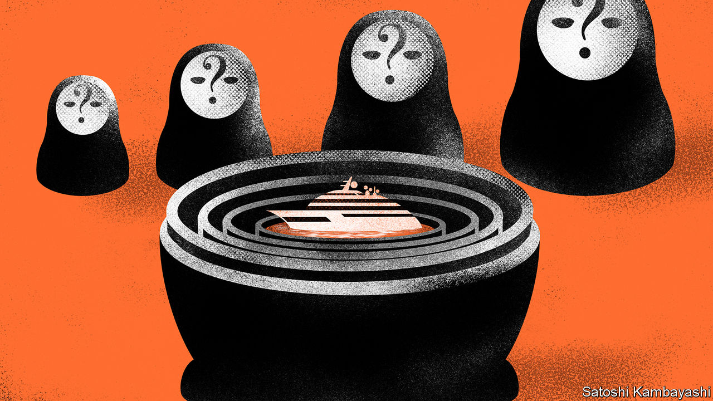
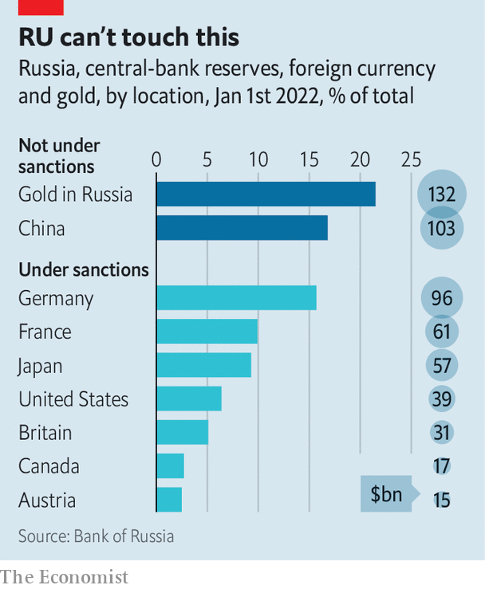

###### Seizing opportunities

# Could seizing Russian assets help rebuild Ukraine? 

##### Both legal and practical hurdles stand in the way 

 

> Jun 6th 2022 

In 2011 viktor vekselberg, a metals tycoon and Kremlin insider, visited the team designing the , a $90m yacht he had ordered, to oversee its construction. His attention to detail proved his undoing. When Mr Vekselberg came under American sanctions in 2018, his foreign assets were frozen—but not the , which was held via a shell company registered in the British Virgin Islands. Then two engineers at the shipyard, remembering the meeting in 2011, tipped off the fbi. A trail of money transfers confirmed that Mr Vekselberg did indeed own the . On April 4th this year Spanish police, acting at America’s request, seized the boat in Mallorca.

Netting the  was a coup for KleptoCapture, a task force set up by Joe Biden, America’s president, to track the assets of oligarchs blacklisted by the West after Russia invaded Ukraine. The eu has captured about $7bn in art, boats and property; Italy has impounded a $700m superyacht said to be linked to Vladimir Putin; America has held about $1bn in vessels and aircraft. Add in the chunk of the Russian central bank’s currency reserves that have come under , and nearly $400bn in assets have been blocked. 

According to the Kyiv School of Economics, the  to Ukraine so far could amount to as much as $600bn. To many, therefore, the idea of seizing Russian assets, selling them and using the proceeds to compensate the victims of Mr Putin’s aggression seems irresistible. Charles Michel, the head of the European Council, for instance, has argued that “it is extremely important not only to freeze assets, but also to make it possible to confiscate them, to make them available for rebuilding Ukraine.” The idea has gained support from politicians everywhere from Canada to Germany. But there are two big obstacles to the plan: the practical difficulties of freezing assets, and the legal difficulties of seizing them.

 


Consider the practicalities of freezing assets first. The central bank’s currency reserves are a relatively straightforward target. More than half of Russia’s reserves are held in the West and are subject to sanctions. So far, however, this giant stash is “hindered”, not technically frozen: transactions with the central bank are prohibited, but its funds are not legally blocked. That means Western countries are an extra step away from being able to seize the money, says Adam Smith of Gibson Dunn, a law firm. Ukraine’s allies could decide to take that step, as America did when it froze the Afghan central bank’s reserves last year, after the Taliban entered Kabul.

Private assets are harder to target. Russia’s stock of foreign direct investment amounts to some $500bn. But little of this is subject to freezes, says Rachel Ziemba of cnas, an American think-tank. One problem is that it is hard to know where the investment is based: its recorded location is often Cyprus, but that tends to be only an intermediate stop. Freezes have therefore focused on individuals instead. 

Here, too, tracking down assets is tricky. Anders Aslund, a former adviser to the Russian and Ukrainian governments, estimates that Russians under sanctions hold some $400bn of assets abroad. But, he says, only $50bn of that is frozen. Having been targeted by sanctions after Russia invaded Crimea in 2014, the wiliest oligarchs now hide their foreign assets behind 20-30 layers of shell companies. Some physical assets have been moved to friendlier territory. More than 100 Russian private jets landed in Dubai in the weeks after the invasion of Ukraine. 

Moreover, the enforcement of sanctions falls on the private firms—from banks to marinas—that serve the rich. Not all have the expertise to see through tycoons’ obfuscation. Whoever freezes the assets may also have to look after them, which drains resources. Houses need to be tended to; yachts cost 10% of their value in yearly maintenance. 


These difficulties pale into insignificance when compared with the problems of confiscation—the next step if Russian assets are to be used to rebuild Ukraine. In Western democracies seizing foreign property on the basis of nationality or political opinion is illegal. That is not to say there are no precedents for the expropriation of both state and private assets. But they have taken place at extraordinary times, and when certain strict criteria have been met. 

Seize and desist 

When it comes to individuals, the typical condition for confiscation is a criminal conviction—not just for any crime, but those that are deemed to warrant seizure. The forfeited assets must either be determined an instrument of the crime, or linked to the proceeds from it. Such things can take years (and a lot of money) to be proved in court. And the hurdle is unlikely to disappear soon: a bill introduced in the us Senate in April that would have granted the president powers to confiscate oligarchs’ assets was soundly defeated after the American Civil Liberties Union warned it would probably be struck down in court. 

Officials in the West are therefore instead working to lengthen the list of crimes that warrant seizure. In April the Biden administration introduced a bill that would add sanction and export-controls evasion to the list of offences punishable by the Racketeer Influenced and Corrupt Organisations Act, which was passed in 1970 to crack down on mobsters and allows for ill-gotten gains to be seized. On May 25th the European Commission outlined plans to make it easier for member countries to confiscate assets belonging to individuals suspected of breaching sanctions.

Each proposal faces a tough political battle. Although most Republicans support bashing Russia, few want to give Mr Biden a victory ahead of the mid-term elections in November. The eu will have no power to tell member governments how to use the proceeds from the liquidated assets. Some countries will be wary of confiscation: Germany may have to amend its constitution, which guarantees private property; Cyprus and Malta, which act as transit hubs for Russian money, are unlikely to support seizures.

The confiscation of state assets, meanwhile, would require Western governments to designate Russia a hostile power, or to call for regime change, which they have shied away from doing so far. As a rule, the doctrine of “sovereign immunity”, enshrined by a un convention, protects foreign states from local prosecution. But some laws, most notably in America, allow the government to seize foreign state assets without trial in certain cases. 

One such law is the International Emergency Economic Powers Act (ieepa), which provides legal backing for the current freezes. It does not explicitly grant the president powers to “vest” assets—ie, to change who owns them. But one exception, added in 2001, allows for some vesting when America is engaged in “armed hostilities” with another country. This was used by George W. Bush to seize Iraqi assets after he invaded the country in 2003. Today, however, America is at pains to emphasise that its shipments of weapons to Ukraine do not equate to its being in armed conflict with Russia. Saying otherwise could become “the actual reason for war”, notes Antonia Tzinova of Holland &amp; Knight, another law firm.

Seizures can happen outside ieepa. America’s executive branch has the authority to transfer control of certain foreign state assets when it changes what it considers to be the legitimate government—as it did in 2019, when it confiscated Venezuelan assets after recognising Juan Guaidó as president. But America has so far fallen short of calling for Mr Putin to go. Under rare circumstances, Congress can also lift the immunity of sovereign states, allowing their assets to compensate claimants in a domestic trial. One chunk of the frozen Afghan assets has been set aside while courts hear from the families of the victims of the September 11th attacks. For this to apply to Russia, though, America would have to declare it a terrorist state. The eu, for its part, is not even discussing the matter of sovereign assets, points out Jan Dunin-Wasowicz of Hughes Hubbard &amp; Reed, a law firm. Mentions of them are conspicuously absent from its proposals. 

International courts do not appear to be a fruitful avenue, either. Neither Russia nor Ukraine have consented to the jurisdiction of the International Court of Justice, save for a few narrow exceptions, says Astrid Coracini of the University of Vienna. A newly created body, akin to a commission set up by the un in 1991 to seek reparations from Iraq after it invaded Kuwait, would require Russia’s consent.

Creative ideas are therefore springing up. One is to target the billions of dollars a day that Russia receives for its energy exports, rather than its stock of assets. In a meeting of the g7 countries in May, America proposed levying a tariff on Russian oil, the proceeds of which could then be sent to Ukraine. But achieving agreement even within the eu will be a tall order. 

Another scheme would funnel payments for Russian oil to escrow accounts at international banks, as happened with Iranian crude in the 2010s. The accumulated bounty, worth around $100bn, became available again to Iran after sanctions were lifted in 2016. This time the West could demand that some of the money be donated to Ukraine. One insider suspects the idea is being considered in Washington. Russia could, however, try to wind down its remaining oil sales to the West. Enforcing the measure more widely, meanwhile, would require transgressors to be threatened with “secondary” sanctions—something that the West has so far avoided. 

All this suggests that attempts to seize Russian assets while the war rages will struggle to avoid one of three pitfalls. Unless Western countries ditch the protections they offer to foreign individuals and states, they risk spending many years in court. If they do ditch them, however, the trust underpinning their economies and societies could be endangered. More creative ideas, meanwhile, may invite Russian retaliation and anger the rest of the world.

That does not mean Russian treasure will remain untouchable for ever. Most reparations tend to be agreed once war ends, often as a condition for unfreezing foreign assets. Mr Putin still seems far from considering peace. But if he ever comes round to it, letting some money go to Ukraine may be the price he has to pay for seeing some of his own assets—including, maybe, a multi-million-dollar superyacht—return home. ■


