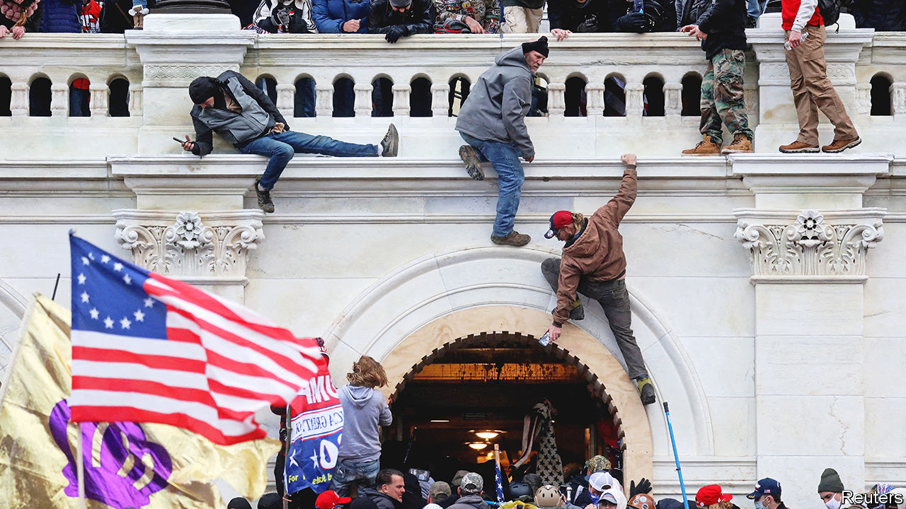

###### The Capitol-riot hearings

# America’s probe into the Capitol riot is needed, before it’s too late 

##### The enemy of democracy is complacency 

 

> Jun 8th 2022 

The essence of what happened on January 6th 2021 is well-known, if still shocking to recall. A mob  in Washington, dc, in an effort to prevent Congress from certifying Joe Biden’s election victory. Four people in the crowd died that day, and five police officers in its aftermath. Members of Congress had to be rushed to a secure location in a basement. Rioters erected a mock gallows and chanted “Hang Mike Pence”. And the man who inspired all this was the president himself, who had urged his followers to help overturn his election defeat. As the Republicans’ leader in the Senate, Mitch McConnell, told the Senate a few weeks later, Donald Trump was “practically and morally responsible” for these events: “The people who stormed this building believed they were acting on the wishes and instructions of their president.”

So what is the point of the  of the House committee probing the insurrection due to start on June 9th? From Thursday’s prime-time political theatre to half a dozen sessions that will follow before a final report in September, the coverage will be viewed very differently on either side of a polarised country. Commentators on the right will belittle it all as a witch hunt. And after November’s mid-term elections, in which the  control of the House, they can be counted on to bury the matter. 

Yet that ticking clock gives an urgency to the proceedings, which matter profoundly, for three reasons. One flows from the basic workings of democracy: institutions must do their job. It is the task of Congress to probe how an assault on the Capitol happened and conclude what lessons can be learned. Its nine-member committee—seven Democrats and two principled Republicans, Liz Cheney and Adam Kinzinger—has gone about it in a commendably thorough, bipartisan way, despite much resistance. On June 3rd the Department of Justice charged Peter Navarro, a former economic adviser to Mr Trump, for refusing to co-operate with the committee (though it strangely decided not to act against Mark Meadows, the White House chief of staff at the time of the riot, despite similar obstructionism). 

Second, though the core of the story is known, many vital details are not—especially concerning the extent of the coup’s planning and how directly the president was involved. Some revealing details, such as text messages from Mr Trump’s family to Mr Meadows urging him to persuade his boss to stop the riot, have dribbled out in the course of the committee’s work so far. More can be expected in the public hearings, given that they will draw on information gleaned from more than 1,000 depositions and interviews and over 140,000 documents.

A flow of fresh facts about the depth of plotting would reinforce the third reason why these hearings are important: the threat is not over. True, America’s democracy prevailed despite the attack. Members of Congress were eventually able to go back into the chamber and they duly certified the election (albeit that, despite the violence that had occurred that day, 138 Republican House members still voted to reject the results in Pennsylvania). Mr Biden became president. But even now 60% of Republicans believe Mr Trump’s lie that the election was stolen. And the party has decided that the insurrection was not serious enough to break with Mr Trump, leaving him the front-runner for the Republican nomination in 2024. If Republicans select him, Mr McConnell says he will back him.

Astonishing as it may seem, given what is already known about his efforts to thwart the will of the electorate, let alone what may be discovered, Mr Trump could well  legitimately. In case he does not, his supporters are striving to put in place officials who may make a future challenge to the voters’ verdict succeed. The committee’s work, including the public hearings, is a vital part of the eternal vigilance that, more than ever, is needed to defend American democracy. ■


