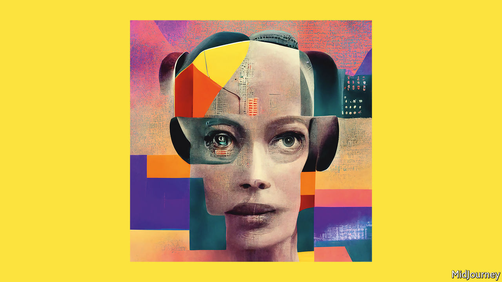

###### Foundation models

# How smarter AI will change creativity 

##### The promise and perils of a breakthrough in machine intelligence 

 

> Jun 9th 2022 

Picture a computer that could finish your sentences, using a better turn of phrase; or use a snatch of melody to  that sounds as if you wrote it (though you never would have); or solve a problem by creating hundreds of lines of computer code—leaving you to focus on something even harder. In a sense, that computer is merely the descendant of the power looms and steam engines that hastened the Industrial Revolution. But it also belongs to a new class of machine, because it grasps the symbols in language, music and programming and uses them in ways that seem creative. A bit like a human. 

The “” that can do these things represent a breakthrough in artificial intelligence, or ai. They, too, promise a revolution, but this one will affect the high-status brainwork that the Industrial Revolution never touched. There are no guarantees about what lies ahead—after all, ai has stumbled in the past. But it is time to look at the promise and perils of the next big thing in machine intelligence.

Foundation models are the latest twist on “” (dl), a technique that rose to prominence ten years ago and now dominates the field of ai. Loosely based on the networked structure of neurons in the human brain, dl systems are “trained” using millions or billions of examples of texts, images or sound clips. In recent years the ballooning cost, in time and money, of training ever-larger dl systems had prompted worries that the technique was reaching its limits. Some fretted about an “ai winter”. But foundation models show that building ever-larger and more complex dl does indeed continue to unlock ever more impressive new capabilities. Nobody knows where the limit lies.

The resulting models are a new form of creative, non-human intelligence. The systems are sophisticated enough both to possess a grasp of language and also to break the rules coherently. A dog cannot laugh at a joke in the , but an ai can explain why it is funny—a feat that is, frankly, sometimes beyond readers of the . When we asked one of these models to create a collage using the title of this leader and nothing more, it came up with the cover art for our American and Asian editions, pictured (we tried to distract our anxious human designers with a  in our European editions). 

Foundation models have some surprising and useful properties. The eeriest of these is their “emergent” behaviour—that is, skills (such as the ability to get a joke or match a situation and a proverb) which arise from the size and depth of the models, rather than being the result of deliberate design. Just as a rapid succession of still photographs gives the sensation of movement, so trillions of binary computational decisions fuse into a simulacrum of fluid human comprehension and creativity that, whatever the philosophers may say, looks a lot like the real thing. Even the creators of these systems are surprised at their power. 

This intelligence is broad and adaptable. True, foundation models are capable of behaving like an idiot, but then humans are, too. If you ask one who won the Nobel prize for physics in 1625, it may suggest Galileo, Bacon or Kepler, not understanding that the first prize was awarded in 1901. However, they are also adaptable in ways that earlier ais were not, perhaps because at some level there is a similarity between the rules for manipulating symbols in disciplines as different as drawing, creative writing and computer programming. This breadth means that foundation models could be used in lots of applications, from helping find new drugs using predictions about how proteins fold in three dimensions, to selecting interesting charts from datasets and dealing with open-ended questions by trawling huge databases to formulate answers that open up new areas of inquiry. 

That is exciting, and promises to bring , most of which still have to be imagined. But it also stirs up worries. Inevitably, people fear that ais creative enough to surprise their creators could become malign. In fact, foundation models are light-years from the sentient killer-robots beloved by Hollywood. Terminators tend to be focused, obsessive and blind to the broader consequences of their actions. Foundational ai, by contrast, is fuzzy. Similarly, people are anxious about the prodigious amounts of power training these models consume and the emissions they produce. However, ais are becoming more efficient, and their insights may well be essential in developing the technology that accelerates a shift to renewable energy. 

A more penetrating worry is over who controls foundation models. Training a really large system such as Google’s PaLM costs more than $10m a go and requires access to huge amounts of data—the more computing power and the more data the better. This raises the spectre of a technology concentrated in the hands of a small number of tech companies or governments.

If so, the training data could further entrench the world’s biases—and in a particularly stifling and unpleasant way. Would you trust a ten-year-old whose entire sense of reality had been formed by surfing the internet? Might Chinese- and American-trained ais be recruited to an ideological struggle to bend minds? What will happen to cultures that are poorly represented online?

And then there is the question of access. For the moment, the biggest models are restricted, to prevent them from being used for nefarious purposes such as generating fake news stories. Openai, a startup, has designed its model, called DALL-E 2, in an attempt to stop it producing violent or pornographic images. Firms are right to fear abuse, but the more powerful these models are, the more limiting access to them creates a new elite. Self-regulation is unlikely to resolve the dilemma.

Bring on the revolution

For years it has been said that ai-powered automation poses a threat to people in repetitive, routine jobs, and that artists, writers and programmers were safer. Foundation models challenge that assumption. But they also show how ai can be used as a software sidekick to enhance productivity. This machine intelligence does not resemble the human kind, but offers something entirely different. Handled well, it is more likely to complement humanity than usurp it. ■


