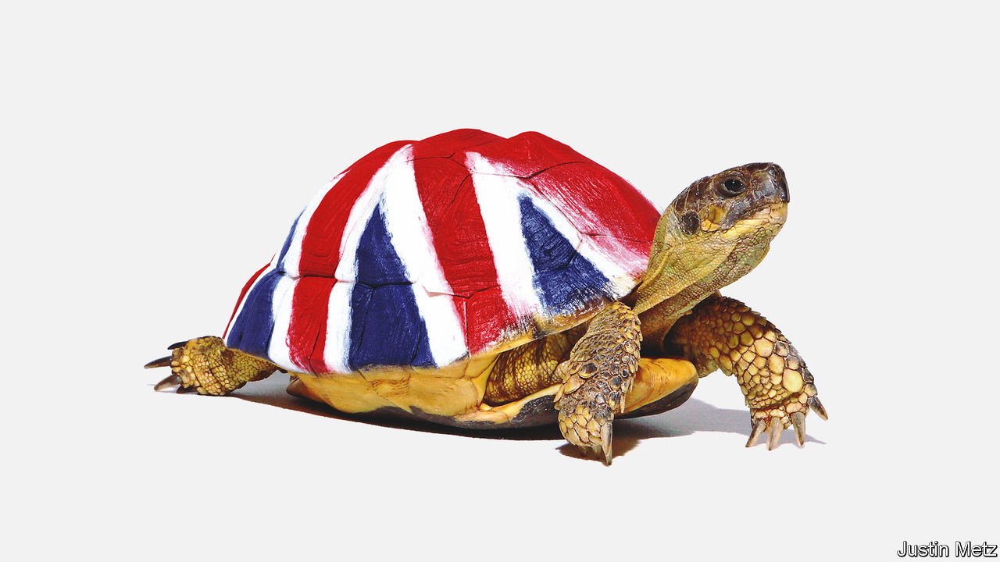

###### Britain’s problem is not just Boris Johnson

# Low economic growth is a slow-burning crisis for Britain 

##### It must arrest its economic decline 

 

> Jun 9th 2022 

Conservative mps’ half-hearted vote to  as prime minister, on June 6th, betrayed how deeply Britain’s ruling party  hard choices. A defeat for Mr Johnson would have ushered in a new government, with a chance to prove itself before the next election. A resounding victory would have given him a fresh mandate to show that he had put his transgressions behind him. The irresolute blow the rebels inflicted leaves Britain in the hands of a washed-up cabinet mouthing grandiloquent promises it cannot honour.

This newspaper has long argued that Mr Johnson ought to have resigned for lying repeatedly to Parliament about whether he broke his own laws. But hypocrisy and deceit do not begin to capture the wider problem that he and his country face. Britain is . It likes to think of itself as a dynamic, free-market place, but its economy lags behind much of the rich world. There is plenty of speechifying about growth, and no shortage of ideas about how to turn the country round. But the mettle and strategic thinking that reform requires are absent—another instance of Tories ducking hard choices. 

Britain’s stagnation also holds lessons for other slow-growing countries, many of them in Europe. Lower gdp means declining global influence, faltering faith in free markets and less money for public services. A struggle over fixed resources fires the populism that turns politics into an ugly fight about identity. The shortage of funds for investment entrenches tired and inefficient institutions. Worst of all, the lack of growth limits Britons’ scope to flourish. 

The idea that Britain has a growth problem is not new. But few realise how deep a hole it is in. Whereas average annual gdp growth over the decade preceding the global financial crisis of 2007-09 was 2.7%, the new normal is now closer to just 1.7%. 

Plenty of countries suffered from the financial crisis and covid-19. But Britain’s problems run deeper. In 2022 gdp per head will be more than 25% lower than America’s, measured at purchasing-power parity. Britain has been declining against America and Germany since the mid-2000s. Average wages now lag behind America’s by about as much as Poland’s do Britain’s. 

Underlying this is feeble productivity. In the decade to 2007, British productivity growth was second only to America’s in the g7. In the decade to 2019, growth in output per hour worked stalled to just 0.7% a year, making Britain the second-slowest in the g7; only Italy was slower. Had Britain’s productivity growth rate not fallen after the financial crisis, gdp per person in 2019 would have been £6,700 ($8,380) higher than it is. 

At least in the short run,  has made matters worse. Business investment is lower than when the referendum took place. Since the end of 2020 firms trading with the European Union have faced extra paperwork, customs delays and higher taxes. In the last quarter of 2021 Britain exported 16% less than at the end of 2019. Global goods trade, by contrast, grew by nearly 6%.

The outlook is poor, too. The oecd predicts that next year gdp in Britain will be stagnant. Official forecasts show that real take-home pay will be lower in five years than it is today, eaten away by higher taxes and consumer-price inflation that, at 9%, is the highest among big rich economies.

Part of the problem is that boosterish politicians talk so much nonsense about growth. The statistics are noisy and complex enough for a clever civil servant to find a number that paints Britain in a favourable light. Don’t be fooled. Self-delusion stifles fresh thinking about policy, one reason Britain’s economic debates have been tangential to growth, harmful even. For most of the 2010s politicians obsessed about cutting deficits. Budget discipline is important, but hardly a cure for Britain’s ills. In a speech this week Mr Johnson was to propose unlocking growth by letting people use housing benefits to buy houses.

“”, a theme of this government, could in theory focus on raising the productivity of workers and capital in Britain’s left-behind regions. In practice, it seems to put redistribution before output. That may be the just thing to do, but it is naive to expect that sending pots of public money to Britain’s poorer places will increase the size of the national pie.

When it comes to growth, Britain’s politicians will the ends but not the means. They run scared of the homeowning elderly, who turn up to vote and make up a growing share of the electorate. So tax rises are heaped on businesses and workers instead, further harming the economy. The government has likewise watered down its plans for reforming the planning system—because elderly homeowners object.

A change of government may not fix the problem. Parts of Labour grasp the challenge. But the party is fixated on outbidding the Tories over levelling up, and is less likely than the Conservatives to reform public services in a way that will lower costs and taxes. 

Britain has been here before. In 1979, in opposition, Margaret Thatcher lamented its declining economic standing. “Travel abroad, and see how much better our neighbours are doing,” she urged Tory supporters. Her uncompromising reforms led to nearly three decades in which British living standards closed on those in the rest of the rich world.

The stagnation nation 

Over the coming months we will look at growth in Britain and how to fix it. Some solutions are familiar but politically difficult, like solving the housing crisis in south-east England and boosting trade with the eu. Others involve fresh thinking to harness the potential of the country’s universities and life-sciences firms, and to expose managers to competition. 

Britain’s advantages, from the English language to the common-law system, have not gone away. However, under the dishonest, unserious—and now politically wounded—Mr Johnson, Britain is at threat from rising barriers to trade, an ageing electorate and rigid planning. Britain suffers from complacency, born of centuries as a first-rank economy, and Johnsonian bluster only exacerbates it. If Britain is to avoid a bleak future it must grasp reform. That will require a once-in-a-generation show of political courage, persuasion and policy ingenuity. Just like four decades ago, there is no alternative. ■


