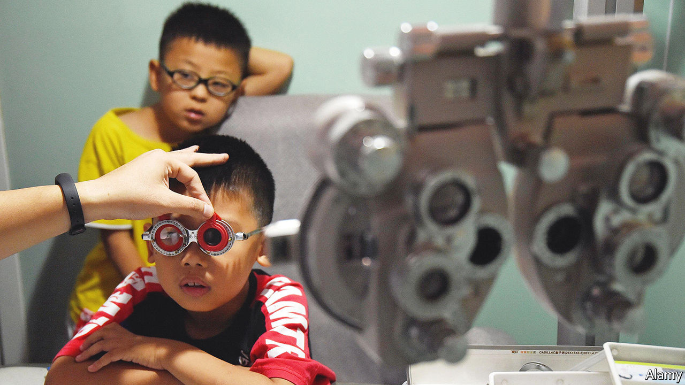

###### What to do about myopia

# Short-sightedness has become an epidemic 

##### To fight it, schools should send their students outside 

 

> Jun 9th 2022 

Few things come with no downsides at all. Rich countries have almost completely banished infectious diseases such as tuberculosis, cholera and . Instead, their health ministries spend much of their time worrying about illnesses caused by wealth. Cheap, calorie-dense food has abolished starvation in the rich world, but it also encourages diabetes. Sedentary, white-collar jobs are less arduous (and less lethal) than manual work. They also promote obesity and heart disease. 

Even education is not always an unalloyed good. Over the past few decades, East Asia has seen a stunning rise in the rate of . And a growing pile of evidence suggests that the main underlying reason for this is education—specifically, the fact that children spend large parts of the day in comparatively dimly lit classrooms. 

Before the long economic booms that began in the 1960s, myopia was uncommon in East Asia. These days, among the young, it is almost ubiquitous. In Hong Kong, Singapore and Taipei more than 80% of school-leavers are short-sighted. In Seoul over nine in ten young men are. China, which began its economic rise later, . Data from as far afield as Guangzhou in the south and Inner Mongolia in the north show myopia rates among young people of about 80%. 

If East Asia is the centre of the epidemic, the West is not immune. Good data are harder to come by. But studies suggest rates of between 20% and 40% in Europe, an order of magnitude higher than the natural state of affairs. One study in California found a rate of 59% among 17- to 19-year-olds. 

There are, admittedly, worse things to suffer from. But short-sightedness is not always benign. Glasses and contact lenses are an expensive, lifelong hassle. In parts of rural China, where some families cannot afford either, children struggle in the very schools that are causing the problem. And severe myopia predisposes those enduring it to other eye diseases in middle age, some of which can cause untreatable loss of vision. Governments in Asia are increasingly worried about the public-health implications of entire generations growing up short-sighted. Those in other parts of the world should start worrying, too. 

The evidence suggests that regular exposure to bright daylight is vital in properly controlling the growth of children’s eyes. Too little light leads to elongated, short-sighted eyes. Researchers think that this explains why rates are so high in Asia, where a strong cultural emphasis on the value of education leads to long school days and, often, private tutoring in the afternoon and evening. That leaves little time for sunshine. Western children, whose parents are increasingly worried by a hyper-competitive jobs market that threatens much less secure employment than they enjoyed, are beginning to go the same way.

Special eyedrops, as well as clever glasses and contact lenses, may be able to slow the progression of myopia once it has started. But prevention is better than mitigation, and the science suggests a cheap, straightforward measure. A series of encouraging trials, many conducted in Taiwan, show that giving schoolchildren—and especially those in primary education—more time outside can cut the number who go on to develop myopia. An island-wide policy of doing just that seems to have begun reversing the decades-long rise in myopia rates. Similar attempts in Singapore relied on parents, who proved more reluctant to change their behaviour, perhaps worried that other parents might not follow suit, leaving their children at a disadvantage in the classroom. 

Governments are well placed to solve such collective-action problems, while reassuring anxious parents that a bit less classroom time is unlikely to be catastrophic. After all, countries such as Finland and Sweden do well in global education rankings with a less intense approach to education. Giving more outdoor time to young children would still leave room for them to cram for exams in their teenage years. And longer breaks in the playground may also make a dent in other rich-world problems such as childhood obesity. Far-sighted governments should send the kids outdoors. ■

