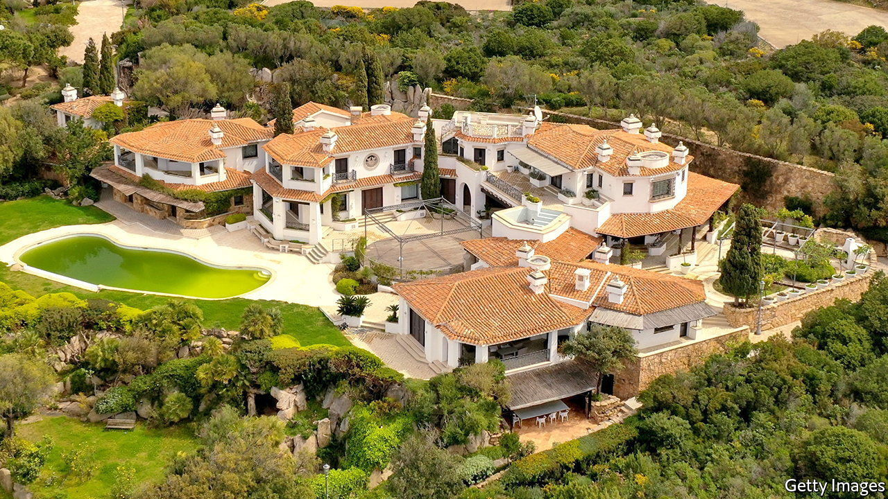
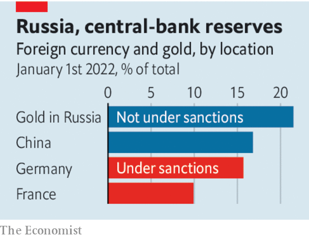

###### Sanctions and Russia

# Why the West should be wary of permanently seizing Russian assets 

##### It is a seductive idea, but would also be a mistake 

 

> Jun 9th 2022 

More than 100 days into the , the biggest sanctions programme ever imposed on a major economy is still being tightened. America and Europe have frozen Russia’s currency reserves held in Western banks. On June 3rd the European Union joined America and Britain in placing a partial embargo on , and also cut off Sberbank, its largest lender, from the swift interbank messaging system. A motley crew of oligarchs and their toys have been sanctioned. In Fiji the , a 100-metre superyacht with a helipad and pool, is the subject of Western actions, as are private planes in Dubai and  in England. 

Sanctions have caused serious disruption to Russia’s economy and if kept in place will impair its performance for years. Even so, their limitations are clear. Owing to high energy prices—Brent crude costs about $120 a barrel—Vladimir Putin’s regime is enjoying bumper revenues. Because only Western countries and a handful of Asian allies are enforcing sanctions, many customers continue to buy Russian oil. As a result, by the end of 2023 its crude production is expected to be only about 20% below its pre-war level. Kremlin-linked tycoons are still free to travel much of the world. Russian missiles continue to  in Ukraine and devastate its .

The bill for rebuilding Ukraine’s smashed cities and repairing its ruined industrial base will be huge: upwards of $600bn, . That has got many people wondering if the West should shift from merely freezing Russian assets temporarily to . They could then be used to pay for the reconstruction that lies ahead.

Russia has about $300bn of reserves held in the West and up to another $1trn of mainly private-sector assets held abroad. On May 19th Ursula von der Leyen, the president of the European Commission, said that the eu was looking into asset seizures. The g7 has discussed using them, too.

The idea that the aggressor should pay for the damage it has caused is appealing and popular. But the legal justification, and strategic logic, of sanctions are that they impair a country’s capability to pursue a course of action and may change its behaviour, because if that country alters its path the assets will be released. A shift from this approach to a policy of permanent seizure would be a big step that would be justifiable only if two tests are passed. The first is that any new policy is compatible with the rule of law. And the second is that it has a clear strategic pay-off.

Start with the rule of law. In America the president has the authority to freeze a foreign government’s assets but not typically to seize them unless America is at war with that country. Ever since Russia invaded Ukraine, President Joe Biden has been at pains to say America is not in open conflict with it. The executive branch can transfer control over certain foreign assets when it stops recognising a country’s government, as with some funds that belong to Venezuela and Afghanistan. However, America says it does not seek regime change in Russia. 

 


Under international law, reparations usually involve the consent of the paying country, typically as part of a peace treaty. Such negotiations are a long way off, and Ukraine must not be forced into them. Seizing assets owned by individuals, however odious they are, before they have been convicted by a court is also dubious. In some countries, such as Germany, doing so may violate the constitution. 

What about the West’s strategic interests? In the short run, permanent seizure would make no difference to the Kremlin’s ability to fund its deadly war machine, since Mr Putin’s regime cannot use the foreign assets that have already been sanctioned and frozen. In the long run, the precedent set by confiscations without a clear legal footing would expose all cross-border assets, including Western ones, to tit-for-tat appropriation by governments. It would also give a further incentive for countries that are not allied with America, or which have unstable relations with it, to bypass the American-led financial system, which is a bedrock of Western power. 

Rather than resorting to asset confiscations, the West must strengthen Ukraine’s war effort. That means  and speeding up their deployment and the training of Ukrainian forces to use them. It means maintaining sanctions for as long as Russia wages its war and occupies Ukraine. And it means making clear that even if no peace deal is signed, and no Russian reparations are ever paid, Europe and America will still have to foot a large part of the bill for rebuilding Ukraine’s shattered economy. ■


