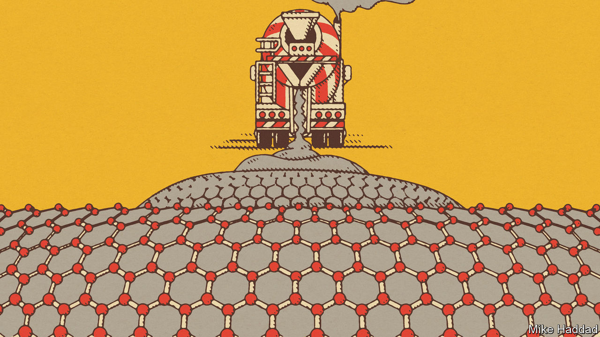
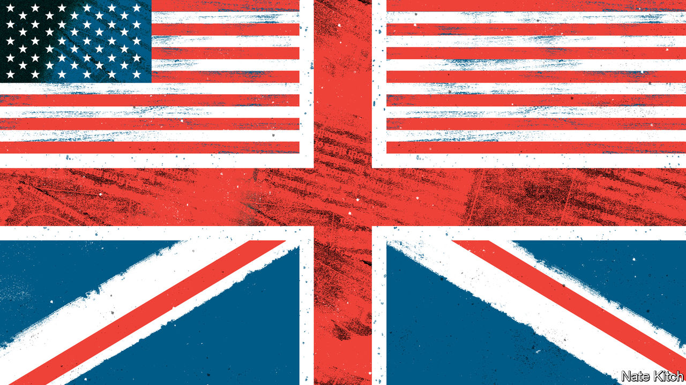

###### On Russia, gun control, graphene, Tokyo, American-British politics, bears

# Letters to the editor 

##### A selection of correspondence 

 

> Jun 9th 2022 


Keep the pressure on Russia

I agree with Andrey Kortunov (, May 20th) that the war in Ukraine is to an extent a clash of societies and politics, but his article misrepresents the conflict overall. This is not a collision of models. That would depict two competing ideals. Ukraine was never offering an alternative model to Russia, in the way that America offered an alternative to the Soviet Union during the cold war. Rather, the conflict is about Russia subjugating the Ukrainian populace to a warped interpretation of history emanating from the Russian government. 

The Russian International Affairs Council is funded by the Russian Ministry of Foreign Affairs. Mr Kortunov, as the riac’s director-general, has in the past repeated the mantra that Europe’s security architecture needs to be changed to accommodate Russia. His article continues that erroneous tradition and calls on Europe to strike a deal with Russia. Why should Europe evolve its security to placate a bully that has always found new excuses to justify its unhappiness? 

This war is more about the aggrandisement of Russia and the sense that we should conciliate the Kremlin regardless of its actions; these should not be represented as anything but Russian aggression.

stephen g.f. hall

Lecturer (assistant professor) in politics

University of Bath

 


Unarm the citizen army

After a mass shooting Republicans always argue that a heavily armed citizenry is essential for public safety (“”, May 28th). When I was deployed to Saigon at the height of the Vietnam war the army prohibited us from routinely carrying firearms in the city. This regulation almost certainly saved lives; off-duty troops had easy access to alcohol, but without weapons they were less likely to cause innocent deaths or to frequent dangerous areas. Those who parrot the views of the National Rifle Association about arming citizens might give some thought to the experiences of the actual army. 

john wilson


As a corrective to the repeated slaughter of innocents, and to the maleficent Republican bluster and impotent Democratic hand-wringing accompanying each new mass murder, we should consider imposing three choices on American gunowners: surrender your guns; play with your weapons under supervision in the National Guard; or be dispatched to Ukraine, where you can serve in a practical way the cause of freedom you so profess to love.

joshua nossiter


 


Greener graphene

Graphene has indeed taken a slow road to find its place in the world (“”, May 21st). While the 30% increase in strength and other beneficial properties for concrete applications are certainly attracting attention, what has truly excited industry is the direct reduction in carbon-dioxide output during the cement manufacturing process. The biggest offender, but a necessary ingredient, in cement manufacturing, is something called “clinker”. It is the binding agent created in the way you outlined by roasting limestone and various compounds at high temperatures to burn off carbon. 

Advanced testing by First Graphene in conjunction with some of the world’s biggest cement-additive manufacturers shows that replacing the bulk of the clinker with very small amounts of graphene can reduce carbon emissions by up to 20% while, at the very least, maintaining the same performance characteristics as current cement products. 

michael bell

Chief executive

First Graphene


Remembering Tokyo

Regarding your fine obituary for Saotome Katsumoto (), the firebombing of Tokyo in March 1945 has become a mere historical footnote. In fact, 70 of Japan’s largest cities were virtually destroyed by incendiary bombs in the first half of 1945, before the atomic bombings. Combined with the naval blockade, this practically reduced Japanese civilians to starvation. 

Nowhere is this subject more sensitively and devastatingly portrayed than in “Grave of the Fireflies,” an anime film written and directed by Takahata Isao in 1988. It follows the path of two orphaned siblings struggling to survive the final grim months of the war. The Tokyo firebombings are graphically but superbly portrayed. 

jody ferguson


 


British politics 101

Bagehot’s column on the obsession of British politics with America confirmed what I have believed for a long time (). American job titles and terminology are an unstoppable force. The bbc seems to train its journalists in New York or Chicago. They regularly speak of candidates running rather than standing for office, or of putting their names to a ticket. We hear of stump speeches, no doubt given on whistle-stop tours, although I don’t think I’ve ever known a British politician speak from a train “on the campaign trail”. 

How long until we have primaries or are asked to vote for a district attorney, town sheriff or judge? When we do, I can only hope that they will have more power than that other American import, our toothless metro mayors.

mike pavasovic


Countries other than America do feature in contemporary debate in Britain. The levelling-up discourse often cites German unification, and demographic discussions quickly invoke Japan. During lockdowns Sweden was watched with fascination. And Australian-style is a fashionable policy prefix. Some diversity does exist, despite the gerrymandered bookshelves.

babak moussavi


Bagehot deplored the singular focus of the British political class on America. One week later, the opening line of your article on the turnaround of John Lewis compared the retailer’s Christmas adverts to America’s Super Bowl commercials (“”, May 28th). The comparison was comically spurious, demonstrating that even where an analogy to America is not available, somehow America must be mentioned. 

Perhaps, therefore, the root of Bagehot's complaint is to be found with -reading British politicos?

norman henderson

Adjunct professor

University of Regina


 


If you go down to the woods…

I suspect that your leader writer is not an American hiker (“”, May 14th). America’s bear season runs from whenever they come out of their dens to whenever they return to them. Even in the coldest localities, bears are active for five or six months of the year, not for “two months from September”. As for hikers being advised to stay on their trails in bear season, bears like trails too and we are just as likely to encounter them there as when we are bushwhacking. 

The good news is that bears do not pursue humans as aggressively as writers pursue arresting opening lines.

robert mcwilliams


