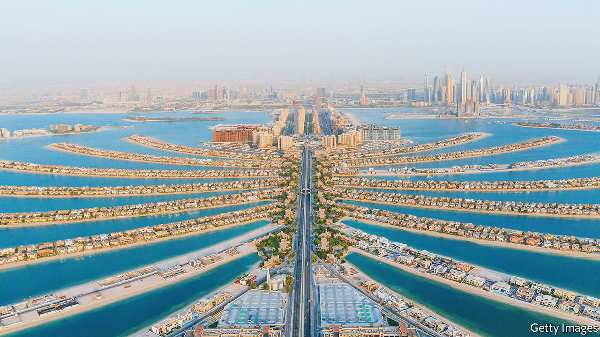

###### Look on my works

# Gulf states have spent billions to build cities in the sea 

##### They are expensive, often bad for the environment, and may end up underwater 

 

> Jun 9th 2022 

Acentury ago the site of Bahrain’s land-registration bureau was not on land. Like a good bit of the country, it has been reclaimed from the sea. Bahrain’s eagerness for such projects is easy to understand: its natural land area is just 665 square kilometres (257 square miles), over half the size of Greater London. The south is mostly desert, good for oilfields, military bases and little else.

Since the 1960s Bahrain has added more than 11% to its land area through reclamation, says Mohammed Al Khalifa, the head of the property regulator. It may soon add much more. Last year Bahrain said it would build five new cities on reclaimed land. “We’re surrounded by shallow waters, so it doesn’t take much to do reclamation—it’s like a bathtub.”

The plan is still aspirational, with officials yet to secure funding or draw up blueprints. If it comes to pass, it will expand the country by more than half its current size. Yet land-reclamation projects, in Bahrain and elsewhere in the Gulf, come with a slate of environmental and economic concerns—and perhaps even existential ones.

If Bahrain has built out of necessity, other Gulf states do it out of choice. Palm Jumeirah, a collection of islands shaped like a palm tree, is one of Dubai’s most iconic features. Abu Dhabi dredged the coastline to create attractions like Yas Island, home to theme parks and fancy hotels. Saudi Arabia has plenty of empty land; yet it still wants to build something called the Oxagon, an eight-sided floating industrial city in the Red Sea.

Developers say they try not to harm the environment. But scientists and locals worry. Fishermen in Bahrain say land-reclamation has damaged their livelihoods by depleting fish stocks, forcing them to work farther out at sea. This annoys neighbouring Qatar, which regularly detains Bahraini boats that sail into its waters.

A study found land-reclamation projects shrank the number of mangroves in Tubli Bay, off Bahrain’s east coast. Using satellite imagery, another group of researchers concluded that the Palm increased average water temperatures by 7.5°C over 19 years, which is bad for reefs and hurts some marine life.

These schemes can also be bad for investors: buying property on an artificial island is the ultimate off-plan sale. When the first residents of the Palm moved into their villas, they discovered the properties occupied less land than promised: developers had to squeeze in more of them to recoup building costs.

At least they were built. Dubai has a second palm-shaped archipelago near the main port, 19km south-west of its better-known cousin. Workers started construction in 2002, but the financial crisis of 2008 put a stop to it. Two decades on, the second Palm remains a featureless expanse of sand.

Then there is The World, the sort of project you would conceive if you read Percy Shelley’s poem “Ozymandias” as a how-to guide. Nakheel, the developer, spent billions to create 300 islands in the rough shape of the world map. Then the financial crisis hit. Today there is a glitzy resort around “Tierra del Fuego”, and a beach club in “Lebanon”, but most of The World is as barren as the moon. 

Climate change menaces the Gulf’s artificial lands, just as it does all waterfront property. The Palm was designed to handle a 50cm rise in sea levels. Researchers at the University of Tehran have estimated that Gulf waters could rise 84cm by the end of the century.

No one has ever recorded a cyclone in the Persian Gulf. But a study published in  in 2015 concluded that they are no longer inconceivable. Last year Cyclone Shaheen made landfall in Oman, the first of its kind to do so in at least a century. What man raised from the sea, the sea may take back. 


