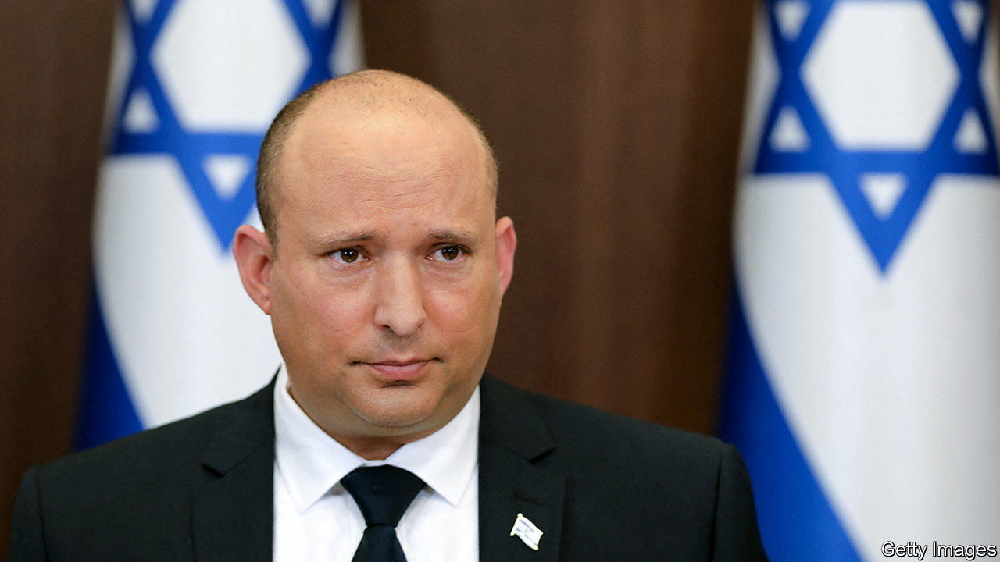

###### Bolder abroad, embattled at home

# Israel’s prime minister explains his new approach to Iran 

##### Naftali Bennett tells The Economist how he aims to keep his country safe 

 

> Jun 8th 2022 

“We are implementing the Octopus Doctrine,” says Naftali Bennett, Israel’s prime minister. “We no longer play with the tentacles, with Iran’s proxies: we’ve created a new equation by going for the head.” Talking to  after nearly a year in office, he explains how Israel and its covert services are raising the stakes in the shadowy war they have waged with Iran for nearly four decades. 

In the past Israel aimed its attacks on Iran almost exclusively at its nuclear programme and scientists connected with it. When Israel hit other Iranian targets, such as the Islamic Revolutionary Guard Corps (irgc) and its expeditionary Quds Force, it tended to do so in third countries, such as Syria. Now it is attacking the irgc inside Iran as well. In February it struck a factory making drones for the Guards in western Iran. In May it assassinated one of their commanders in Tehran, Iran’s capital.

Israel is becoming less coy about such attacks. Previously it nearly always refused to acknowledge operations in Iran. Now senior Israeli officials often give off-record briefings, sometimes only hours after Iranian targets have been hit. In April Mossad, Israel’s foreign-intelligence agency, even aired a recording of a Revolutionary Guard being interrogated by Israeli agents, supposedly inside Iran. 

Not all members of Israel’s security establishment are happy with this brash new approach. Some intelligence veterans are said to have grumbled that “poking Tehran in the eye” will cause more trouble than it is worth. Mr Bennett himself sticks to the official line that Israel does not directly take responsibility for any specific operation in Iran but says he is convinced that “the Iranians are much more timid than you think” when it comes to reacting to Israeli audacity. Clobbering them directly will yield good results, he reckons. He fully approves of these bolder tactics. 

Will this deter Iran and its proxies from attacking Israeli targets? He notes with satisfaction that Hizbullah, an Iranian-backed Shia political movement-cum-militia in Lebanon, and Hamas, an Iranian-backed Palestinian Islamist group that runs the Gaza Strip, have not launched rockets against Israel in the past year. 

Mr Bennett also hopes that these brazen attacks may prompt Iran to accept a tighter version of the nuclear agreement signed with four Western powers plus China and Russia in 2015, from which America withdrew in 2018 under President Donald Trump. Though President Joe Biden says he wants to revive that deal, talks with Iran have not yet yielded a formula for doing so. Mr Bennett argues that Iran’s economy is in such dire need of relief from sanctions that if America plays tough it may be able to strike a deal that freezes Iran’s nuclear development indefinitely, without the “sunset clauses” of the original pact, whereby curbs on Iran lapse after a time. Israel, according to Mr Bennett, seeks to outspend Iran in its weapons programmes and outmatch it in technology—in the hope of bankrupting it. 

Mr Bennett calls this ploy “a financial Star Wars”, alluding to America’s development of missile defences in the 1980s which, in Mr Bennett’s view, forced the Soviet Union in its dying days to accept agreements on arms control with America. In the same vein, Israel is planning a laser-defence network. At a later stage, he says, this may be broadened into a regional missile-defence umbrella that could also protect Israel’s new Arab allies in the Persian Gulf. 

Yet this offensive against Iran does not seem to have given Mr Bennett a political boost at home. His unwieldy eight-party coalition, which for the first time includes an Islamist Arab party, is coming apart at the seams. It has lost its majority in the Knesset, Israel’s parliament. Its components agree on very little. The main reason for its creation was to dump Israel’s previous prime minister, Binyamin Netanyahu. It never had much more of an agenda to bind it together.

As leader of the opposition, Mr Netanyahu is still plotting a comeback. He is unlikely to find enough supporters in the Knesset to form a new government. But he needs only one more defector from the governing coalition to force an election. Israel suffered three elections in 2019-20, as neither Mr Netanyahu nor his opponents were able to form a government. It was only after a fourth, a year ago, that Mr Bennett managed to cobble together his coalition. Opinion polls suggest that a fifth poll may at last yield a majority for Mr Netanyahu and his allies. 

Mr Bennett, whose own party has only six seats in the 120-strong Knesset, admits there is little he can do to stop his government from disintegrating, bar an appeal to his partners “not to fall off track, back into the chaos of elections”. Still, he gamely hopes to “continue for another month, and then another”. At least, he claims, “We’ve shown Israel how a normal country looks for the past year.” But his laudable “experiment” of including an Arab party in government has, he laments, enabled Mr Netanyahu to activate a “machine of poison and lies” that brands the coalition as “relying on terror supporters”. ■

