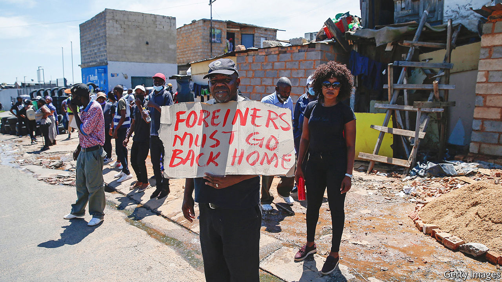
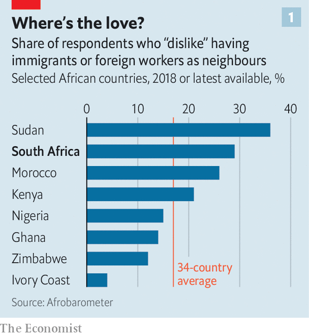
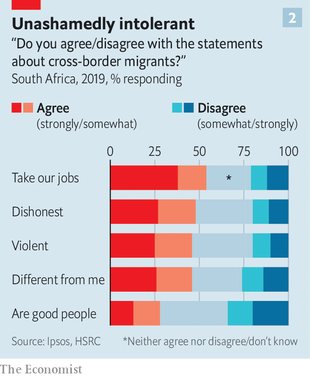

###### Not welcome

# South African xenophobes run amok 

##### One in eight South Africans tell pollsters they have taken part in “violent action” against foreigners 

 

> Jun 9th 2022 

“It could have been me,” says Dumisani, a Zimbabwean living in Diepsloot, on the northern outskirts of Johannesburg. On April 7th a mob of South Africans beat and burned to death his fellow countryman, Elvis Nyathi, after tearing through the township demanding to see migrants’ identity documents. “South Africans are frustrated and they are taking it out on foreigners,” says Dumisani (whose name has been changed). Ever since the lynching he struggles to sleep at night, fearing that vigilantes will come for him. “I’d rather be confronted by the police or Home Affairs than these guys.” 

During apartheid South Africa had what scholars call a “two-gates” immigration policy. White foreigners came through the front gate, receiving residency rights and incentives like subsidised housing. Africans were shown the back gate, with temporary entry tied to specific jobs and no pathway to citizenship. (Black South Africans were in effect denied full citizenship, too.) After the shift to democracy in 1994, Nelson Mandela’s government allowed people from the rest of the continent to come through the front gate. That formalised South Africa’s role as a hub for African economic migrants and asylum seekers. 

The current spasms of xenophobic violence in places such as Diepsloot are not the first. Xenowatch, a research consortium, estimates that 623 people have been killed and 123,000 forced to leave their homes since 1994. The vast majority of victims are Africans, who make up about three-quarters of the estimated 4m immigrants in the country of 60m. Most of the incidents took place in the past decade. 

 


But two things distinguish the latest episodes. First is the influence of vigilante groups such as Operation Dudula (“push back” in Zulu), which organise marches in townships and use social media to amplify their vitriol. The second is the level of political support for anti-migrant policies. As the African National Congress (anc) confronts the probable loss of its electoral majority in 2024, the ruling party is blaming foreigners for its own failures. Meanwhile, many opposition parties blame the anc for allowing the foreigners to ruin the country in the first place. The pan-Africanism of Nelson Mandela is being drowned out by a xenophobic cacophony.

 


Politics dovetails with public opinion. In a report published in 2020 by Afrobarometer, a research group, the share of respondents who would dislike having foreigners as neighbours was higher in South Africa than in all but three of the other 33 African countries polled (see chart 1). Analysis by the Human Sciences Research Council (hsrc), a think-tank, finds that 46% of South Africans see migrants as “violent”, 48% view them as “dishonest” and just 28% think that migrants are “good people” (see chart 2). 

In another poll from 2021 around 3% of South Africans said they had taken part in “violent action” against foreigners in their neighbourhood in the past year—and almost 10% in “the more distant past”. A further 12% said they might do so. South Africans are becoming more forthcoming about such views, says Steven Gordon of hsrc, a sign that “this form of violence is becoming more socially acceptable.”

David Mabusela, who works for a Methodist church in Diepsloot, claims without evidence that “the majority of the crimes being committed are by Zimbabweans.” Ephraim Thobojame, also from Diepsloot, says that he is keen to join a vigilante group: “Operation Dudula is the only one listening to us.”

In South Africa crime is high and the police are woeful. Academic evidence does not, however, support the public’s perception of crime-causing migrants. The foreign-born are less likely than locals to be in prison. A study in 2018 concluded there was no link between the share of foreigners in a municipality and the rates of four of five common types of crime (the exception was property crime). The connection was stronger between crime and the proportion of internal migrants, ie, people from other parts of South Africa. 

Migrants are often victims of crime, including at the hands of police. At an Ethiopian restaurant in Diepsloot the smell of roasted coffee wafts through the room. A cow carcass hangs from a hook ready to be diced into  (raw beef with chili). It is a gathering place for the Ethiopians who, with Somalis and migrants from South Asia, run the convenience (“”) shops in many townships. All of the merchants describe abuse and extortion by police officers. Habitwold Shigute says that cash and goods worth 33,000 rand (more than $2,200) were taken from his shop last year, on the spurious grounds that the items were counterfeit. “You work for ten years and you get looted in ten minutes,” he says.

Overworked and over here

If not literally seen as robbers, migrants are viewed as stealing jobs. In 2021 just 22% of South Africans disagreed with the statement: “Immigrants take jobs away from people who were born in South Africa,” according to the hsrc. “We’re the ones who are suffering,” says Mr Thobojame, outside his shack in Diepsloot. “Our politicians lie. They said they’d create jobs, but they always create jobs for foreigners.” 

In a country with an unemployment rate of 35%, such views are perhaps unsurprising. But again the evidence belies public opinion. The oecd, a club of mostly rich countries, reckons that immigrants increase South Africans’ employment rates and incomes. The World Bank found that for every job a migrant got between 1996 and 2011, two were created for locals. 

Evidence has not quietened South Africa’s politicians, however. Actionsa, a party founded in 2020, won 16% of the vote in Johannesburg in local elections last year, partly because of its hard line on immigrants. The Economic Freedom Fighters, a hard-left offshoot of the anc, claims to be a pan-African party. But as its poll ratings have flatlined, it has embarked on Dudula-style stunts such as marching into restaurants and checking workers’ papers. Xenophobia is also found in ethnically-based parties such as the Patriotic Alliance, which mostly appeals to so-called “coloureds” (people of mixed race). Its leader has called for “Mass deportations now!!!”

President Cyril Ramaphosa has likened vigilantes to “apartheid oppressors”. But his government is making it harder for migrants to live legally in the country. Visa applications that used to take weeks now drag on for many months. Processing of asylum claims has ground to a halt. A porous border and corrupt officials make it easy to cross illegally. Long-awaited legislation meant to simplify migration is being written by securocrats, who have more sway than government economists. 

Zimbabweans, who make up about a quarter of migrants, according to the un, face a particularly uncertain future. After an exodus prompted by hyperinflation and political violence in Zimbabwe in the late 2000s, South Africa gave large numbers of Zimbabweans permission to stay. This will be withdrawn at the end of the year. Migrants will suffer, as will relatives back home who rely on their remittances. The policy will also affect South Africans, and not in the way the government expects. 

For a glimpse of what might happen, consider Robertson, a farming hamlet 160km from Cape Town. In March a protest by South Africans against farmers hiring Zimbabweans was hijacked by migrants from Lesotho, who later attacked their fellow southern Africans. They said people from Lesotho were being denied jobs picking fruit and vegetables. Hundreds of Zimbabweans fled the Nkqubela township in fear for their lives. Since the incident and a corresponding media storm the authorities have cracked down on farmers’ use of Zimbabwean labour, on the grounds that many workers have fake or expired visas. (Some Zimbabweans admit to using forged documents but others say they are within the grace period of their permits.) 

“There’s no work now,” says Onward Ngezvenyu, a Zimbabwean. Many of his fellow countrymen are packing their bags. Others want to stay until they have enough money to build a house back home. Mr Ngezvenyu stresses that were it not for zanu-pf, Zimbabwe’s tyrannically inept ruling party, he would not be in South Africa. “We don’t want to be here. We want to work next to our family. We want to be near our kids, to help them with their homework.” 

Away from home truths

Farms are scrambling to hire new workers. Grant Smuts, a third-generation farmer, says he employs just 5% of the Zimbabweans he did a few months ago, after an unannounced inspection by more than a dozen government officials in April. He suspects that many who worked on his farm did so illegally, but argues that it was the role of labour brokers to check paperwork. “There are not enough South Africans in Robertson to furnish the work required,” he says. What is more, “Zimbabweans are more productive and willing to work.” A kilo of tomatoes that used to cost 50 cents to harvest now costs twice that, because of the lower productivity of locals. 

“If we can speak the honest truth, local people are lazy people,” says Thamsanqa Julius Rum, a resident of Nkqubela. Many South Africans in the township rely on the money they get from renting tiny bits of their backyards to Zimbabweans for 500 rand per shack, with an extra charge for wives and children. “They pay a lot of money for rent,” he says. “If the Zimbabweans leave it will be a problem.” 

On a walk around Nkqubela, Lennox Mase, a local pastor, points out the electricity cords that run from plugs in South Africans’ houses to Zimbabwean or Basotho shacks. South Africans do not pay their own electricity bills but they insist that migrants cough up, he notes. “The township taverns are full of young South Africans. You don’t find any foreigners there.” He tells of a Zimbabwean friend who works on Sundays rather than attending his church. “Lennox, when I’m back in Zimbabwe I’ll be a Christian on Sunday,” his friend tells him. “Now I need to work.” ■

