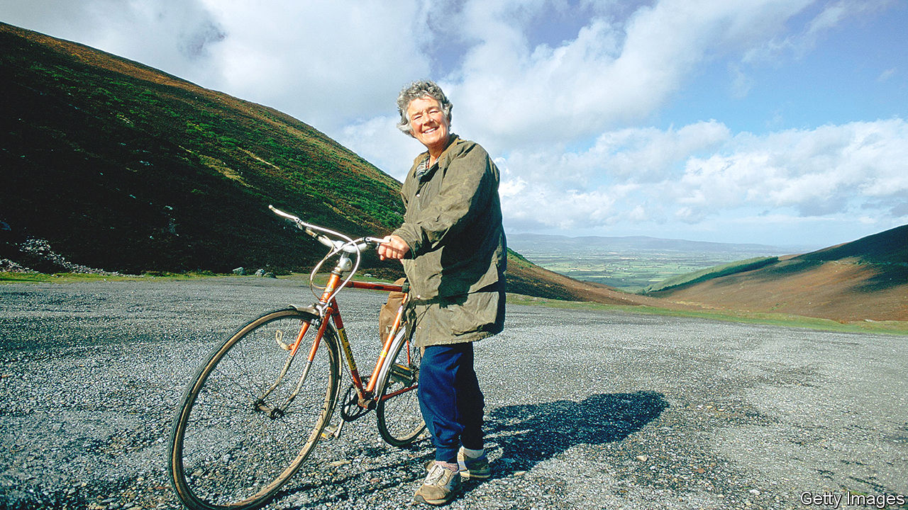

###### Have bike, will travel

# Dervla Murphy let nothing stand in the way of adventure 

##### Ireland’s best-loved travel writer died on May 22nd, aged 90 

 

> Jun 8th 2022 

The moment was unforgettable. Dervla Murphy was ten, struggling up a steep hill near Lismore in County Waterford on her second-hand bike, when she looked down at her thin legs slowly pumping and thought that if they just went on doing so, she could get to India. On the same birthday when she had got the bike she had also been given a second-hand atlas, so the route was in her head already. Nothing stood in her way at all except two little tiny stretches of water and a mountain range or three. 

So began a dream of travelling that eventually led to a trek of 4,500 miles from Ireland to Delhi, a journey of 1,300 miles through the Peruvian Andes and trips to southern Africa, Madagascar, Cuba and the Middle East. She kept copious diaries, often written by oil-lamp or moonlight as she prepared to slide her sore bones into yet another flea-bag or a charpoy in the open air, and the diaries grew into 26 books which earned her the title, daft she thought, of an Irish national treasure. 

Her preferred conveyance for most of these trips was an Armstrong Cadet man’s bike, bought in 1961 and christened Roz, short for Don Quixote’s steed Rocinante. Roz was fitted out with two pannier-bag-holders that could carry 28lb of kit, including the vital notebooks, a good deal of aspirin, William Blake’s poems, a stock of American cigarettes and an emergency supply of Courvoisier. Her whole temperament was steady, reconciled to being pushed through deep sand, heaved up cliff faces and near-drowned in raging rivers, as her owner was. If Roz could not manage it had to be Dervla’s poor feet, or a pony, or a mule (in Ethiopia), or the buses that bounced violently and sickeningly over one atrocious track after another. Once in the Himalayas she even boarded a small Dakota, but hated herself for making use of this noisy mechanised impertinence. It was an insult to the mountains. 

Generally, too, she travelled alone. Why shouldn’t a woman go where she pleased, embracing an unplanned life? She did not start the long treks until she was 31, having to stay at home before then to care for her disabled mother and ageing father. By that time she certainly knew her own mind, batty and stubborn and fiercely independent. (Even her daughter Rachel, whom she sometimes took roaming with her later, had been conceived with no intention of ever marrying.) When Responsible Persons gave her Good Advice, such as telling her it was folly to cross Afghanistan on a bike, she was all the more perversely determined to go. Mind you, she carried a .25 pistol in the pocket of her slacks and used it too, dispatching a wolf that flung itself at her and seeing off a lecherous six-foot Kurd, to her great satisfaction and surprise. 

Many who met her in the world’s wilder and less visited places assumed, in fact, that she was a man. She was tall, deep-voiced and well-muscled, and , as when fording a river in Pakistan, could carry Roz round her neck. She could also drink like a man, beer being her staple, and preferred to do her research (though that was too solemn a name for it), in bars, pubs and teahouses or at village gatherings, where locals crowded curiously round her. Those were the people she wanted to mix with, ordinary folk, sharing their joy at bloodily fought polo matches or letting toddlers ride round on her back while she brayed like a donkey. To them she would patiently show, time after time, how a bicycle worked, and with them she would sit down fairly gratefully to meals of stewed clover, fly-blown bread and rancid ghee, amazed by how freely they shared the little they had. 

The more remote the place, the more she was drawn there. To look out on thousands of miles of uninhabited land, from the top of a mountain she could possibly freewheel down, was sheer bliss. Her greatest happiness often lay in harshness, such as the vast ice of Siberia, the dazzlingly tinted ranges of the Hindu Kush—like light immobilised—or the crenellated peak in the Andes through which the sun woke her one morning as it rose. Yet human incursions also delighted her, in gardens full of roses and pomegranates, orchards misted with apricot and apple blossom and fields where women worked decked out in crimson and silver. Her special love was for Afghanistan, not then convulsed by war and not yet touched by the creeping blight of Modernity, Uniformity and so-called Progress. She felt she might have stayed for ever in the Hindu Kush, living in the sanity of backwardness. 

Dislike of Western ways permeated “Full Tilt”, her first and most famous book, which told of her dream-trip to India. But the exploits to which she subjected both Roz and her own unfortunate carcass disguised the true strength of her political feelings. Gradually she showed them more. For subsequent books she lived in squalid, disease-ridden camps among refugees from Tibet and Palestine, becoming a campaigner for them, and travelled among victims of aids and genocide in Africa. For “A Place Apart” she took Roz to Northern Ireland during the Troubles, talking to people on both sides in an effort to understand Irish nationalism, for which her father had been imprisoned. Her happiest spell of research was also close to home, for “Tales from Two Cities”, a study of race relations on the outskirts of Birmingham and Bradford. Both trips were mostly pub-work, and reinforced the major conclusion she had reached already—that wherever you went in this fractious world, people were essentially the same and had to be treated with simple (socialist) fairness. 

In old age, living in a chilly warren of stone buildings in Lismore surrounded by books, cats and forget-me-nots and subsisting mostly on beer, her regrets were few. But they were heartfelt. She wished she had visited Tibet before the Chinese took over, and she wished that remote places might be allowed to stay that way. Mass Tourism, Motor Roads, Expanding Markets, Capitalism itself, were all neat hell to her. Each mobile phone announced the end of a sealed and precious culture. 

Travel was done now, and arthritis made it hard to write. But she was happy enough just to watch the leaves moving in the wind, excited, preparing to spin abroad. ■

