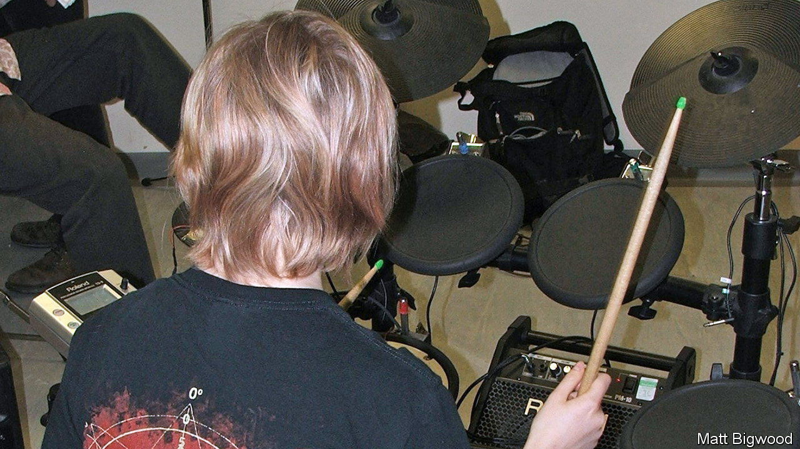

###### Music therapy

# Learning to drum can help children with behavioural problems 

##### Brain scanning shows in more detail how it works 

 

> Jun 8th 2022 

Music is good for the health. And drumming may be best of all. As well as being physically demanding, it requires people to synchronise their limbs and to react to outside stimuli, such as what the rest of the band is up to. 

It is particularly helpful for children who have emotional and behavioural difficulties. Researchers at the Clem Burke Drumming Project—an organisation named after Blondie’s drummer, who was one of its founders—have shown that teaching such children to drum helps them to control their reactions more generally, to focus more effectively on tasks they are given, and to communicate better with other people. 

The project’s latest work, published in the  by a team led by Marie-Stéphanie Cahart of King’s College, London, goes a step further. It looks at the neurological changes which accompany these shifts.

Ms Cahart and her colleagues recruited 36 autistic teenagers and split them into two groups. One lot had drum lessons twice a week for eight weeks. The others did not. At the beginning and end of the project everyone was asked to stay still for 45 minutes in a functional magnetic-resonance imaging (fmri) machine, to see how the activity of their brains had changed. Their behaviour, as reported by their guardians, was also recorded.

As expected, most of the drumming group showed positive behavioural changes. And these were indeed reflected in their brains. The fmri scans showed that several clusters of connectivity between parts of those brains had strengthened during the experiment. In particular, two regions involved in attention control, the right dorsolateral prefrontal cortex and the right inferior frontal gyrus, formed strong links, respectively, with places associated with introspection and with areas involved in deciphering facial expressions. 

These changes in the brain’s “wetware” thus nicely match the changes in behaviour which learning to drum induces. Not a surprise, perhaps. But a gratifying confirmation of drumming’s power to heal.


