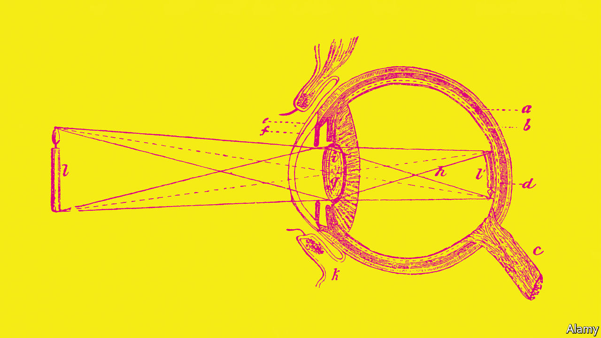
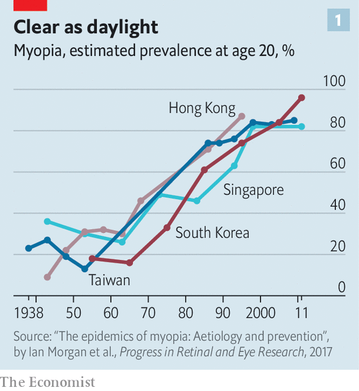
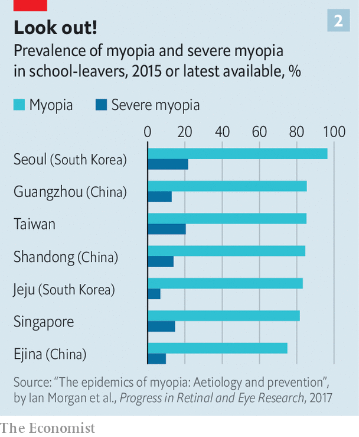

###### Ophthalmology

# Short-sightedness was rare. In Asia, it is becoming ubiquitous 

##### That is storing up problems for the future 

 

> Jun 9th 2022 

In the early 1980s Taiwan’s army realised it had a problem. More and more of its conscripts seemed to be short-sighted, meaning they needed glasses to focus on distant objects. “They were worried that if the worst happened [ie, an attack by China] their troops would be fighting at a disadvantage,” says Ian Morgan, who studies myopia at Australian National University, in Canberra. An island-wide study in 1983 confirmed that around 70% of Taiwanese school leavers needed glasses or contact lenses to see properly.

 


These days, that number is above 80%. But happily for Taiwan’s generals, the military disparity has disappeared. Over the past few decades myopia rates have soared across East Asia (see chart 1). In the 1960s around 20-30% of Chinese school-leavers were short-sighted. These days they are just as myopic as their cousins across the straits, with rates in some parts of China running at over 80%.

Elsewhere on the continent things are even worse. One study of male high-school leavers in Seoul found 97% were short-sighted. Hong Kong and Singapore are not far behind. And although the problem is worst in East Asia, it is not unique to it. Reliable numbers for America and Europe are harder to come by. But one review article, published in 2015, claimed a European rate of between 20% and 40%—an order of magnitude higher than that which people working in the field think is the “natural”, background rate. 

Don’t be short-sighted about this

For most of those affected, myopia is a lifelong, expensive nuisance. But severe myopia can lead to untreatable vision loss, says Annegret Dahlmann-Noor, a consultant ophthalmologist at Moorfields Eye Hospital, in London. A paper published in 2019 concluded that each one-dioptre worsening in myopia was associated with a 67% increase in prevalence of myopic maculopathy, an untreatable condition that causes blindness. (A dioptre is a measure of a lens’s focusing power.) In some parts of East Asia, 20% of young people have severe myopia, defined as -6 dioptres or worse (see chart 2). “This is storing up a big problem for the coming decades,” says Kathryn Rose, head of orthoptics at the University of Technology, Sydney.

 


All that, in turn, is beginning to attract official attention. In 2018 Xi Jinping, China’s president, made controlling childhood myopia a national priority. Crackdowns on the country’s private-tutoring and video-games industries, which began in 2021, were partly motivated by worries about children’s eyesight, says Dr Morgan. The governments of Taiwan and Singapore are likewise trying to do something about the matter. “I think it’s fair to say that public health is starting to wake up to myopia as a problem,” says Dr Dahlmann-Noor. 

Most myopia is caused by misshapen eyeballs. A properly working eye focuses incoming light precisely onto the retina, the light-sensitive surface at the back of the eyeball (see picture above). In a myopic eye, by contrast, the eyeball is distorted in a way that causes the light to end up focused short of the retina. Sufferers can see normally up close, but distant objects are blurred. And the condition tends to be progressive, with vision worsening throughout childhood and adolescence, before stabilising in adulthood.

For decades, researchers had thought myopia was mostly genetic. It runs in families, and genomic studies have turned up several gene variants which increase the risk of developing the condition. There were early hints, though, that this could not be the whole story. A study of Inuit in Alaska, published in 1969, found that myopia was virtually unknown in those middle-aged or older, but that rates were above 50% in older children and young adults. Such a change is much too fast to be purely genetic, and it had happened just as the study participants had begun to adopt a more settled, Westernised way of life. But the results went against the dogma of the day, says Dr Morgan, and were ignored.

The spike in East Asia, which occurred as places there industrialised, was harder to dismiss. Short-sightedness is stereotypically an affliction of the bookish, and a procession of studies has confirmed a strong, reliable link with education. “The more educated you are, and the higher your grades, and the more you participate in after-school classes and tutorials—the more likely you are [to be myopic]”, says Dr Morgan. And an intriguing study on orthodox Jewish children in Israel, in the 1990s, confirmed the link with long school hours. It showed that boys—who receive intensive religious education in addition to the normal curriculum—were more myopic than their sisters, who do not. 

Since there is no obvious way in which learning sums, spelling or even the Talmud could cause short-sightedness directly, the assumption was that education was a proxy for something else. One possibility is the popular notion (raised by Johannes Kepler, a German astronomer who himself needed glasses, more than 400 years ago) that myopia is linked to too much close-in work, such as reading and writing.

That theory remains popular, says Dr Rose, but evidence for it is mixed at best. Instead, the dominant hypothesis now is that exposure to daylight is the main variable. A study of Californian children, published in 2007, found that time spent outdoors was strongly associated with a lower risk of myopia. Another paper, published the following year by Drs Rose and Morgan and their colleagues, followed more than 4,000 children in Sydney for three years and came to a similar conclusion. The type of activity—sports, walking, picnics—did not seem to matter. Simply being outdoors was the crucial point. The researchers cross-checked the close-work hypothesis and found that being outside drastically reduced the risk of short-sightedness, even for children that did a lot of it.

This theory fits the data neatly. It explains why myopia seems, like diabetes and heart disease, to be what doctors call a “disease of affluence”—more common in rich countries than poor ones—since economic growth brings with it more education, and therefore, for children, more time inside. It explains why rates are high in East Asia in particular, says Dr Morgan, since the ubiquity of private tutoring and after-school classes mean schoolchildren there routinely work longer days than their Western counterparts. Most South Korean students, for instance, attend private tutoring schools called  in which lessons often stretch well into the evening. 

Seeing the light

The daylight-exposure theory is also bolstered by animal studies, in which that exposure can be carefully controlled, and in which dimness reliably produces short sight. Researchers have a putative mechanism, too. Exposure to bright light appears to stimulate the production of dopamine, a neurotransmitter, in the retina. Dopamine, in turn, seems to help regulate the rate at which the eye grows. Too little, and the eye grows too long to focus properly.

Human trials, too, confirm the theory. One of the biggest, led by Pei-Chang Wu of the Chang Gung University College of Medicine, in Taiwan, was published in 2020. It reported results from millions of Taiwanese primary-school pupils who had gone through the school system between 2001 and 2015. In 2010 the government instituted a programme called “Tian-Tian Outdoor 120”, which encouraged schools to take pupils outside for two hours a day. After it was implemented, rates of myopia fell, slowly but steadily, from 49.4% in 2012 to 46.1% in 2015—reversing a decades-long trend of rising rates. 

Exactly how much light is needed is unclear, though Dr Morgan reckons 10,000 lux is in the right ballpark. That is about as much as you might get in the shade on a reasonably sunny day. (Direct sunlight in the tropics can exceed 100,000 lux.) Levels indoors, by contrast, rarely exceed 1,000 lux. It is technically possible to light classrooms to 10,000 lux, notes Dr Rose. But even with led lighting, she says, the amount of heat produced would require specialist air conditioning, and the glare might be enough to make reading tricky. 

Researchers have also been working on ways to slow myopia’s progression once it has started. One is to use low doses of atropine, a poisonous chemical found in deadly nightshade—the juice of which was once used by women to dilate their pupils, in order to make themselves look more attractive. Another is specially designed “ortho-k” contact lenses, which are intended to reshape the cornea while worn. (The cornea is the front, transparent part of the eye, which does most of the work of focusing light on the retina; the eye’s so-called lens is mainly for fine tuning.) These also seem effective, though Dr Rose worries about the side-effects from giving contact lenses to children, since if misused they can cause irreversible corneal scarring. 

Sophisticated pairs of spectacles may help, too. In 2020 the  published a Chinese trial of “defocus incorporated multiple segments” (dims) glasses. The lenses of these have a central zone designed to correct the wearer’s sight, which is surrounded by hundreds of other small zones of different optical power. The idea is to provide both clear vision through the central part of the lens and deliberately distorted vision through the smaller zones, since poorly focused vision is thought to signal to the eye to slow its rate of growth. Wearing dims glasses appeared to cut the rate of myopic progression roughly in half. 

Eyedrops, more sunlight and clever glasses might be able to prevent or slow myopia in future generations of schoolchildren. But by the time sufferers reach adulthood, the condition is permanent. This means that in some countries, a public-health problem is already baked in. For those with really serious myopia, says Dr Rose, and who are at the highest risk of bad complications, unhealthy changes in the eye can start to occur when patients are in their 40s. “And some of those are not in any way treatable.” ■


