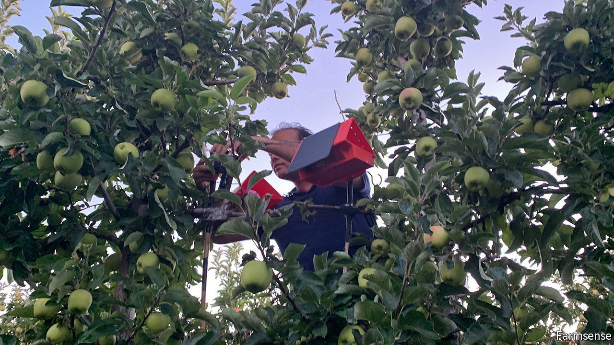

###### Agricultural entomology

# Technology used by spies is detecting pesky moths 

##### It “listens” to their wing beats using lasers 

 

> Jun 9th 2022 

Insects cause billions of dollars of damage to crops every year, driving farmers to apply pesticides on an industrial scale, at huge expense and often with unwelcome ecological side-effects. They take this carpet-bombing approach because they lack information about where and when it is best to hit pests, and nobody wants to use too little pesticide and thus risk losing crops. Technologists at FarmSense, a firm in Riverside, California, hope to change that. 

The established approach to detecting insect pests, moths in particular, is to employ pheromone-baited sticky traps. Pheromones are chemicals which animals use to communicate—and especially to attract members of the opposite sex. An appropriately baited sticky trap gives a fair idea of the number and type of pests around, but not with sufficient detail for the precise application of pest control measures. Such traps have, however, changed little in decades, except that some now come with a digital camera which transmits a daily picture of the trapped insects. FarmSense’s researchers reckon they can do better.

The company’s device, FlightSensor, has been in full-scale tests on farms since 2020 and is about to be made generally available. It does not trap insects. Rather, it scans them with a laser as they fly by. The developers’ insight was that the shadows of passing wings produce the same oscillating signal as the sound of the wing beats recorded by a microphone. This approach is similar to bouncing a laser beam off a glass window to detect the vibrations of a conversation in the room beyond, a technique employed in espionage for decades. 

FlightSensor’s technology builds on the work of Eamonn Keogh, one of FarmSense’s founders, who is also a professor at the University of California’s Riverside campus. Dr Keogh helped pioneer the field of “computational entomology”, in which special algorithms receive data from scanners and learn to determine the sex and species of passing critters. FarmSense claims to have more digital data on insects than the rest of the world combined. 

For the first tranche of targets the results are impressive. Navel orangeworm moths, in particular, are a common pest of almond and pistachio trees—both important to Californian agriculture. FlightSensor can identify them accurately more than 99% of the time. And the algorithm is still improving its capability, and adding new species as it gets more data. Sometimes it can distinguish insects which, to a human eye, look identical. 

FarmSense’s optical approach works better than microphones for recording wing beats because the insects under investigation are quiet and the sound they emit thus easily lost in background noise. Bees and houseflies buzz about noisily. But moths and the trichogrammatid wasps that parasitise them (or, rather, their caterpillars), and are therefore of almost equal interest to farmers, are all but inaudible. They are easily detectable by laser, though. And while sticky traps are at least an alternative for large moths, the FarmSense sensor picks up everything, down to trichogrammatids a thousandth of the size of the moths these wasps are interested in.

In contrast to existing traps, which report only total numbers captured in a given period, the new sensors record each insect as it arrives, revealing diurnal and nocturnal patterns of activity. In one case, FarmSense was able to show a farmer that navel orangeworm moths appeared in her fields only between three o’clock and five o’clock in the morning. So, rather than spraying disruptive pheromones throughout the hours of darkness, she is able to restrict the puffing around of these chemicals to times when moths are active, cutting the amount of pheromone required by 80%. American farmers spend hundreds of millions of dollars a year on pest-reducing pheromones, so reducing their use in this way should bring useful savings. 

There should be ecological benefits as well. In particular, pesticides of all sorts often have side-effects on benign, and even desirable insects. Using a more targeted approach which deployed less of them would reduce that problem. 

A further advantage of the new sensors is their lack of need for maintenance. Sticky traps eventually stop being sticky, because of a build-up of either dust or of dead insects, so someone has to replace the sticky cards. FlightSensors will function for months at a time, reducing the labour and other associated costs. 

The sensors should also prove useful for academic entomologists. Marta Skowron Volponi of the University of Gdansk, in Poland, is employing them to look at bee-mimicking clearwing moths. They may help her discover how the insects manage to sound like bees as well as looking like them. Meanwhile, at the University of California’s campus in Davis, Joanna Chiu is using them to study the daily activity of , a fruit fly that is one of the workhorses of genetics. From farm to lab, then, listening to insects with light may soon be all the rage. ■


