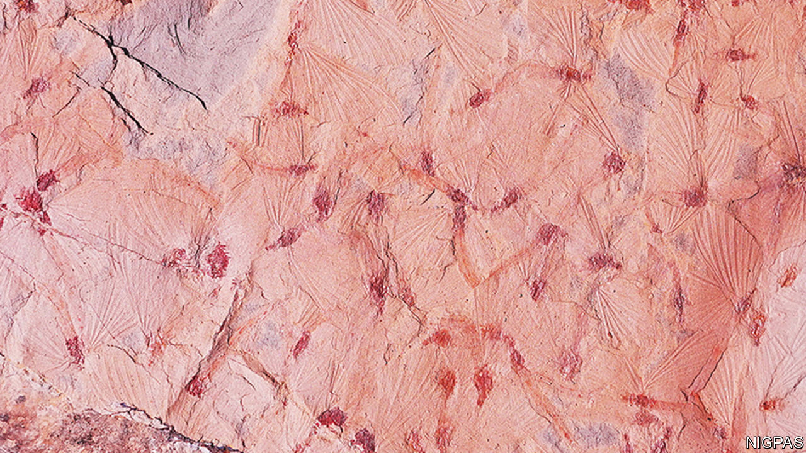

###### Fossil insects

# The oldest mayfly swarm 

##### A feast for Jurassic insectivores 

 

> Jun 8th 2022 

This is part of the oldest known mayfly swarm. It was collected, by a team led by Zhang Qianqi of the Nanjing Institute of Geology and Palaeontology, from a site near Hezhou, in southern China, and is reported in the latest edition of . Some 180m years ago, during the early part of the Jurassic period, this site was a lake where mayflies lived and swarmed to mate, as they do today, providing, as a side-effect, a feast for local insectivores. These probably included small pterosaurs, but not birds, which had not yet evolved. Insects rarely fossilise well in rock (though they do in amber), but in this case exquisite anatomical details of the creatures are visible in the mudstone that has solidified from the lake’s sediments.■


