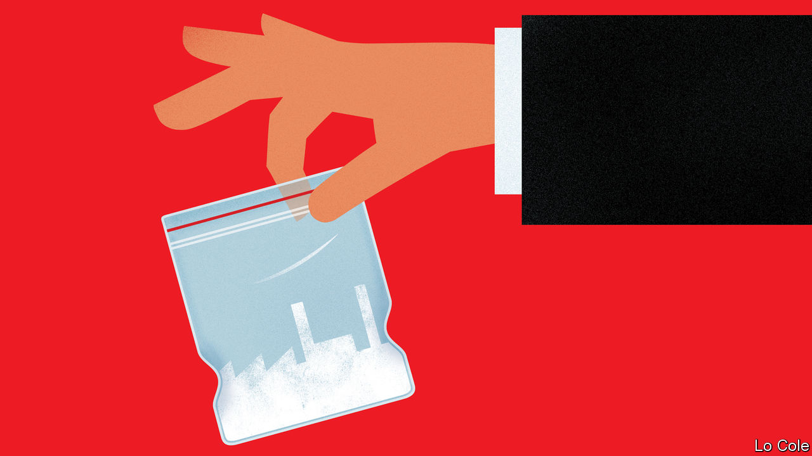

###### Bello

# Latin American politicians are fed up with the war on drugs 

##### Both of Colombia’s presidential front-runners want change 

 

> Jun 9th 2022 

Thirty years ago Gilberto Rodríguez Orejuela and his associates were the world’s most powerful criminals, reckoned to control 75% of cocaine shipments from Colombia. They adopted a businesslike approach to a lawless trade, often preferring bribery to violence, and used their profits from drugs to buy legal enterprises, from pharmacy chains to América de Cali, a football club in their home city. When he died on May 31st after 18 years in an American prison, Mr Rodríguez was barely remembered in his home country. Yet the business which he pioneered is stronger than ever, while across the Americas there is palpable fatigue with the “war” against it.

That fatigue is expressed by both the candidates in Colombia’s presidential run-off on June 19th. Rodolfo Hernández, a populist of the right, has called for the legalisation of drugs. His leftist rival, Gustavo Petro, says his country should recognise that the war is lost. Mexico’s president, Andrés Manuel López Obrador, favours “hugs rather than bullets” for the drug trade’s foot soldiers; arrests of drug kingpins fell until recently. Officials in the United States seem more preoccupied with the arrival of migrants than of cocaine. Drug-related deaths there continue to rise, but over 60% are caused by fentanyl, a powerful synthetic drug, much of which is made in Mexico.

Since the 1990s anti-drug policy in the region has had three prongs: eradicating coca, the raw material for cocaine; the promotion of alternative livelihoods through “integrated rural development”, as the jargon goes; and seizing or destroying drug shipments, processing plants, chemical inputs and money. 

The most visible and controversial of the three is the eradication of coca. It is a Sisyphean task. Between 2000 and 2006 Colombia cut its coca acreage by half, chiefly by using aerial spraying of glyphosate, a weed-killer. But planting surged again during and after peace talks between the government and the Marxist farc guerrillas, who controlled much of the coca-producing areas. In 2015 the government banned aerial spraying for legal and health reasons. 

Iván Duque, Colombia’s president since 2018, is an eager protagonist of the war on drugs. His government has eradicated over 100,000 hectares (250,000 acres) of coca a year. Peru, the second-biggest producer, has also met its more modest eradication targets. These achievements are illusory. In both countries total coca output has risen inexorably. According to American government estimates, Latin America’s cocaine production has more than doubled over the past decade, to 2,400 tonnes a year. That is partly because productivity has risen, with denser planting, irrigation and skilled farming. Coca has now been detected in Honduras and Venezuela, where it is a new crop. In Colombia, the effect of repression has been to drive the crop into remote mountains, national parks and other protected areas, where it causes environmental damage and is harder to eradicate. 

There is a consensus among experts that forced eradication cannot deliver a sustained decrease in supply. They favour promoting legal alternatives to coca and relying on voluntary eradication. That is easier said than done. “To go from a consensus to the construction of public policies requires a lot of government capability on the ground,” says Daniel Rico, a criminologist. Since 2016 Colombian governments have in theory wanted to beef up security and the presence of the state in rural areas, but have failed to do so. Instead, some aspects of the drug business have undergone de facto legalisation, says Mr Rico. Farmers are rarely prosecuted for growing coca, and most money-laundering and the supply of chemical inputs goes unpunished.

The economics of an illegal business conspire against the drug warriors. The retail price of cocaine is determined by risk, not costs, and is perhaps 60 times higher on a Californian street than an Andean farm. Legalisation would be the sensible answer. But there is little evidence that it is politically feasible. 

That leaves Latin American governments to deal with the ugly reality of organised crime. The protean mafias who traffic drugs consolidate or fragment, acting more or less violently, according to taste and local circumstance. What is constant is their accumulation of military, political and economic power as cocaine has become a global business. If Colombia’s next president manages to improve rural security and give a boost to legal economic activity that could be more effective than yanking up coca plants.


