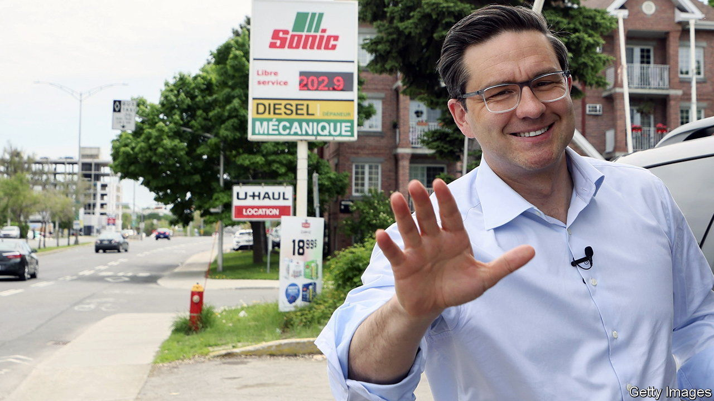

###### Populism with Canadian characteristics

# “Canada’s Trump” is politer than the real thing 

##### Pierre Poilievre is the front-runner to lead the Conservative Party 

 

> Jun 9th 2022 

On a sunday in April 600 people packed into the Elks Lodge on the outskirts of North Bay in northern Ontario. Some had driven hours to hear Pierre Poilievre, the only Canadian politician who sets pulses racing these days. Cars bore bumper stickers that read “Freedom Convoy 2022”, a reference to protests against vaccine mandates led by truckers that shut down Ottawa, Canada’s capital, for three weeks in February. “Defund the cbc”, Canada’s public broadcaster, demanded a sign held by an eight-year-old boy. One man’s t-shirt proclaimed him to be a “Thought Criminal”. But many looked like mild-mannered folk with time to kill between attending church and visiting their grandchildren.

Blue-shirted and tieless, the 43-year-old Mr Poilievre warmed up the crowd like a late-night talk-show host. He cracked jokes before laying into the country’s Liberal government, led by Justin Trudeau. A proposal to regulate content on the internet befits the regimes of North Korea and Iran, Mr Poilievre fumed. Inflation, the worry uppermost in voters’ minds, is a form of oppression. “You might be the working guy who has lost his freedom to go on a hunting or fishing trip on the weekend because gas prices are a buck-ninety-three a litre and you can no longer fuel up your truck,” he speculated. When he is prime minister Canadians will be “the freest people in the world”.

Before that, however, he has to become leader of the Conservative Party in a vote scheduled for September 10th. Polls suggest that he is the front-runner. He is the hard-edged, plain-speaking antithesis of many Canadian politicians. “Pierre is real. He’s a breath of fresh air,” said Nancy Olmsted, a former Olympic canoeist who attended the event in North Bay. 

When Mr Trudeau was elected prime minister in 2015 he was the breath of fresh air. Possessed of Kennedyesque charisma, he offered moderately progressive answers to grievances about economic insecurity. But Mr Trudeau has become a symbol of divisions he had hoped to narrow. His attentiveness to the concerns of vulnerable groups, from indigenous people to transgender folk, has made some ordinary Canadians feel that he cares less about them. 

Things came to a head during the truckers’ protest, when Mr Trudeau accused protesters of promoting “hatred and division”, a charge that misrepresented many of them. He appalled civil libertarians by invoking the Emergencies Act for the first time in its 34-year-history, allowing the government to restrict assembly and freeze bank accounts. Two inquiries, one in Parliament which is already under way, and another led by a judge, will investigate whether the government was right to invoke the act. 

As elsewhere, voters are shocked by inflation, too, which reached 6.8% in the year to April, its highest level in more than 30 years. On June 2nd Doug Ford, whose Progressive Conservative Party is the provincial counterpart of the Conservatives in Ontario, won re-election as the province’s premier in part on a promise to “keep costs down”. As worrying to many is the rise of nearly 50% in house prices since early 2020, though these have begun to fall since the Bank of Canada began  in March. 

Mr Poilievre seeks to convert unease into anger. A politics nerd who has been an mp since he was 25, he adopts a Trumpian swagger on the stump. He rails against “gatekeepers” and argues Mr Trudeau shares blame with the Bank of Canada for “Justinflation”. He has said he would sack the bank’s governor, who is meant to be independent. He denounces the World Economic Forum, a global gabfest, as working “against the interests of our people”.

If this is populism, it is populism with Canadian characteristics. Although Mr Poilievre’s crowds are nearly all white (diversity in North Bay was provided only by his Venezuelan-born wife, Anaida), his villains have no colour. He avoids alienating the multi-ethnic suburbs of Toronto where national elections are won and lost. Mr Poilievre is trying to “channel that [anti-elite] sentiment without endorsing the more extreme groups”, says Roland Paris of the University of Ottawa. 

Whether voters will be in the mood for Mr Poilievre’s calibrated populism by the time of the next election, due in 2025, will depend a lot on how Mr Trudeau, and Canada’s economy, perform in the interim. Mr Trudeau reinforced his minority government in March by striking an agreement with the leftist New Democratic Party. At times more Canadians say they disapprove of the government than approve, but Mr Trudeau is “not in the danger zone”, says David Coletto of Abacus Data, a pollster.

And although Mr Poilievre is the front-runner to lead the opposition, he has yet to seal the deal. Mr Ford’s win in Ontario may persuade some that a candidate who is less strident will have a better chance of defeating the Liberals. One Conservative Party organiser in North Bay worries that Mr Poilievre is too Trumpian for most voters. To win a national election he may have to learn how to reassure Canadians, rather than just riling them up. ■

