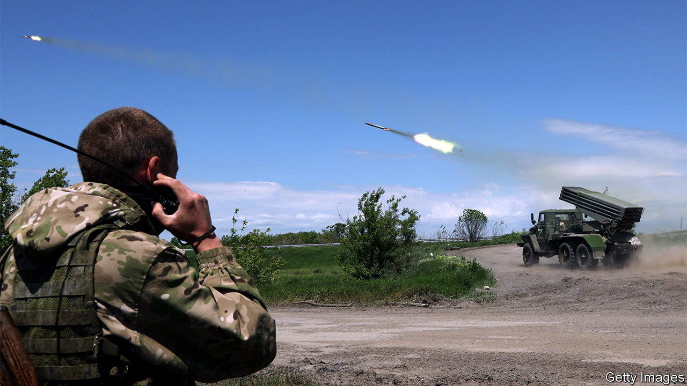

###### The Economist explains

# How Ukraine is fighting back against Russian artillery 

##### American-supplied missiles will help to counter the barrages 

 

> Jun 2nd 2022 

As the focus of the  has turned to the eastern , Russia is trying to beat down Ukrainian defences and make incremental advances. One important way of doing this is through the use of heavy , which is capable of indirect fire (meaning the target does not need to be within sight) over great distances. This has long been central to Russian military doctrine—Josef Stalin called it “the god of war”. In Ukraine Russia’s artillery has inflicted huge damage; images of Mariupol and other cities show neighbourhoods reduced to rubble. In doing so, however, they draw back Ukrainian artillery fire (“counter-battery” fire), leading to cat-and-mouse artillery duels. Neutralising Russian artillery is vital if Ukraine is to halt Russia’s advance. What does it take to gain the upper hand? 

To counter an artillery attack, the other side must know where it came from. Artillery batteries may take several minutes to hit a target, which risks making them sitting ducks in this time, partly because shells can take up to 40 seconds to arrive, and the aim needs to be adjusted if the first rounds miss. The best way to locate enemy guns is counter-artillery radar, says Patrick Benham-Crosswell, a former tank officer in the British Army and author of “The Dangerous World of Tommy Atkins: An Introduction to Land Warfare”. This detects shells in flight and traces their trajectory back to the point of origin. America has supplied Ukraine with counter-artillery radar sets, which can locate the weapons firing before the first shells land. (Russia has similar systems.) Alternatively, drones can spot the clouds of smoke produced by artillery firing. Ukraine in particular has deployed large numbers of drones, both military types and repurposed consumer models, to support its artillery. 

Where counter-battery fire is likely, artillery adopts a “shoot-and-scoot” tactic, firing at a target before rapidly moving on. This is only possible with self-propelled weapons such as the Russian 2S19 Msta, a 152mm gun that moves on its own tracks. Towed guns, such as the M777 155mm howitzers recently supplied to Ukraine by America, or Russia’s 152mm 2A65 Msta-B, take time to hitch and move after firing. Their crews are also in the open, making them vulnerable to shrapnel, whereas self-propelled gun crews are protected by the vehicle’s armour. Towed guns are however much cheaper and lighter (so easier for Ukraine’s allies to supply), and less complex to use. Another kind of artillery weapon, truck-mounted Multiple Launch Rocket Systems (MLRS) such as the ubiquitous 40-tube BM-21 ‘Grad’ launchers used by both sides, can send a barrage quickly (albeit not terribly accurately) before moving on. Their disadvantage is that they can produce clouds of highly visible smoke. 

The most important factor in an artillery battle is range. The side which fires farthest can put itself out of enemy reach. The American M777 howitzer’s Excalibur GPS-guided shells, for example, have a range of more than 40km, compared with 25km for the Russian 152mm 2A65 Msta-B. A desire for longer range is behind Ukrainian requests for American-made mobile MLRS launchers. Their 270mm missiles—which also have GPS guidance—can hit targets as far as 84km away with high precision, matching or even beating Russia’s best systems. (The same launchers can also fire a single ATACMS missile over 300km, prompting worries in the West over supplying Ukraine with weapons that could hit deep in Russian territory.) On June 1st, America announced  advanced MLRS weapons to Ukraine, though only with medium-range missiles. Britain and Germany are reportedly planning to send similar weapons too. If Ukraine is to stand up to Russia’s artillery barrages, it will need plenty more.


