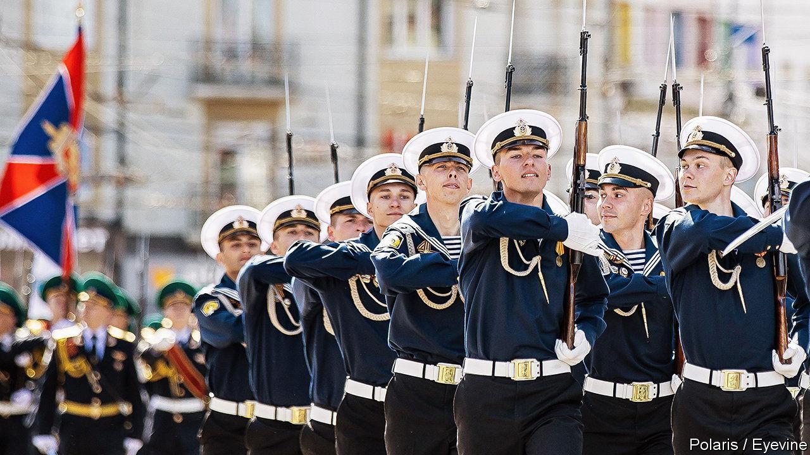
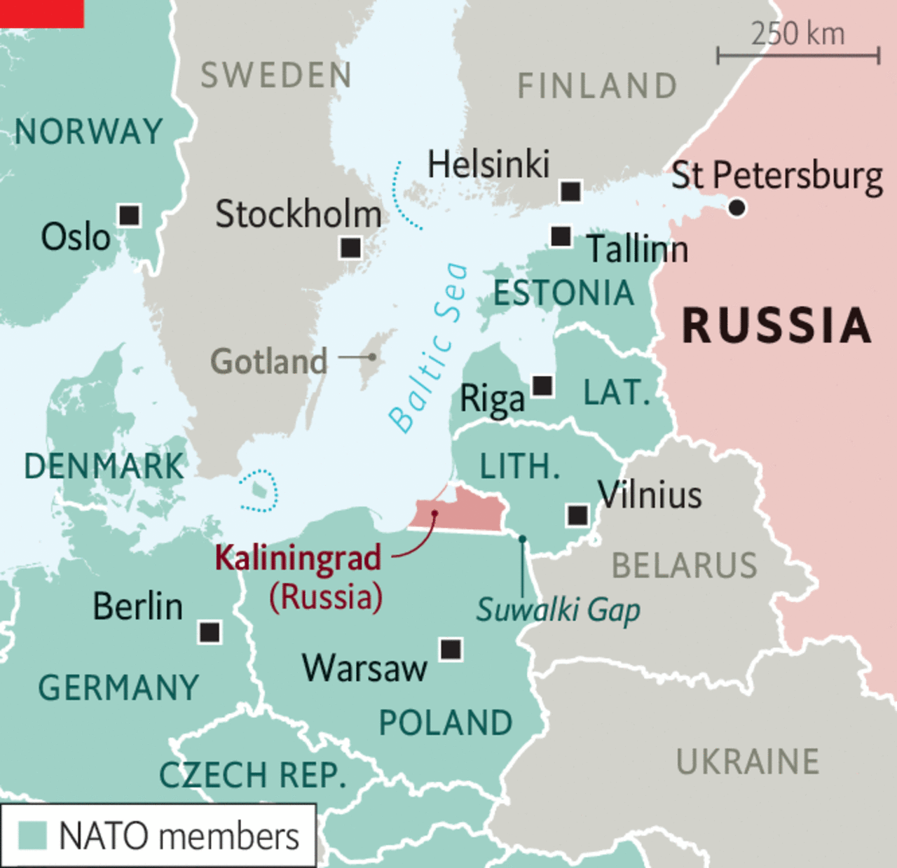

###### The Economist explains

# Is Kaliningrad, Russia’s exclave surrounded by EU countries, an asset or a liability? 

##### It is used to threaten Europe but could be isolated in a war 

 

> Jun 6th 2022 

IN MAY, AS part of a naval drill, more than 100 Russian soldiers in Kaliningrad pretended to fire nuclear rockets at imagined enemy positions in Europe. Russia often uses the exclave to threaten Europe. Unlike many of the country’s ports it remains ice-free year-round and is home to its Baltic fleet. Sweden fears a naval attack from Kaliningrad on Gotland, an island in the Baltic Sea. worries that Russia could invade Poland and Lithuania to create a land corridor from the territory to Belarus. But in the event of war with NATO, the exclave could cause problems for Russia. How did it come to control Kaliningrad, and is it an asset or a liability?

 


Kaliningrad is a “natural buffer zone” that provides the first line of defence for Russia from the West, says Jonas Kjellen, an analyst at foi, Sweden’s state defence-research agency. It is studded with radar systems which provide aerial surveillance of central Europe. In 2012 it was equipped with the s-400, a long-range missile defence system. In 2016 Russia sent a short-range Iskander missile system to Kaliningrad, which would, in theory, allow Russia to place nuclear warheads uncomfortably close to European cities. The Kremlin claimed the move was necessary to counter a growing American military presence in the region.

Kaliningrad is roughly the size of Northern Ireland (see map). The port was founded in 1255 by the Teutonic Knights, a Christian military order. As Königsberg, East Prussia’s commercial capital, it flourished for centuries. It produced the philosophers Immanuel Kant and Hannah Arendt, and E.T.A. Hoffmann, the author of “The Nutcracker and the Mouse King”. At the end of the second world war, Germany lost the territory to the Soviet Union. It was resettled with Russians and Belarusians and renamed after Mikhail Kalinin, a Bolshevik politician. When the Baltic republics gained independence in 1991, the territory and its 950,000 residents were cut off from the rest of Russia. A separatist movement never gained traction; after protests in 2010 against the Kremlin’s nominees for governor, Russia cracked down on local media and civil society.

But in the event of war, the territory’s snug location between NATO members leaves little room for Russian forces to disperse. Kaliningrad would also be difficult to resupply. There is probably no part of Russia that is more closely watched by Western spies, reckons Michael Kofman, director of the Russia Studies Programme at cna, an American think-tank. Russia could strike European targets with long-range missiles without relying on the exclave. If and when  join nato, Kaliningrad will find itself encircled by members of the alliance. Mr Kjellen warns that it could become the “closest point of interaction” between NATO forces and Russia. “If an incident were to happen, it would most likely be in the Baltic Sea,” he reckons.

Despite the Russian government’s attempts to stimulate the exclave’s economy, Kaliningrad has struggled in recent decades. Financial support and tax incentives for foreign investment granted in 1996 have been insufficient to prop up the declining industrial economy. War in Ukraine has brought  and soured commercial relationships with Poles and Lithuanians. Flights to and from the rest of the country have become prohibitively expensive: much of Europe’s airspace is closed to Russian carriers and Lithuania has imposed stringent conditions for transit passes. Rarely must Kaliningrad’s residents have felt further from Russia.


