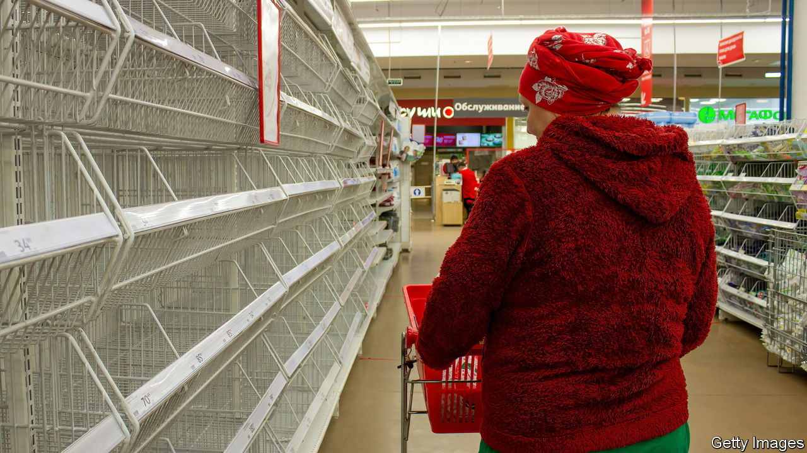
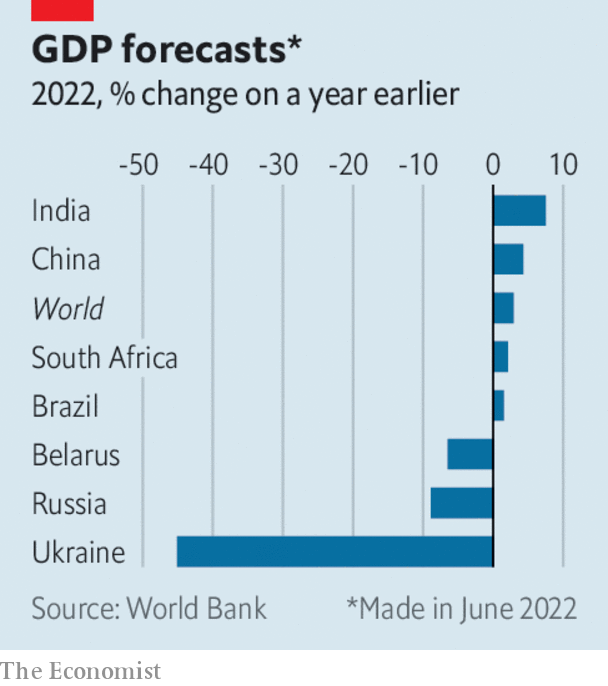

###### The world this week

# Business 

#####  

 

> Jun 9th 2022 

 


The World Bank slashed its forecast of global   this year, to 2.9%. It warned that the risk of stagflation was considerable and that the world should prepare for “several years of above-average inflation and below-average growth”. Real income per person in 2023 is expected to remain below pre-pandemic levels in 40% of developing economies. The oecd also cut its forecast for growth, but played down the risk of stagflation; it expects inflation to start easing later this year. 

Appearing before a Senate committee, Janet Yellen acknowledged that America’s high level of  was “unacceptable”, and asked Congress to “mitigate” rising household costs through a variety of measures, such as lowering prescription-drug prices. The American treasury secretary earlier denied claims in a new book that she had told Joe Biden to reduce the size of his $1.9trn stimulus package last year because it would stoke inflation. 

 issued a profit warning because of a build-up in its inventory, which it will clear by heavily discounting prices on a range of goods. Like other retailers, the department-store chain is adapting to a change in consumer spending towards household essentials, such as food and fuel, and away from frivolous products.

In Britain  fell at an annual rate of 1.1% in May, the biggest drop since January 2021, when the country was in lockdown. The four-day  weekend provided a small fillip. Retail footfall was up by 6.9% versus the average for May. Spending in pubs rose by 74%, year on year. 

Currency fluctuations

The  fell sharply again, after Recep Tayyip Erdogan, Turkey’s president, reiterated his pledge to continue cutting interest rates, despite annual inflation running at 73.5%. Mr Erdogan has pressed the nominally independent central bank to reduce rates, which he hopes will boost growth. But the weak lira is pushing up the cost of imports, especially for food and energy. Mr Erdogan has called interest rates “the mother of evils”. This week he said only “those living a charmed existence” benefit from them. 

 central bank made a more assertive push to tame inflation by raising its main interest rate by half a percentage point, to 0.85%. That follows a smaller increase in May.  central bank also lifted its benchmark rate by half a point, to 4.9%, the biggest rise in over a decade. 

Share prices in  continued their winning streak, amid hopes that the government’s crackdown on the industry is nearing an end. Didi Global’s depressed stock surged by as much as 60%, after reports that an almost year-long ban on downloading the ride-hailing giant’s app would soon be lifted. 

, an affiliate of Alibaba and also a target of the Chinese government’s ire, this week opened a digital wholesale bank, which it has based in Singapore. anext Bank will provide financial services to small- and medium-sized enterprises. 

Howard Schultz said he would step down as chief executive of  early next year. Mr Schultz took up the job on an interim basis in April, his third stint leading the coffee chain. Like Amazon, Starbucks is fighting a grassroots effort to unionise its employees. It has decided to close one of the outlets that recently plumped to join a union, apparently over a faulty grease trap. 

 sent a formal complaint to  stating that it was in “clear material breach” of their $44bn buy-out agreement by “actively resisting” his request for the number of fake and spam accounts on the platform. Twitter said that if necessary it would enforce the transaction, though it has reportedly agreed to give Mr Musk access to data on the swarms of tweets it hosts each day. It is thought Mr Musk is looking for a way out. Since striking the deal Twitter has lost about a fifth of its stockmarket value. 

Meanwhile,  share price plunged after reports that Mr Musk was thinking of cutting the carmaker’s workforce by 10% because he has a “super bad feeling” about the economy. Mr Musk recently told Tesla’s staff that they could no longer work remotely and were expected in the office at least 40 hours a week. 

Thursday is the new Friday

Tesla employees wanting to spend less time in the office could benefit from the results of the world’s biggest experiment of a , which has just started in Britain. The six-month programme involves 70 firms and 3,300 staff, who will receive full pay but work 80% of their time. The experiment is being run by a think-tank and academics to measure whether and how a reduced work week affects productivity, and if people can work “shorter and smarter”. 

