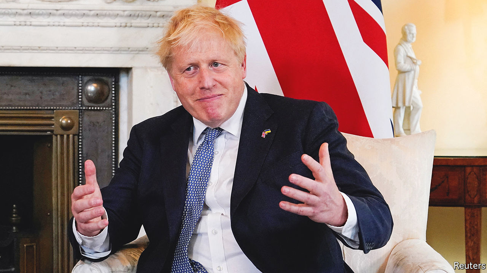
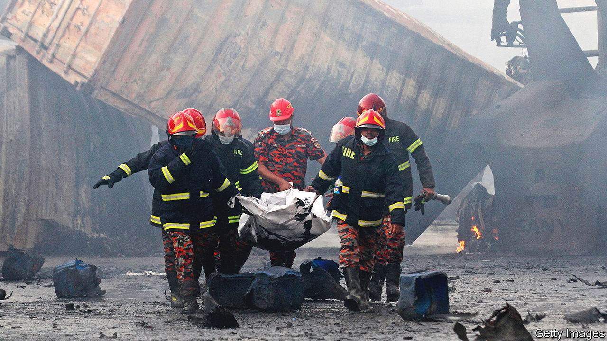

###### The world this week

# Politics 

#####  

 

> Jun 9th 2022 

Battling the fallout from parties held at Downing Street during covid-19 lockdowns, , Britain’s prime minister, won a snap no-confidence vote among Conservative mps. But more than 40% of his own mps voted against him, severely denting his authority. The party’s rules prevent another formal challenge to Mr Johnson’s leadership for a year. But Mr Johnson’s opponents note that his support was weaker than that accorded Theresa May in a similar vote in 2018, as her premiership floundered. Six months later, she quit. 

 governing Social Democrats won what was in effect a no-confidence vote, but only by securing the co-operation of an independent mp of Kurdish descent by reaffirming their support for a Kurdish group in Syria. That further complicates relations with Turkey, which has said it will block Sweden’s and Finland’s bids to join nato owing to their support for Kurdish organisations that Turkey deems terrorists. 

 troops continued to resist Russia’s offensive in Severodonetsk, a besieged city in the east of Ukraine that has become the focus of the Russian invasion. Elsewhere, the pace of fighting has slowed markedly, probably as a result of both widespread casualties and the loss of much military equipment on both sides. Russian missiles hit Kyiv, the capital, for the first time in several weeks. 

A Russian strike destroyed Ukraine’s second-biggest grain terminal in Mykolaiv. At a meeting of the un Security Council the president of the European Council accused Russia of “using  as a stealth missile” by blocking grain exports from Ukraine. The Russian ambassador stormed out of the session. Talks between Russia and Turkey aimed at allowing grain exports to resume from Ukraine’s blockaded ports ended without a solution. 

 junta, which came to power by staging coups in 2020 and 2021 and had pledged to step down by February this year, said it would delay handing power to a civilian government by another two years. The Economic Community of West African States warned that it would not lift sanctions until the junta agreed to a shorter transition.

Slaughtering the innocents

Gunmen killed at least 50 people when they attacked a Catholic church in Nigeria’s south-western Ondo state. The attack was the first of its kind in Ondo. Violence appears to be spreading from the north-west, where thousands have been killed by  over the past decade.

 ruling All Progressives Congress party picked Bola Tinubu, a former governor of Lagos state, as its presidential candidate for an election next year. The 70-year-old will run against the main opposition candidate, Atiku Abubakar, a 75-year-old former vice-president.

With tensions increasing between the two countries, Felix Tshisekedi, the president of , bluntly accused neighbouring  of backing the m23 rebel group, which in recent weeks has attacked villages and army posts in eastern Congo. Rwanda denies involvement.

Two wealthy brothers, , who have been charged with fraud and money-laundering in  in relation to suspected corruption during the presidency of Jacob Zuma, were arrested in Dubai. They are expected to be extradited. 

Judges in  went on strike to protest against interference in the judiciary and the sacking of 57 judges by Kais Saied, the president.

 


A fire and explosion at a container depot in , near the port of Chattogram, killed more than 45 people and injured hundreds more. Some 850 tonnes of hydrogen peroxide, a hazardous chemical, had been stored in the open, near other containers. 

 ruling Bharatiya Janata Party rebuked two senior officials who made disparaging remarks about the Prophet Muhammad, amid mounting protests from Muslim countries. Though the bjp often fans anti-Muslim sentiment at home, its sectarian outlook had not previously had much impact on foreign relations. 

Australia said a  cut in front of one its surveillance aircraft in international airspace over the South China Sea. The Chinese plane released “chaff”—small pieces of metal meant to confuse radar—which entered the Australian plane’s engine. No one was injured. The allegation came a day after Canada said that its military planes, in the region to enforce un sanctions against North Korea, had been repeatedly buzzed by Chinese jets. China accused Australia and Canada of provocative behaviour.

Voters in  overwhelmingly decided to remove the local district attorney from office in a recall election. Chesa Boudin’s ultra-progressive positions on law and order were too much even for the famously liberal bastion. 

Crime also dominated the primary election for mayor of . Rick Caruso, a property developer and former Republican, got the most votes. He has promised to put more police on the streets. Karen Bass, a progressive congresswoman and favourite to win until Mr Caruso’s belated entry into the race, came second. They face each other in a run-off in November. 

The former leader of the Proud Boys, a far-right group, and four others were charged with seditious conspiracy for trying to prevent Congress from certifying election results by storming the Capitol on . The indictments came three days before congressional hearings into the events of January 6th, due to be broadcast live on prime time television. 

The search continued for Dom Phillips, a British journalist, and Bruno Araújo Pereira, an indigenous official, who disappeared in the . The area is known for tensions over illegal fishing, mining and hunting. It has been reported that Mr Pereira received death threats the week before the trip. Relatives of the men expressed frustration at the authorities’ slow response.

Hugs and misses

The  began in Los Angeles. America announced a series of new policies regarding the region, including an effort to curb migration from Central America. Jair Bolsonaro, Brazil’s president, prepared to meet Joe Biden for the first time. But Andrés Manuel López Obrador, Mexico’s president, stayed away in protest at the exclusion of Cuba, Nicaragua and Venezuela from the event. Instead he sent his foreign minister, with a “hug” for Mr Biden. 

